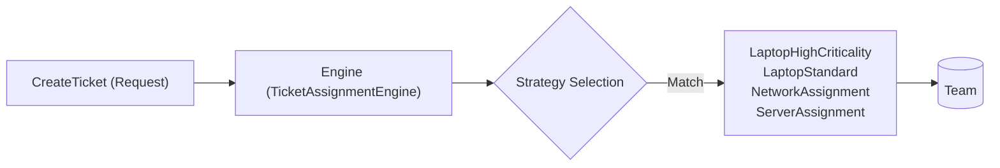
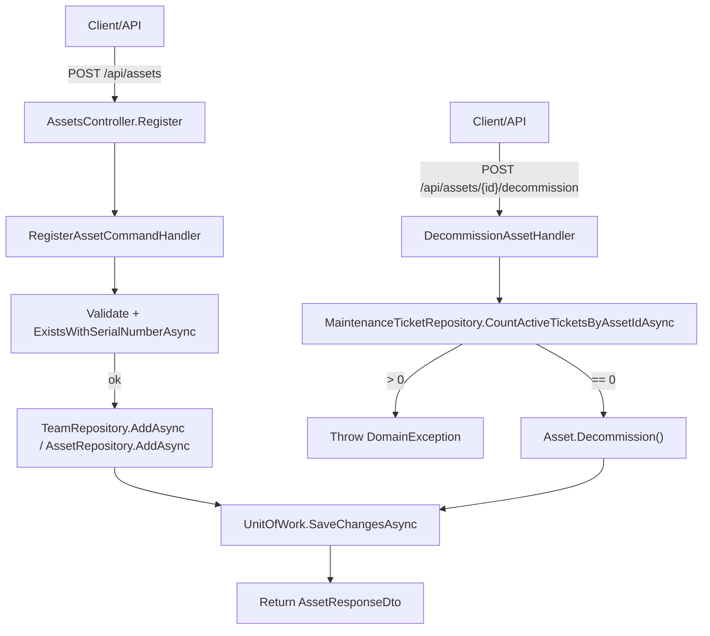
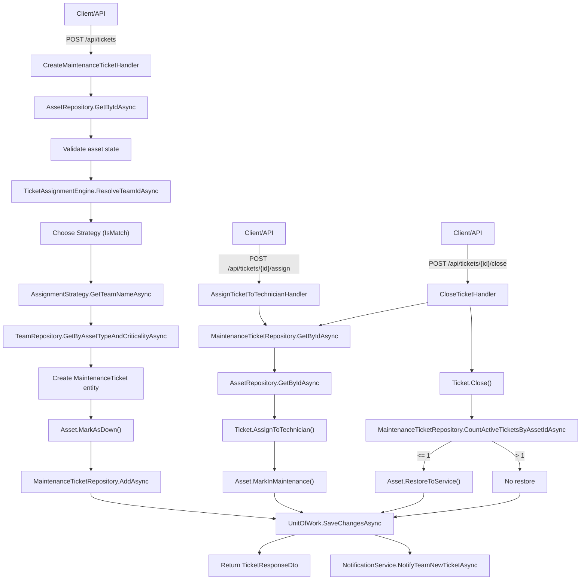
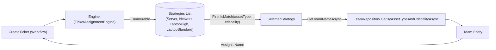
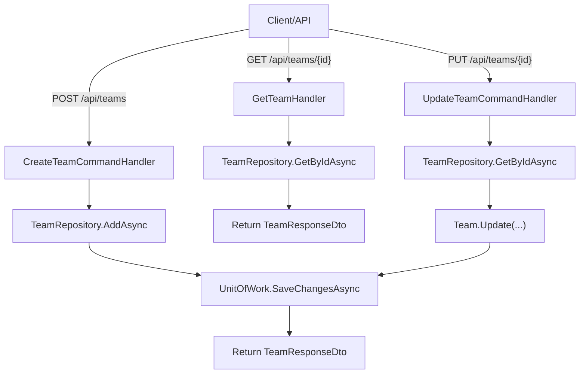
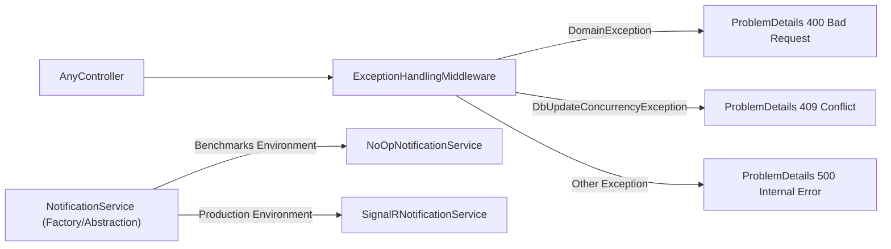

# AssetFlow Core

AssetFlow Core est une application d'exemple conçue avec les principes de la Clean Architecture, du Domain-Driven Design (DDD) et du pattern CQRS. Elle gère des assets (matériels), des équipes techniques et des tickets de maintenance, avec un moteur d'assignation automatique basé sur le pattern Strategy.

## Architecture & Principes
- Clean Architecture : séparation claire des couches `WebApi`, `Application`, `Domain` et `Infrastructure`.
- DDD : les entités du domaine (`Asset`, `Team`, `MaintenanceTicket`) encapsulent la logique métier et les invariants.
- CQRS / Vertical Slice : chaque cas d'usage implémente un Handler unique (Create, Update, Get, ...).
- Pattern Strategy : moteur d'assignation de tickets qui sélectionne une stratégie basée sur le type d'actif et la criticité du ticket.

## ✨ Fonctionnalités principales

- **Gestion des Actifs (Assets) :** Enregistrement, suivi d'inventaire unique par numéro de série, et déclassement des équipements obsolètes.
- **Cycle de vie des Tickets :** Création de tickets de maintenance assignés à des équipements spécifiques avec gestion fine des niveaux de criticité (`Low`, `Medium`, `High`).
- **Affectation Intelligente :** Attribution automatique ou manuelle des demandes d'intervention à des équipes techniques dédiées.
- **Résolution collaborative :** Processus de clôture des incidents avec traçabilité et rapports de résolution détaillés.
- **Haute Performance :** Couche de mise en cache avancée éliminant la fragmentation mémoire, validée par des tests rigoureux de benchmarking.
- **Extensibilité :** Architecture modulaire facilitant l'ajout de nouvelles fonctionnalités, types d'actifs ou stratégies d'assignation sans impact sur les composants existants.

## Nouvelle fonctionnalité : Assistance IA (RAG)

La couche Infrastructure inclut désormais une intégration RAG (Retrieval‑Augmented Generation) pour générer des notes d'assistance et des résumés de résolution à l'aide d'un modèle local (Ollama).

Principales caractéristiques :
- Utilise Microsoft Semantic Kernel pour le pipeline de chat completion.
- Génération d'embeddings pour recherche vectorielle locale (LocalVectorStore).
- Services principaux situés dans : `AssetFlowCore.Infrastructure/RAG` (ex. `AIAssistanceGenerator`, `OllamaConnectivityService`, `OllamaSemanticKernelSetup`).
- File d'attente et worker pour traitement asynchrone des demandes IA : `AIAssistanceQueue`, `AIAssistanceWorker`.

Configuration minimale (appsettings.json / variables d'environnement) :

```json
"Ollama": {
  "BaseUrl": "http://localhost:11434",
  "ChatModel": "mistral",
  "EmbeddingModel": "nomic-embed-text"
}
```

Activation :
- Le module RAG est enregistré automatiquement par `services.AddInfrastructure(configuration)` (voir `AssetFlowCore.Infrastructure/DependencyInjection.cs`).

Conseils :
- Vérifier que le démon Ollama est démarré et que l'endpoint `/api/tags` retourne la liste des modèles.
- Les logs d'infrastructure exposent l'état de la connexion et les erreurs de génération IA.

Si vous souhaitez désactiver l'IA, retirez l'appel `AddOllamaRagServices(configuration)` de l'enregistrement des services.

## Cas d'usage (UseCases)
- Assets
  - `RegisterAsset` : enregistrer un nouvel asset
  - `GetAllAssets` : lister les assets
  - `DecommissionAsset` : mettre un asset au rebut
- Tickets
  - `CreateMaintenanceTicket` : ouvrir un ticket
  - `AssignTicketToTechnician` : assigner un ticket à un technicien
  - `CloseTicket` : clôturer un ticket
  - `GetTicket` : récupérer un ticket
  - `RequestTicketTransfer` : demander un transfert
- Teams
  - `CreateTeam` : créer une équipe d'astreinte
  - `GetTeam` : récupérer une équipe
  - `UpdateTeam` : mettre à jour une équipe

## Moteur d'assignation automatique (Strategy)
Le moteur `TicketAssignmentEngine` résout dynamiquement la meilleure `IAssignmentStrategy` pour un couple `(AssetType, TicketCriticality)`.

Stratégies implémentées :
- `LaptopHighCriticalityStrategy` : match si `AssetType == Laptop` et `TicketCriticality == High`
- `LaptopStandardStrategy` : match si `AssetType == Laptop` et `TicketCriticality != High`
- `NetworkAssignmentStrategy` : match si `AssetType == NetworkDevice`
- `ServerAssignmentStrategy` : match si `AssetType == Server`

Algorithme résumé :
1. DI injecte `IEnumerable<IAssignmentStrategy>` dans `TicketAssignmentEngine`.
2. `ResolveTeamIdAsync` sélectionne la première stratégie dont `IsMatch(assetType, criticality)` retourne `true`.
3. La stratégie appelle `TeamRepository.GetByAssetTypeAndCriticalityAsync(assetType, criticality)` pour récupérer l'équipe en base et renvoyer son `Name`.
4. Si aucune équipe n'est trouvée, `AssignmentStrategyBase.GetTeamNameAsync` lève une `DomainException` — d'où la nécessité de pré-seeder les équipes.
5. Si aucune stratégie ne matche, fallback explicite vers `LaptopStandardStrategy`.

## Pré-requis pour l'assignation automatique
Avant de créer des assets et tickets, assurez-vous d'avoir au minimum ces 4 équipes en base :
- `LaptopHighCriticality` (AssetType = `Laptop`, TicketCriticality = `High`)
- `LaptopStandard` (AssetType = `Laptop`, TicketCriticality != `High`)
- `NetworkAssignment` (AssetType = `NetworkDevice`)
- `ServerAssignment` (AssetType = `Server`)

Sans ces équipes, l'assignation automatique lèvera une `DomainException` et l'opération échouera.

## Flux fonctionnel (du seed à l'assignation)
1. Seed / Create Teams (4 équipes minimum).
2. `RegisterAsset` : persiste un nouvel asset.
3. `CreateMaintenanceTicket` :
   - Récupère l'asset et valide les invariants.
   - Convertit la criticité en énumération.
   - Appelle `TicketAssignmentEngine.ResolveTeamIdAsync(asset.Type, criticality)`.
   - La stratégie appropriée est choisie et renvoie le `team.Name`.
   - Le ticket est créé (assigné à `assignedTeamId`) et l'asset est marqué `Down`.
   - Persistance via `UnitOfWork.SaveChangesAsync()`.
4. `AssignTicketToTechnician` : mutation du ticket, `asset.MarkInMaintenance()` si nécessaire, puis `SaveChangesAsync()`.

## Ajouter une nouvelle stratégie
1. Implémentez `IAssignmentStrategy` (ou héritez de `AssignmentStrategyBase`).
2. Enregistrez la stratégie dans DI (injection scoped dans `Program.cs`).
3. Seed/ajoutez l'équipe correspondante en base via migration/seed ou API `CreateTeam`.

## Points opérationnels et recommandations
- L'ordre d'enregistrement des stratégies (DI) peut influer sur la priorité si plusieurs stratégies sont compatibles ; `TicketAssignmentEngine` prend la première match.
- `AssignmentStrategyBase` centralise la résolution d'équipe et lève une `DomainException` si la recherche échoue.
- Utiliser les DTOs exposés par l'API pour les réponses (ex : `TeamResponseDto` ne contient pas toutes les propriétés internes).

## Diagramme (flux)


## Tests
- Unit tests et Integration tests fournis pour la plupart des UseCases (handlers, repositories, controllers).

## Exécution
- .NET 8 requis
- Lancer les tests via Visual Studio Test Explorer ou `dotnet test`.

## Diagrammes d'activité (mermaid)
Les diagrammes suivants représentent les principaux scénarios applicatifs et flux utilisateur/système. Ils couvrent la création d'équipes, la gestion des assets, la création/assignation/clôture de tickets, le moteur d'assignation (Strategy) et la gestion des erreurs/notifications.

### 1) Lifecycle d'un Asset


### 2) Cycle de vie d'un Ticket (Create → Assign → Close)


### 3) Moteur d'assignation (Strategy pattern)


### 4) Gestion des équipes (Team CRUD)


### 5) Gestion des erreurs & notifications


---
Ces diagrammes représentent les principaux chemins d'interaction utilisateur et les flux internes du système. 

