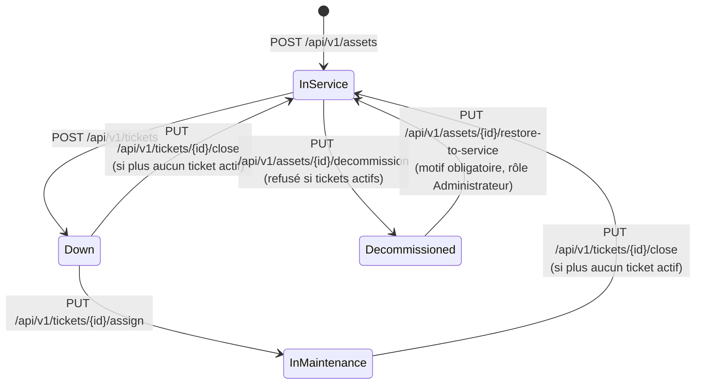
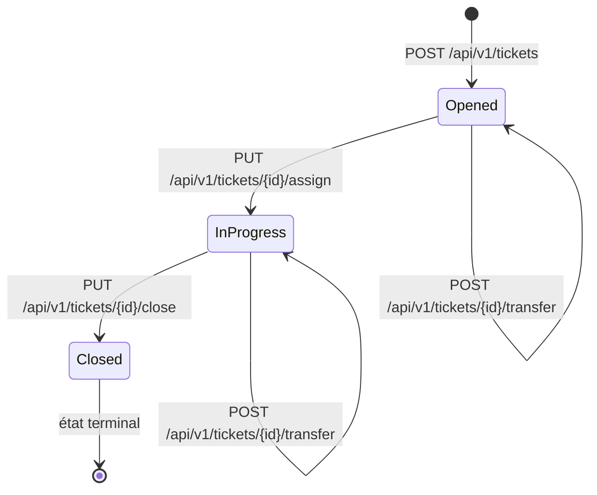

# AssetFlow Core — Spécification de l'API REST

Documentation de référence de l'API HTTP exposée par `AssetFlowCore.WebApi`, destinée aux consommateurs de l'API (notamment le frontend Angular).

> **Portée et fiabilité de ce document.** Tout ce qui suit a été relevé directement dans le code source le **2026-08-06**, après les lots de corrections backend (Lot 1), de complétion du contrat (Lot 2) et du Lot 2 bis (contrat débloqué par le Lot 0) — controllers, commandes, validateurs FluentValidation, handlers, entités, configurations EF Core, middleware d'exception. Les comportements documentés sont ceux **réellement implémentés**, y compris lorsqu'ils s'écartent des attributs `ProducesResponseType` déclarés sur les controllers. La section [Écarts et limitations connus](#9-écarts-et-limitations-connus) recense ces divergences.

> **Ruptures de contrat du Lot 2.** Un client écrit contre la version antérieure au Lot 2 doit être repris sur quatre points : les ressources introuvables répondent désormais **404** et non 400 ; `PUT /api/v1/teams/{id}` répond **200** et non 201 ; `TicketResponseDto` et `TeamResponseDto` portent de nouveaux champs ; les réponses `201` portent un en-tête `Location`.
>
> **Ruptures de contrat du Lot 2 bis.** Un client écrit contre la version antérieure au Lot 2 bis doit être repris sur trois points supplémentaires : toutes les routes sont désormais sous `/api/v1/...` (l'ancien préfixe a disparu) ; `TicketStatus.Resolved` n'existe plus ; le motif de transfert n'est plus concaténé à `description` mais exposé dans `TicketResponseDto.transferHistory`. Voir [§9](#9-écarts-et-limitations-connus) pour le détail.

## Sommaire

1. [Aperçu](#1-aperçu)
2. [Conventions](#2-conventions)
3. [Gestion des erreurs](#3-gestion-des-erreurs)
4. [Modèle de données](#4-modèle-de-données)
5. [Endpoints — Assets](#5-endpoints--assets)
6. [Endpoints — Tickets](#6-endpoints--tickets)
7. [Endpoints — Teams](#7-endpoints--teams)
8. [Temps réel — SignalR](#8-temps-réel--signalr)
9. [Écarts et limitations connus](#9-écarts-et-limitations-connus)
10. [Comportements transverses](#10-comportements-transverses)
11. [Endpoints techniques](#11-endpoints-techniques)
12. [Annexes](#12-annexes)

---

## 1. Aperçu

| Élément | Valeur |
|---|---|
| Framework | ASP.NET Core (.NET 8), controllers MVC |
| Base d'URL en développement | `http://localhost:5046` · `https://localhost:7138` |
| Base d'URL en conteneur | `http://localhost:8080` (docker-compose) |
| Préfixe des routes | `/api/v1/[controller]` → `/api/v1/assets`, `/api/v1/tickets`, `/api/v1/teams` |
| Versioning | **Segment d'URL `/v1`** (décision 0.15, Lot 2 bis) — pas de période de dépréciation pour l'ancien préfixe non versionné |
| Format d'échange | JSON (`application/json`), erreurs en `application/problem+json` |
| Documentation interactive | Swagger UI sur `/swagger` — **Development uniquement** |
| Authentification | **JWT Bearer** (Entra ID/OIDC) requis sur toute route hors sondes et documentation (voir [§9](#authentification-jwt-bearer-entra-id)). Tenant réel non encore enregistré (étape 7.0) |
| Pagination / filtrage / tri | sur `GET /api/v1/tickets` uniquement ([§6.1](#61-get-apiv1tickets--lister-les-incidents)) |

### Ressources et opérations

| Ressource | Opérations disponibles |
|---|---|
| **Assets** (actifs matériels) | lister, consulter par id (avec ses incidents), créer, mettre au rebut, **remettre en service** |
| **Tickets** (incidents de maintenance) | lister (filtres, tri, pagination), consulter par id, créer, prendre en charge, clôturer, transférer (motif historisé) |
| **Teams** (équipes d'astreinte) | lister, consulter par id, créer, modifier, supprimer, **activer**, **désactiver** |

---

## 2. Conventions

### Nommage JSON

- **Propriétés en `camelCase`** (comportement par défaut d'ASP.NET Core) : `AssetResponseDto.SerialNumber` est sérialisé `serialNumber`.
- **Valeurs d'énumérations en chaînes `PascalCase`.** `Program.cs` enregistre `JsonStringEnumConverter` **sans politique de nommage** : les valeurs circulent telles qu'écrites en C# (`"InService"`, `"NetworkDevice"`, `"High"`). La conversion camelCase ne s'applique qu'aux **noms de propriétés**, jamais aux valeurs d'enums.
- En entrée, les valeurs d'enums sont acceptées **sans respect de la casse** (`Enum.Parse(..., ignoreCase: true)` dans les handlers, `IsEnumName(caseSensitive: false)` dans les validateurs) : `"server"`, `"SERVER"` et `"Server"` sont équivalents.

### Types

| Type C# | JSON | Remarque |
|---|---|---|
| `Guid` | `string` | format `"3fa85f64-5717-4562-b3fc-2c963f66afa6"` |
| `Guid?` | `string \| null` | |
| `DateTime` | `string` | ISO 8601 UTC, ex. `"2026-08-04T09:12:33.1234567Z"` (toutes les dates sont produites par `DateTime.UtcNow`) |
| `string?` | `string \| null` | la propriété est présente avec la valeur `null`, elle n'est pas omise |
| `IEnumerable<T>` | `T[]` | |

### Codes de statut réellement renvoyés

| Code | Quand |
|---|---|
| `200 OK` | lectures, et **mise à jour d'une équipe** |
| `201 Created` | création d'un asset, d'un ticket, d'une équipe |
| `204 No Content` | mise au rebut, prise en charge, clôture, transfert, suppression d'équipe |
| `400 Bad Request` | échec de validation, ou violation d'une règle métier |
| `404 Not Found` | ressource désignée par l'URI absente, ou identifiant mal formé rejeté par le routage |
| `409 Conflict` | conflit de concurrence optimiste |
| `500 Internal Server Error` | toute autre exception non gérée |

`201 Created` porte l'en-tête **`Location`** pointant vers la ressource créée : `/api/v1/Assets/{id}`, `/api/v1/Tickets/{id}`, `/api/v1/Teams/{id}`. La casse du segment reprend le nom du controller ; le routage étant insensible à la casse, l'adresse est directement suivable.

---

## 3. Gestion des erreurs

Toutes les erreurs sont produites par un middleware unique (`ExceptionHandlingMiddleware`) au format **ProblemDetails (RFC 7807)**.

> ⚠️ **Écart constaté le 2026-08-05** sur l'API en exécution : les réponses d'erreur portent `Content-Type: application/json`, et non `application/problem+json`. Le middleware pose bien ce dernier, mais `WriteAsJsonAsync` le réécrit ensuite. Un client ne doit donc **pas** filtrer sur le type de contenu pour reconnaître le format. À corriger côté code (positionner le type après l'écriture, ou écrire la réponse autrement) ou à acter ici.

| Exception levée | Code | `title` |
|---|---|---|
| `FluentValidation.ValidationException` | 400 | `Validation de la requête échouée` |
| `ArgumentException` (et dérivées) | 400 | `Données d'entrée invalides` |
| `NotFoundException` | 404 | `Ressource introuvable` |
| `DomainException` | 400 | `Règle métier violée` |
| `DbUpdateConcurrencyException` | 409 | `Concurrence d'accès détectée` |
| autre | 500 | `Erreur interne du serveur` |

Les règles métier du domaine — y compris les transitions d'état d'un incident — lèvent toutes une `DomainException` et produisent donc un **400**.

### 400 ou 404 : la règle appliquée

`NotFoundException` dérive de `DomainException` ; l'ordre des cas du middleware la traite en premier. La distinction suit la position de la référence dans la requête :

| Situation | Code | Exemple |
|---|---|---|
| La ressource **désignée par l'URI** n'existe pas | **404** | `GET /api/v1/tickets/{id}` sur un identifiant inconnu |
| Une référence portée par le **corps** ou la chaîne de requête ne correspond à rien | **400** | `POST /api/v1/tickets/{id}/transfer` vers une équipe inconnue ; `POST /api/v1/tickets` sur un actif inexistant |

La requête est recevable dans le second cas : c'est la donnée fournie qui est refusée, au même titre qu'une valeur d'énumération invalide.

### Ressource introuvable (404)

```json
{
  "title": "Ressource introuvable",
  "status": 404,
  "detail": "L'incident 3fa85f64-5717-4562-b3fc-2c963f66afa6 est introuvable."
}
```

Un identifiant **mal formé** (non convertible en `Guid`) ne parvient pas au cas d'usage : la contrainte de route `{id:guid}` le rejette et le routage répond `404` sans corps ProblemDetails.

Les champs `type` et `instance` de ProblemDetails ne sont pas alimentés par le middleware. `title`, `status` et `detail` le sont systématiquement.

### Erreur de validation (400)

L'extension `errors` est un dictionnaire `{ "NomDePropriété": ["message", ...] }`. **Les clés sont les noms de propriétés C# en `PascalCase`**, pas en camelCase.

```json
{
  "title": "Validation de la requête échouée",
  "status": 400,
  "detail": "Une ou plusieurs erreurs de validation se sont produites.",
  "errors": {
    "Title": ["Le titre du ticket est obligatoire."]
  }
}
```

### Règle métier violée (400)

```json
{
  "title": "Règle métier violée",
  "status": 400,
  "detail": "Ce numéro de série constructeur est déjà enregistré dans le parc."
}
```

### Conflit de concurrence (409)

```json
{
  "title": "Concurrence d'accès détectée",
  "status": 409,
  "detail": "Cette ressource a été mise à jour par un autre utilisateur. Veuillez recharger les données."
}
```

### Erreur interne (500)

Le `detail` est un message générique : le message d'exception est **journalisé côté serveur, jamais renvoyé**. L'extension `traceId` reprend l'identifiant de trace de la requête et permet de retrouver l'entrée de journal correspondante.

```json
{
  "title": "Erreur interne du serveur",
  "status": 500,
  "detail": "Une erreur inattendue s'est produite. Contactez le support en communiquant l'identifiant de trace.",
  "traceId": "0HN7Q1G4K5V2A:00000003"
}
```

---

## 4. Modèle de données

### Énumérations

| Enum | Valeurs (chaînes transmises) |
|---|---|
| `AssetType` | `Server` · `Laptop` · `NetworkDevice` |
| `AssetStatus` | `InService` · `Down` · `InMaintenance` · `Decommissioned` |
| `TicketCriticality` | `Low` · `Medium` · `High` |
| `TicketStatus` | `Opened` · `InProgress` · `Closed` |

> `TicketStatus.Resolved` a été **supprimée** de l'énumération (décision 0.3, Lot 2 bis) : le cycle est `Opened → InProgress → Closed`, sans étape intermédiaire de résolution.

### `AssetResponseDto`

| Propriété JSON | Type | Description |
|---|---|---|
| `id` | `string` (Guid) | identifiant de l'actif |
| `name` | `string` | libellé, max. 100 caractères |
| `serialNumber` | `string` | numéro de série **normalisé** (trim + majuscules), unique dans le parc |
| `type` | `AssetType` | |
| `status` | `AssetStatus` | |
| `createdAt` | `string` (date-heure) | UTC |

### `AssetDetailResponseDto`

Renvoyé par `GET /api/v1/assets/{id}`. Reprend tous les champs d'`AssetResponseDto` et y ajoute :

| Propriété JSON | Type | Description |
|---|---|---|
| `tickets` | `AssetTicketDto[]` | incidents de l'actif, **du plus récent au plus ancien** ; tableau vide, jamais `null` |

#### `AssetTicketDto`

| Propriété JSON | Type | Description |
|---|---|---|
| `id` · `title` · `criticality` · `status` · `createdAt` | | mêmes valeurs que dans `TicketResponseDto` |
| `assignedTeamId` | `string` (Guid) | équipe assignée |
| `assignedTeamName` | `string` | nom de l'équipe |

Le contexte de l'actif étant déjà porté par la fiche, cette forme réduite ne répète ni `assetId`, ni la description, ni la note d'assistance.

### `TicketResponseDto`

| Propriété JSON | Type | Description |
|---|---|---|
| `id` | `string` (Guid) | |
| `assetId` | `string` (Guid) | actif concerné |
| `title` | `string` | max. 150 caractères |
| `description` | `string` | description de l'anomalie, **exactement celle saisie à l'ouverture** — un transfert ne la modifie plus (décision 0.5, Lot 2 bis) |
| `criticality` | `TicketCriticality` | |
| `status` | `TicketStatus` | |
| `assignedTeamId` | `string \| null` | équipe résolue par le moteur d'assignation |
| `assignedTeamName` | `string` | nom de l'équipe |
| `resolutionComment` | `string \| null` | compte rendu de clôture ; `null` tant que l'incident n'est pas clôturé |
| `createdAt` | `string` (date-heure) | UTC, date d'ouverture |
| `assistanceNote` | `string \| null` | note d'assistance **Markdown** produite par l'analyse IA ; `null` tant qu'elle n'a pas abouti |
| `isAiProcessing` | `boolean` | vrai tant que l'analyse IA est en cours ; repasse à faux qu'elle réussisse ou échoue |
| `assignedByUserId` | `string \| null` (Guid) | auteur de la prise en charge (décision 0.2) ; `null` tant que jamais pris en charge |
| `closedByUserId` | `string \| null` (Guid) | auteur de la clôture (décision 0.2) ; `null` tant que non clôturé |
| `transferHistory` | `TicketTransferHistoryDto[]` | historique des transferts (décision 0.5), du plus ancien au plus récent. **Peuplé uniquement par `GET /api/v1/tickets/{id}`** — tableau vide sur les autres réponses portant ce DTO (liste, création), la collection n'y étant pas chargée |

> Le couple `assistanceNote` / `isAiProcessing` permet à un écran d'afficher « analyse en cours » puis la note. La fin de traitement n'étant notifiée par aucun événement temps réel, le client doit relire l'incident pour l'observer (voir [§10.4](#104-assistance-ia-asynchrone)).

#### `TicketTransferHistoryDto`

| Propriété JSON | Type | Description |
|---|---|---|
| `fromTeamId` | `string` (Guid) | équipe d'origine au moment du transfert |
| `fromTeamName` | `string` | nom résolu de l'équipe d'origine ; `"Équipe inconnue"` si l'équipe a depuis été supprimée |
| `toTeamId` | `string` (Guid) | équipe cible |
| `toTeamName` | `string` | nom résolu de l'équipe cible |
| `reason` | `string` | motif saisi lors du transfert, max. 1000 caractères |
| `transferredAt` | `string` (date-heure) | UTC |

Aucune contrainte de clé étrangère vers `t_teams` : une équipe historiquement transférée peut être supprimée depuis sans que cela bloque sa suppression, laquelle ne vérifie que les tickets **actifs** qui lui sont assignés.

### `TeamResponseDto`

| Propriété JSON | Type | Description |
|---|---|---|
| `id` | `string` (Guid) | |
| `name` | `string` | **unique** en base, max. 100 caractères |
| `description` | `string \| null` | max. 500 caractères |
| `isActive` | `boolean` | |
| `createdAt` | `string` (date-heure) | UTC |
| `assetType` | `AssetType` | type d'actif pris en charge |
| `ticketCriticality` | `TicketCriticality` | criticité prise en charge |

### `PagedResultDto<T>`

Enveloppe de pagination, aujourd'hui utilisée par `GET /api/v1/tickets`.

| Propriété JSON | Type | Description |
|---|---|---|
| `items` | `T[]` | éléments de la page demandée |
| `page` | `number` | numéro de page demandé, à partir de 1 |
| `pageSize` | `number` | taille de page demandée |
| `totalCount` | `number` | **nombre total d'éléments correspondant aux filtres**, toutes pages confondues |
| `totalPages` | `number` | nombre de pages, arrondi au supérieur ; `0` si aucun élément |

Une page au-delà de la dernière renvoie `items` vide avec un `totalCount` inchangé — ce n'est pas une erreur.

### Contraintes de persistance (SQL Server)

| Table | Contrainte |
|---|---|
| `t_assets` | `name` requis (100) · `serial_num` requis (50) **unique** |
| `t_teams` | `name` requis (100) **unique** (`IX_t_teams_name`) · `asset_type` requis (100) · `ticket_criticality` requis (100) · `description` (500) · index sur `is_active` |
| `t_maintenance_tickets` | `title` requis (150) · `description` requis (`nvarchar(max)`) · `asset_id` et `assigned_team_id` requis · `row_version` = jeton de concurrence · index `(asset_id, status)` et `assigned_team_id` · suppression des équipes et actifs référencés en `RESTRICT` |
| `t_ticket_transfer_histories` | `reason` requis (1000) · `maintenance_ticket_id` requis, FK vers `t_maintenance_tickets` en `RESTRICT`, index dédié · **aucune** FK vers `t_teams` (`from_team_id`/`to_team_id` sont de simples colonnes `Guid`) |

---

## 5. Endpoints — Assets

### 5.1 `GET /api/v1/assets` — Lister les actifs

Retourne l'inventaire complet, sans pagination ni filtre.

- **Réponse `200 OK`** : `AssetResponseDto[]`
- **Mise en cache** : réponse servie depuis un cache mémoire de **5 minutes**, invalidé par toute écriture sur un actif — voir [§10.1](#101-cache-mémoire-et-fraîcheur-des-données).

```bash
curl https://localhost:7138/api/v1/assets
```

```json
[
  {
    "id": "8f14e45f-ceea-467a-9c33-1b2f3c4d5e6f",
    "name": "Serveur de sauvegarde",
    "serialNumber": "SRV-00042",
    "type": "Server",
    "status": "InService",
    "createdAt": "2026-08-01T14:22:07.4512345Z"
  }
]
```

### 5.2 `GET /api/v1/assets/{id}` — Consulter un actif et ses incidents

Fiche unitaire : les caractéristiques de l'actif et l'ensemble de ses incidents, du plus récent au plus ancien. Lecture **non mise en cache**.

- **Réponse `200 OK`** : `AssetDetailResponseDto`
- **Réponse `404`** : `L'actif {id} est introuvable.`

```bash
curl https://localhost:7138/api/v1/assets/8f14e45f-ceea-467a-9c33-1b2f3c4d5e6f
```

```json
{
  "id": "8f14e45f-ceea-467a-9c33-1b2f3c4d5e6f",
  "name": "Serveur de sauvegarde",
  "serialNumber": "SRV-00042",
  "type": "Server",
  "status": "Down",
  "createdAt": "2026-08-01T14:22:07.4512345Z",
  "tickets": [
    {
      "id": "c9d8e7f6-a5b4-43c2-91d0-2e3f4a5b6c7d",
      "title": "Disque système saturé",
      "criticality": "High",
      "status": "Opened",
      "createdAt": "2026-08-04T09:15:00.0000000Z",
      "assignedTeamId": "7e1c0001-0000-4000-8000-000000000001",
      "assignedTeamName": "Infrastructure-Serveurs-Critique"
    }
  ]
}
```

### 5.3 `POST /api/v1/assets` — Enregistrer un actif

**Corps** (`RegisterAssetRequest`)

| Champ | Type | Obligatoire | Contraintes |
|---|---|---|---|
| `name` | `string` | oui | non vide (après trim), max. 100 en base |
| `serialNumber` | `string` | oui | **5 à 50 caractères**, normalisé en majuscules sans espaces de bord, unique |
| `type` | `AssetType` | oui | `Server` · `Laptop` · `NetworkDevice` (casse indifférente) |

- **Réponse `201 Created`** : `AssetResponseDto` (statut initial `InService`), avec l'en-tête `Location: /api/v1/Assets/{id}`

```bash
curl -X POST https://localhost:7138/api/v1/assets \
  -H "Content-Type: application/json" \
  -d '{"name":"Poste comptabilité","serialNumber":"lpt-00871","type":"laptop"}'
```

```json
{
  "id": "b1c2d3e4-f5a6-47b8-9c0d-1e2f3a4b5c6d",
  "name": "Poste comptabilité",
  "serialNumber": "LPT-00871",
  "type": "Laptop",
  "status": "InService",
  "createdAt": "2026-08-04T09:12:33.1234567Z"
}
```

**Erreurs `400`** — cet endpoint n'a **aucun validateur FluentValidation** : les erreurs proviennent du domaine, une seule à la fois, et n'ont donc **pas** de dictionnaire `errors`.

| Cause | `title` | `detail` |
|---|---|---|
| numéro de série déjà pris | `Règle métier violée` | `Ce numéro de série constructeur est déjà enregistré dans le parc.` |
| `serialNumber` vide | `Données d'entrée invalides` | `Le numéro de série ne peut pas être vide.` |
| `serialNumber` hors bornes | `Données d'entrée invalides` | `Le numéro de série doit contenir entre 5 et 50 caractères.` |
| `type` hors énumération | `Données d'entrée invalides` | message de `Enum.Parse` (ex. `Requested value 'Desktop' was not found.`) |
| `name` vide | `Données d'entrée invalides` | `Le nom de l'actif ne peut pas être vide.` |

> La vérification d'unicité précède la validation du format : un `serialNumber` de moins de 5 caractères déjà présent en base renvoie l'erreur de doublon, pas l'erreur de longueur.

### 5.4 `PUT /api/v1/assets/{id}/decommission` — Mettre au rebut

Passe l'actif en `Decommissioned`. Réversible via [§5.5](#55-put-apiv1assetsidrestore-to-service--remettre-en-service) (décision 0.4, Lot 2 bis).

- **Paramètre** : `id` (Guid, contraint par la route)
- **Réponse `204 No Content`**

```bash
curl -X PUT https://localhost:7138/api/v1/assets/8f14e45f-ceea-467a-9c33-1b2f3c4d5e6f/decommission
```

**Erreurs**

| Cause | Code | `detail` |
|---|---|---|
| actif inexistant | **404** | `L'actif {id} est introuvable.` |
| incidents en cours | 400 | `Action interdite : l'actif fait l'objet de N incident(s) en cours de traitement.` |

> Un incident « en cours » est un ticket au statut `Opened` ou `InProgress`.

### 5.5 `PUT /api/v1/assets/{id}/restore-to-service` — Remettre en service

Remet un actif **mis au rebut** en service (décision 0.4, Lot 2 bis). Réservé au rôle **`Administrateur`** (Lot 7). Motif obligatoire, non persisté mais journalisé (`ILogger`) — aucune entité d'historique dédiée, à la différence du transfert de ticket ([§6.6](#66-post-apiv1ticketsidtransfer--transférer-à-une-autre-équipe)).

**Corps** (`RestoreAssetToServiceRequest`)

| Champ | Type | Obligatoire | Contraintes |
|---|---|---|---|
| `reason` | `string` | oui | non vide (après trim) |

- **Réponse `204 No Content`**

```bash
curl -X PUT https://localhost:7138/api/v1/assets/8f14e45f-ceea-467a-9c33-1b2f3c4d5e6f/restore-to-service \
  -H "Content-Type: application/json" \
  -H "Authorization: Bearer <jeton avec le rôle Administrateur>" \
  -d '{"reason":"Mise au rebut réalisée par erreur"}'
```

**Erreurs**

| Cause | Code | `detail` |
|---|---|---|
| actif inexistant | **404** | `L'actif {id} est introuvable.` |
| `reason` vide | 400 | `Le motif de remise en service est obligatoire.` |
| actif non `Decommissioned` | 400 | `Seul un actif mis au rebut peut être remis en service.` |
| rôle insuffisant | **403** | — |

> Une fois remis en service, l'actif redevient immédiatement éligible à l'ouverture d'un incident ([§6.2](#62-post-apiv1tickets--ouvrir-un-ticket)), qui rejette tout actif `Decommissioned`. Le numéro de série reste unique quel que soit l'état de l'actif : cette contrainte ne filtre jamais sur le statut.

---

## 6. Endpoints — Tickets

### 6.1 `GET /api/v1/tickets` — Lister les incidents

Liste **paginée** des incidents, avec filtres et tri. Lecture directe en base, sans cache.

**Paramètres de requête** — tous facultatifs ; les filtres fournis se cumulent (ET logique).

| Paramètre | Type | Défaut | Description |
|---|---|---|---|
| `status` | `TicketStatus` | — | `Opened` · `InProgress` · `Closed` |
| `criticality` | `TicketCriticality` | — | `Low` · `Medium` · `High` |
| `teamId` | `string` (Guid) | — | équipe assignée |
| `assetId` | `string` (Guid) | — | actif concerné |
| `sortBy` | `string` | `CreatedAt` | `CreatedAt` · `Criticality` · `Status` · `Title` |
| `sortDescending` | `boolean` | `true` | ordre décroissant |
| `page` | `number` | `1` | numéro de page, ≥ 1 |
| `pageSize` | `number` | `20` | taille de page, de 1 à **100** |

- **Réponse `200 OK`** : `PagedResultDto<TicketResponseDto>`

Les tris sur `criticality` et `status` suivent l'**ordre métier**, non l'ordre alphabétique du texte stocké : décroissant sur la criticité place `High` en tête ; décroissant sur le statut place le stade le plus avancé du cycle de vie en tête. Le tri est complété par l'identifiant, de sorte qu'une valeur de tri partagée ne fasse pas varier la composition des pages d'un appel à l'autre.

```bash
curl "https://localhost:7138/api/v1/tickets?status=Opened&criticality=High&sortBy=CreatedAt&page=1&pageSize=20"
```

```json
{
  "items": [
    {
      "id": "c9d8e7f6-a5b4-43c2-91d0-2e3f4a5b6c7d",
      "assetId": "8f14e45f-ceea-467a-9c33-1b2f3c4d5e6f",
      "title": "Disque système saturé",
      "description": "Le volume C: est à 99 %, les sauvegardes échouent.",
      "criticality": "High",
      "status": "Opened",
      "assignedTeamId": "7e1c0001-0000-4000-8000-000000000001",
      "assignedTeamName": "Infrastructure-Serveurs-Critique",
      "resolutionComment": null,
      "createdAt": "2026-08-04T09:15:00.0000000Z",
      "assistanceNote": null,
      "isAiProcessing": true
    }
  ],
  "page": 1,
  "pageSize": 20,
  "totalCount": 137,
  "totalPages": 7
}
```

**Erreurs `400` de validation** (avec `errors`)

| Champ | Message |
|---|---|
| `Page` | `Le numéro de page doit être supérieur ou égal à 1.` |
| `PageSize` | `La taille de page doit être comprise entre 1 et 100.` |
| `Status` | `L'état doit être l'un des suivants : Opened, InProgress ou Closed.` |
| `Criticality` | `La criticité doit être l'une des suivantes : Low, Medium ou High.` |
| `SortBy` | `Le tri doit porter sur l'un des champs suivants : CreatedAt, Criticality, Status ou Title.` |

Un `teamId` ou un `assetId` inconnu n'est pas une erreur : la liste est simplement vide.

### 6.2 `POST /api/v1/tickets` — Ouvrir un ticket

Crée l'incident, **résout automatiquement l'équipe d'astreinte** (pattern Strategy) et bascule l'actif en `Down`. La demande d'assistance IA est ensuite mise en file d'attente de façon asynchrone ([§10.4](#104-assistance-ia-asynchrone)).

**Corps** (`CreateTicketRequest`)

| Champ | Type | Obligatoire | Contraintes |
|---|---|---|---|
| `assetId` | `string` (Guid) | oui (`[JsonRequired]`) | non vide |
| `title` | `string` | oui | max. **150** caractères |
| `description` | `string` | oui | non vide (stocké en `nvarchar(max)`) |
| `criticality` | `TicketCriticality` | oui | `Low` · `Medium` · `High` (casse indifférente) |

- **Réponse `201 Created`** : `TicketResponseDto` (statut `Opened`), avec l'en-tête `Location: /api/v1/Tickets/{id}`
- **Effets de bord** : `asset.status` → `Down` ; notification SignalR `ReceiveNewTicket` au groupe de l'équipe assignée ; ticket mis en file pour analyse IA (`isAiProcessing = true` en base).

```bash
curl -X POST https://localhost:7138/api/v1/tickets \
  -H "Content-Type: application/json" \
  -d '{"assetId":"8f14e45f-ceea-467a-9c33-1b2f3c4d5e6f","title":"Disque système saturé","description":"Le volume C: est à 99 %, les sauvegardes échouent.","criticality":"High"}'
```

```json
{
  "id": "c9d8e7f6-a5b4-43c2-91d0-2e3f4a5b6c7d",
  "assetId": "8f14e45f-ceea-467a-9c33-1b2f3c4d5e6f",
  "title": "Disque système saturé",
  "description": "Le volume C: est à 99 %, les sauvegardes échouent.",
  "criticality": "High",
  "status": "Opened",
  "assignedTeamId": "7e1c0001-0000-4000-8000-000000000001",
  "assignedTeamName": "Infrastructure-Serveurs-Critique",
  "resolutionComment": null,
  "createdAt": "2026-08-04T09:15:00.0000000Z",
  "assistanceNote": null,
  "isAiProcessing": true
}
```

**Erreurs `400` de validation** (avec dictionnaire `errors`)

| Champ | Message |
|---|---|
| `AssetId` | `L'identifiant de l'actif cible (AssetId) est obligatoire.` |
| `Title` | `Le titre du ticket est obligatoire.` / `Le titre du ticket ne doit pas dépasser 150 caractères.` |
| `Description` | `La description détaillée de l'anomalie est obligatoire.` |
| `Criticality` | `La criticité fournie n'est pas valide. Valeurs autorisées : Low, Medium, High.` |

> Le validateur est configuré en `ClassLevelCascadeMode = CascadeMode.Stop` : **`errors` ne contient qu'un seul champ à la fois**, le premier en échec.

**Erreurs `400` métier**

| Cause | `detail` |
|---|---|
| actif inexistant | `L'actif cible {assetId} n'existe pas.` — référence du corps, donc 400 et non 404 |
| actif au rebut | `Opération interdite : impossible d'ouvrir un incident sur un actif mis au rebut.` |
| aucune équipe pour le couple (type, criticité) | `L'équipe est introuvable en base. Vérifiez que les données de référence sont à jour.` |
| équipe résolue absente de la base | `L'équipe '{nom}' n'existe pas dans la base de données. Vérifiez que les données de référence ont bien été insérées via la migration.` |

> ⚠️ **Prérequis de données** : sans équipes de référence en base pour le couple `(AssetType, TicketCriticality)` demandé, **toute création de ticket échoue en 400**. Voir [§10.3](#103-moteur-dassignation-automatique).

### 6.3 `GET /api/v1/tickets/{id}` — Consulter un ticket

- **Réponse `200 OK`** : `TicketResponseDto`
- **Erreur `404`** : `L'incident {id} est introuvable.`
- **Erreur `400`** : `Le team avec l'ID {id} est introuvable.` — incohérence référentielle, l'équipe assignée ayant disparu

```bash
curl https://localhost:7138/api/v1/tickets/c9d8e7f6-a5b4-43c2-91d0-2e3f4a5b6c7d
```

### 6.4 `PUT /api/v1/tickets/{id}/assign` — Prendre en charge

Passe le ticket en `InProgress` et l'actif lié en `InMaintenance`. **Aucun corps de requête** : l'endpoint ne désigne pas de technicien, malgré son nom interne (`AssignTicketToTechnician`).

- **Réponse `204 No Content`**

```bash
curl -X PUT https://localhost:7138/api/v1/tickets/c9d8e7f6-a5b4-43c2-91d0-2e3f4a5b6c7d/assign
```

**Erreurs**

| Cause | Code | `title` / `detail` |
|---|---|---|
| ticket inexistant | **404** | `Ressource introuvable` — `L'incident {id} est introuvable.` |
| actif lié inexistant | 400 | `Règle métier violée` — `Actif lié introuvable.` |
| ticket pas au statut `Opened` | 400 | `Règle métier violée` — `Seul un ticket ouvert peut être pris en charge.` |
| actif pas au statut `Down` | 400 | `Règle métier violée` — `L'actif doit être en panne avant d'entrer en maintenance.` |
| modification concurrente | 409 | `Concurrence d'accès détectée` |

### 6.5 `PUT /api/v1/tickets/{id}/close` — Clôturer

Passe le ticket en `Closed` et, **s'il ne reste aucun autre ticket actif sur l'actif**, remet celui-ci `InService`.

**Corps** (`CloseTicketRequest`)

| Champ | Type | Obligatoire | Contraintes |
|---|---|---|---|
| `resolutionComment` | `string` | oui | non vide (validé par l'entité, pas par un validateur) |

- **Réponse `204 No Content`**

```bash
curl -X PUT https://localhost:7138/api/v1/tickets/c9d8e7f6-a5b4-43c2-91d0-2e3f4a5b6c7d/close \
  -H "Content-Type: application/json" \
  -d '{"resolutionComment":"Purge des journaux et extension du volume système."}'
```

**Erreurs**

| Cause | Code | `detail` |
|---|---|---|
| ticket inexistant | **404** | `L'incident {id} est introuvable.` |
| actif associé inexistant | 400 | `Actif associé introuvable.` |
| ticket pas au statut `InProgress` | 400 | `Seul un ticket en cours peut être clôturé.` |
| `resolutionComment` vide | 400 | `Un commentaire de résolution est obligatoire.` |
| modification concurrente | 409 | — |

### 6.6 `POST /api/v1/tickets/{id}/transfer` — Transférer à une autre équipe

Réaffecte le ticket à une équipe **désignée par son nom** et historise le motif dans une entrée dédiée (`TicketTransferHistoryDto`, décision 0.5, Lot 2 bis), exposée sur la fiche d'incident ([§4](#4-modèle-de-données)). La **description du ticket n'est plus modifiée** par un transfert — rupture de comportement par rapport à la version précédente du contrat, qui l'y concaténait.

**Corps** (`TransferTicketRequest`)

| Champ | Type | Obligatoire | Contraintes |
|---|---|---|---|
| `targetTeam` | `string` | oui | nom exact d'une équipe **active** |
| `reason` | `string` | oui | historisé, max. 1000 caractères en base |

- **Réponse `204 No Content`**

```bash
curl -X POST https://localhost:7138/api/v1/tickets/c9d8e7f6-a5b4-43c2-91d0-2e3f4a5b6c7d/transfer \
  -H "Content-Type: application/json" \
  -d '{"targetTeam":"Réseau-Télécom","reason":"Cause racine identifiée sur le commutateur."}'
```

**Erreurs**

| Cause | Code | Message |
|---|---|---|
| ticket inexistant | **404** | `L'incident {id} est introuvable.` |
| `targetTeam` vide, inexistant ou inactif | 400 | `L'équipe '{nom}' n'existe pas ou n'est plus active.` — référence du corps ; une chaîne vide emprunte le même message |
| ticket déjà clôturé | 400 | `Impossible de transférer un ticket clôturé.` |
| équipe cible identique à l'actuelle | 400 | `Le ticket est déjà assigné à l'équipe '{nom}'.` |
| `reason` vide | 400 | `Le motif du transfert est obligatoire.` — effet de bord de `TicketTransferHistory` (décision 0.5, Lot 2 bis), pas d'un validateur FluentValidation |

> ⚠️ `RequestTicketTransferCommandValidator` déclare des règles FluentValidation (`TicketId`/`TeamName` non vides), mais le pipeline `MediatR` de validation ne s'exécute **jamais** pour les commandes sans valeur de retour dans ce projet (constat du Lot 2 bis, hors périmètre de correction ce lot) : ces règles ne produisent aucune erreur en pratique. Un `targetTeam` vide aboutit tout de même à un 400, via le message « équipe inexistante » ci-dessus.

---

## 7. Endpoints — Teams

Les équipes portent le couple `(assetType, ticketCriticality)` qui permet au moteur d'assignation de router les tickets. Ces deux champs sont stockés **en texte** et comparés au nom de la valeur d'enum.

### 7.1 `GET /api/v1/teams` — Lister les équipes

Liste complète triée par nom, sans pagination : le référentiel compte au plus quelques dizaines d'équipes.

| Paramètre | Type | Défaut | Description |
|---|---|---|---|
| `onlyActive` | `boolean` | `false` | `true` pour ne retenir que les équipes actives — celles susceptibles de recevoir un incident |

- **Réponse `200 OK`** : `TeamResponseDto[]`
- **Mise en cache** : les deux listes (complète et actives seules) sont servies depuis un cache mémoire de **5 minutes**, invalidé par toute écriture sur une équipe.

```bash
curl "https://localhost:7138/api/v1/teams?onlyActive=true"
```

```json
[
  {
    "id": "7e1c0001-0000-4000-8000-000000000001",
    "name": "Infrastructure-Serveurs-Critique",
    "description": "Astreinte serveurs — incidents critiques",
    "isActive": true,
    "createdAt": "2026-01-01T00:00:00Z",
    "assetType": "Server",
    "ticketCriticality": "High"
  }
]
```

> Aucun endpoint ne permet **aujourd'hui** de désactiver une équipe : une équipe inactive ne peut provenir que d'une intervention en base. La décision 0.6 du plan d'implémentation, tranchée le 2026-08-05, ajoute cette opération sans retirer la suppression — voir « Évolutions de contrat décidées » au §9.

### 7.2 `GET /api/v1/teams/{id}` — Consulter une équipe

- **Réponse `200 OK`** : `TeamResponseDto`
- **Erreur `404`** : `L'équipe {id} est introuvable.`

### 7.3 `POST /api/v1/teams` — Créer une équipe

**Corps** (`CreateTeamRequest`)

| Champ | Type | Obligatoire | Contraintes |
|---|---|---|---|
| `name` | `string` | oui | max. 100 caractères, **unique en base** |
| `assetType` | `string` | oui | nom valide de `AssetType` (casse indifférente) |
| `ticketCriticality` | `string` | oui | nom valide de `TicketCriticality` (casse indifférente) |
| `description` | `string \| null` | non | max. 500 caractères |

- **Réponse `201 Created`** : `TeamResponseDto` (`isActive` = `true`), avec l'en-tête `Location: /api/v1/Teams/{id}`

```bash
curl -X POST https://localhost:7138/api/v1/teams \
  -H "Content-Type: application/json" \
  -d '{"name":"Infrastructure-Serveurs","assetType":"Server","ticketCriticality":"High","description":"Astreinte serveurs critiques"}'
```

**Erreurs `400` de validation** (avec `errors`)

| Champ | Message |
|---|---|
| `Name` | `Le nom de l'équipe est obligatoire.` / `Le nom ne doit pas dépasser 100 caractères.` |
| `AssetType` | `Le type d'asset est obligatoire.` / `Le type d'asset doit être l'un des suivants : Server, Laptop ou NetworkDevice.` |
| `TicketCriticality` | `La criticité prise en charge par l'équipe est obligatoire.` / `La criticité doit être l'une des suivantes : Low, Medium ou High.` |
| `Description` | `La description ne doit pas dépasser 500 caractères.` |

**Erreur `400` de règle métier** : `Une équipe nommée '{nom}' existe déjà.` — l'unicité du nom est contrôlée avant la persistance, l'index unique `IX_t_teams_name` ne sert plus que de garde-fou.

### 7.4 `PUT /api/v1/teams/{id}` — Modifier une équipe

Mise à jour **partielle** : chaque champ omis ou `null` est laissé inchangé.

**Corps** (`UpdateTeamRequest`) — tous les champs sont nullables

| Champ | Type | Contraintes |
|---|---|---|
| `name` | `string \| null` | max. 100 caractères |
| `assetType` | `string \| null` | si fourni, nom valide de `AssetType` |
| `ticketCriticality` | `string \| null` | si fourni, nom valide de `TicketCriticality` |
| `description` | `string \| null` | max. 500 caractères |

- **Réponse `200 OK`** : `TeamResponseDto` reflétant l'état après mise à jour

```bash
# Mise à jour de la seule description : les autres champs sont omis
curl -X PUT https://localhost:7138/api/v1/teams/5d6e7f80-1a2b-4c3d-8e9f-0a1b2c3d4e5f \
  -H "Content-Type: application/json" \
  -d '{"description":"Astreinte 24/7"}'
```

**Comportement `null` vs chaîne vide** — distinction importante :

| Valeur envoyée pour `assetType` | Résultat |
|---|---|
| champ omis ou `null` | champ ignoré, valeur existante conservée (`200`/`201`) |
| `""` (chaîne vide) | **`400`** — la règle `IsEnumName` rejette la chaîne vide |

**Erreurs `400`** : `Le teamId est obligatoire.` · messages de validation ci-dessus · `Le team avec l'ID {id} est introuvable.` · `Une équipe nommée '{nom}' existe déjà.` lorsque le renommage vise le nom d'une autre équipe.

> La réponse n'exposant ni `assetType` ni `ticketCriticality`, un client ne peut pas confirmer la prise en compte de ces deux champs.

### 7.5 `DELETE /api/v1/teams/{id}` — Supprimer une équipe

Suppression **physique et définitive**. [§7.6](#76-put-apiv1teamsidactivate--réactiver-une-équipe)/[§7.7](#77-put-apiv1teamsiddeactivate--désactiver-une-équipe) offrent une alternative **réversible** (décision 0.6, Lot 2 bis), pour une équipe créée par erreur sans avoir à la supprimer.

- **Réponse `204 No Content`**

**Erreurs `400`**

| Cause | `detail` |
|---|---|
| équipe inexistante | `Team introuvable.` |
| tickets actifs assignés | `Impossible de supprimer le team : des tickets actifs lui sont assignes.` |

> Un ticket **clôturé** rattaché à l'équipe ne bloque pas la vérification métier, mais la clé étrangère `assigned_team_id` est en `ON DELETE RESTRICT` : la suppression échoue alors au niveau base et remonte en **500**.

### 7.6 `PUT /api/v1/teams/{id}/activate` — Réactiver une équipe

Repasse `isActive` à `true` : l'équipe redevient éligible à `?onlyActive=true` ([§7.1](#71-get-apiv1teams--lister-les-équipes)) et aux nouvelles assignations. Réservé au rôle **`Administrateur`** (Lot 7). Aucune garde d'idempotence : réactiver une équipe déjà active réussit sans effet.

- **Réponse `200 OK`** : `TeamResponseDto` reflétant l'état après activation

```bash
curl -X PUT https://localhost:7138/api/v1/teams/5d6e7f80-1a2b-4c3d-8e9f-0a1b2c3d4e5f/activate \
  -H "Authorization: Bearer <jeton avec le rôle Administrateur>"
```

**Erreurs** : équipe inexistante → **404** `L'équipe {id} est introuvable.` · rôle insuffisant → **403**.

### 7.7 `PUT /api/v1/teams/{id}/deactivate` — Désactiver une équipe

Repasse `isActive` à `false` : l'équipe disparaît de `?onlyActive=true` et cesse de recevoir de nouveaux incidents, **sans être supprimée** — ses tickets déjà assignés (y compris clôturés) restent intacts. Réservé au rôle **`Administrateur`**. Aucune garde n'empêche de désactiver la **dernière** équipe couvrant un couple (type × criticité) : un client doit avertir avant confirmation si cela rendrait un couple non couvert (`RM-12`, à la charge de l'écran d'administration, Lot 5).

- **Réponse `200 OK`** : `TeamResponseDto` reflétant l'état après désactivation

```bash
curl -X PUT https://localhost:7138/api/v1/teams/5d6e7f80-1a2b-4c3d-8e9f-0a1b2c3d4e5f/deactivate \
  -H "Authorization: Bearer <jeton avec le rôle Administrateur>"
```

**Erreurs** : équipe inexistante → **404** `L'équipe {id} est introuvable.` · rôle insuffisant → **403**.

---

## 8. Temps réel — SignalR

| Élément | Valeur |
|---|---|
| Endpoint du hub | `/ticketHub` |
| Client recommandé | `@microsoft/signalr` |
| Méthode serveur appelable | `JoinTeamGroup(teamName: string)` — abonne la connexion au groupe de l'équipe |
| Événement reçu | `ReceiveNewTicket` avec un `TicketResponseDto` |
| Déclenchement | après `POST /api/v1/tickets`, diffusé **au seul groupe de l'équipe assignée** |

```ts
const connexion = new signalR.HubConnectionBuilder()
  .withUrl('https://localhost:7138/ticketHub')
  .withAutomaticReconnect()
  .build();

connexion.on('ReceiveNewTicket', (ticket) => { /* ... */ });

await connexion.start();
await connexion.invoke('JoinTeamGroup', 'Infrastructure-Serveurs');
```

Le nom de groupe est le **nom de l'équipe**, tel que renvoyé dans `assignedTeamName`. Aucune notification n'est émise lors de la prise en charge, de la clôture ou du transfert d'un ticket.

---

## 9. Écarts et limitations connus

Points relevés dans le code au 2026-08-06, après les lots de corrections backend (Lot 1), de complétion du contrat (Lot 2) et du Lot 2 bis (contrat débloqué par le Lot 0). Ils décrivent le comportement **réel** de l'API et doivent être pris en compte par les clients.

### Endpoints manquants

| Manque | Conséquence pour un client |
|---|---|
| pas de modification d'un actif | nom, numéro de série et type sont figés à la création — aucune décision prise, le besoin n'étant pas exprimé |
| pas de recherche plein texte | la liste d'incidents se filtre par état, criticité, équipe et actif, pas par mots du titre ou de la description |
| pas de pagination sur l'inventaire ni sur les équipes | `GET /api/v1/assets` et `GET /api/v1/teams` renvoient l'intégralité de la collection |

### Évolutions de contrat livrées au Lot 2 bis (2026-08-06)

Le Lot 0 du [plan d'implémentation](IMPLEMENTATION-PLAN.md) (§3, réalisation ordonnancée en §5.1) avait arrêté cinq évolutions modifiant ce contrat. **Les cinq sont livrées** : les sections 5 à 8 ci-dessus décrivent déjà le comportement réel qui en résulte. Un client écrit contre la version précédente du contrat doit être repris sur les trois ruptures.

| Évolution | Effet sur le contrat | Nature |
|---|---|---|
| **URL versionnées** `/api/v1/...` | les 15 routes ont changé de préfixe ; l'ancien préfixe non versionné a disparu, **sans période de dépréciation** | ⛔ rupture |
| **Suppression de `TicketStatus.Resolved`** | l'énumération ne porte plus que trois valeurs ; `GET /api/v1/tickets?status=Resolved` est désormais une valeur invalide (400) | ⛔ rupture |
| **Historique de transferts** | `POST /api/v1/tickets/{id}/transfer` n'ajoute plus le motif à `description` ; l'historique (équipe d'origine, équipe cible, motif, date) est exposé sur la fiche d'incident (`TicketResponseDto.transferHistory`) | ⛔ rupture de comportement pour un client qui lisait le motif dans la description |
| **Activation / désactivation d'équipe** | `PUT /api/v1/teams/{id}/activate` et `.../deactivate` ; `isActive` est désormais pilotable, réservé au rôle `Administrateur` | ➕ additif |
| **Remise en service d'un actif** | `PUT /api/v1/assets/{id}/restore-to-service`, motif obligatoire ; `Decommissioned` n'est plus un état terminal. Réservée au rôle `Administrateur` | ➕ additif |

Deux évolutions supplémentaires ont été livrées au Lot 7, toutes deux **additives** : l'exigence d'un jeton `JWT Bearer` sur l'ensemble des routes (hors sondes), et l'exposition de l'identité de l'auteur d'une prise en charge ou d'une clôture — `TicketResponseDto.AssignedByUserId`/`ClosedByUserId` (`Guid?`, ajoutés en fin de contrat, `null` pour un ticket jamais pris en charge ou clôturé).

### Dette technique constatée (hors périmètre du Lot 2 bis)

Le pipeline de validation `MediatR` (`ValidationBehavior`, `AssetFlowCore.Application/Behaviors/ValidationBehavior.cs`) ne s'exécute **jamais** pour les commandes sans valeur de retour (`IRequest` void / `MediatR.Unit`) : constaté en implémentant la remise en service d'un actif, et confirmé pré-existant sur `RequestTicketTransferCommandValidator` (ses règles `TicketId`/`TeamName` non vides ne produisent aucune erreur en pratique — un `targetTeam` vide aboutit tout de même à un 400, mais via le message « équipe inexistante », pas via la validation). Les commandes avec valeur de retour (ex. `CreateTeamCommand`) ne sont pas concernées. Non corrigé dans ce lot : la remise en service d'un actif valide donc son motif directement dans `Asset.RestoreFromDecommission`, pas via FluentValidation.

### Fin d'analyse IA non notifiée

`assistanceNote` et `isAiProcessing` sont désormais exposés, mais aucun événement temps réel n'annonce la fin de l'analyse : pour l'observer, un client doit relire l'incident.

### Authentification JWT Bearer (Entra ID)

Livrée au Lot 7 (décision 0.1) : `AddAuthentication().AddJwtBearer(...)` dans `Program.cs`, activé **avant** `UseAuthorization()`. Les trois contrôleurs portent `[Authorize]` au niveau classe — toute route hors sondes (`/health`, `/alive`) et documentation (`/swagger`) exige un jeton `JWT Bearer` valide. L'API n'émet **aucun** jeton et n'expose pas d'endpoint de connexion : le client obtient son jeton de l'annuaire (OIDC, PKCE côté navigateur) et le joint en en-tête `Authorization`.

**Rôles** (`AssetFlowCore.WebApi/Authorization/Roles.cs`) : `Administrateur`, `Technicien`, `GestionnaireDeParc`, `ResponsableEquipe`, dérivés des quatre personas du PRD §3 et portés par la revendication `roles` du jeton (`TokenValidationParameters.RoleClaimType`, configurable via `Authentication:Entra:RoleClaimType`, `"roles"` par défaut). Restrictions posées à ce jour : `POST`/`PUT`/`DELETE`/`.../activate`/`.../deactivate` sur `/api/v1/teams`, et `PUT /api/v1/assets/{id}/restore-to-service`, exigent le rôle `Administrateur` (persona « Administrateur du référentiel », PRD §3 ; la restriction sur la remise en service a été posée dès la création de l'endpoint, Lot 2 bis, comme anticipé à l'étape 7.2). Tout le reste n'exige qu'un jeton valide, sans restriction de rôle additionnelle.

**Configuration** (`Authentication:Entra:Authority`/`Audience`/`RoleClaimType`) : présente dans `appsettings.json`/`appsettings.Development.json` avec des valeurs vides — le tenant Entra ID réel (étape 7.0 : enregistrement d'application en plateforme « Single-page application », attribution des groupes d'annuaire aux rôles ci-dessus) reste une tâche d'exploitation non réalisée. Tant qu'`Authority` est vide, l'API démarre normalement ; l'échec ne survient qu'à la première requête protégée (résolution différée des métadonnées OIDC).

**Hub SignalR** (`/ticketHub`) : porte `[Authorize]`. Un WebSocket ne portant pas d'en-tête `Authorization`, le jeton est fourni en chaîne de requête (`?access_token=...`), lu par `JwtBearerEvents.OnMessageReceived` **uniquement** pour les chemins `/ticketHub` — arbitrage assumé, ce jeton atterrit dans les journaux d'accès du serveur/proxy.

**Traçabilité de l'auteur** (décision 0.2) : `PUT /api/v1/tickets/{id}/assign` et `PUT /api/v1/tickets/{id}/close` enregistrent l'identité de l'appelant (entité `User`, provisionnée « just-in-time » à partir des revendications du jeton — `oid`, `name`, `preferred_username`) dans `MaintenanceTicket.AssignedByUserId`/`ClosedByUserId`. La prise en charge reste un geste d'équipe : aucune affectation dirigée vers une personne (`EF-21` hors périmètre).

**Hors périmètre du Lot 7**, écarts assumés : l'enregistrement réel du tenant (étape 7.0, opérationnel) ; le rattachement d'un `User` à une équipe (Lot 6.6 — colonne `TeamId` nullable déjà présente sur `User`).

### CORS

La politique CORS (`Cors:AllowedOrigins`, `["*"]` par défaut) n'est appliquée **qu'en environnement Development**. Hors Development, aucune politique n'est active : un appel navigateur depuis une autre origine échoue.

Décision 0.13 du 2026-08-05 : le frontend est déployé dans un **conteneur nginx dédié**, et un **reverse proxy frontal** réunit les deux images sous une seule origine (frontend en racine, API sous `/api/v1`, WebSockets vers `/ticketHub`). Ce proxy est donc obligatoire en production. En développement, le proxy du serveur Angular joue ce rôle.

### Annulation des requêtes

Chaque action de controller accepte un `CancellationToken`, propagé jusqu'aux dépôts : l'abandon d'une requête HTTP interrompt les lectures et écritures en cours. Deux traitements en sont volontairement exclus car ils suivent la persistance et ne doivent pas être annulés par le départ du client : la **notification SignalR** et la **mise en file de l'analyse IA**.

---

## 10. Comportements transverses

### 10.1 Cache mémoire et fraîcheur des données

Les **listes** d'actifs et d'équipes sont servies par des décorateurs de cache (`IMemoryCache`, **expiration absolue de 5 minutes**). `IUnitOfWork` résout ses dépôts par le conteneur d'injection : les écritures traversent donc les décorateurs et invalident les clés concernées. Les mutations d'entités suivies qui n'appellent aucune méthode de dépôt (mise au rebut, passage en panne, retour en service) sont détectées à la persistance et invalident elles aussi la liste correspondante.

| Scénario | Effet |
|---|---|
| `POST /api/v1/assets` puis `GET /api/v1/assets` | le nouvel actif est **présent immédiatement** |
| `PUT /api/v1/assets/{id}/decommission` ou `.../restore-to-service` puis `GET /api/v1/assets` | le nouveau statut est **visible immédiatement** |
| `POST` / `PUT` / `DELETE` / `.../activate` / `.../deactivate` sur `/api/v1/teams` puis `GET /api/v1/teams` | les deux listes d'équipes (complète et actives seules) sont rechargées |

Ne sont **pas** mises en cache, et reflètent donc toujours l'état courant : `GET /api/v1/assets/{id}` (fiche et incidents) et `GET /api/v1/tickets` (liste paginée).

### 10.2 Transactions et concurrence

- Un cas d'usage = **un seul `SaveChangesAsync`** (Unit of Work) : l'opération est atomique.
- Les tickets portent un jeton `row_version` : une modification concurrente d'un même ticket produit un **409**. Le client doit recharger puis rejouer.

### 10.3 Moteur d'assignation automatique

À la création d'un ticket, l'équipe est résolue par un moteur de stratégies selon le couple `(AssetType, TicketCriticality)` :

| Type d'actif | Criticité | Stratégie retenue |
|---|---|---|
| `Laptop` | `High` | `LaptopHighCriticalityStrategy` |
| `Laptop` | `Low` · `Medium` | `LaptopStandardStrategy` |
| `NetworkDevice` | toutes | `NetworkAssignmentStrategy` |
| `Server` | toutes | `ServerAssignmentStrategy` |
| aucune correspondance | — | repli sur `LaptopStandardStrategy` |

Chaque stratégie interroge la base pour trouver une équipe **active** dont `assetType` et `ticketCriticality` correspondent. **Sans données de référence adéquates, la création de ticket échoue en 400.** Une couverture complète nécessite une équipe active par combinaison utilisée, soit 9 équipes (3 types × 3 criticités).

Ces 9 équipes sont amorcées par la migration `SeedReferenceTeams`. Le processus n'appliquant **aucune migration au démarrage**, une base neuve doit être mise à jour explicitement :

```powershell
dotnet ef database update --project AssetFlowCore.Infrastructure --startup-project AssetFlowCore.WebApi
```

### 10.4 Assistance IA asynchrone

À la création d'un ticket, `isAiProcessing` passe à `true` et l'identifiant du ticket est déposé dans une file en mémoire. Un worker d'arrière-plan génère une note d'assistance Markdown (via Azure OpenAI ou Ollama selon la configuration) puis repasse `isAiProcessing` à `false`.

`assistanceNote` et `isAiProcessing` sont exposés par `TicketResponseDto` : un écran peut afficher « analyse en cours » puis la note. En revanche **aucune notification n'est émise à la fin du traitement** — l'observer suppose de relire l'incident. La file étant en mémoire, les demandes en attente sont **perdues au redémarrage** du processus.

---

## 11. Endpoints techniques

| Endpoint | Description | Disponibilité |
|---|---|---|
| `/swagger` | Swagger UI | **Development uniquement** |
| `/swagger/v1/swagger.json` | document OpenAPI | **Development uniquement** |
| `/health` | état complet (toutes les sondes) | tous environnements |
| `/alive` | vivacité (sondes marquées `live`) | tous environnements |
| `/ticketHub` | hub SignalR | tous environnements |

Les deux sondes répondent `200 Healthy` dans tous les environnements : le `HEALTHCHECK` du [Dockerfile](../Dockerfile) et celui de [docker-compose.yml](../docker-compose.yml) interrogent `http://localhost:8080/health` avec `ASPNETCORE_ENVIRONMENT=Production`. Elles ne divulguent aucune donnée métier, mais restent à protéger d'un accès externe par le reverse proxy de production.

En développement, l'API impose également une redirection HTTPS (`UseHttpsRedirection`) : les appels en HTTP sont redirigés vers le port sécurisé.

---

## 12. Annexes

### 12.1 Cycle de vie d'un actif



Un actif reste en `Down` ou `InMaintenance` tant qu'au moins un ticket `Opened` ou `InProgress` lui est rattaché. Depuis le Lot 2 bis (décision 0.4), `Decommissioned` n'est plus un état terminal.

### 12.2 Cycle de vie d'un ticket



Le transfert réaffecte l'équipe **sans changer le statut**, historise le motif et est refusé sur un ticket `Closed`. Depuis le Lot 2 bis (décision 0.3), `TicketStatus.Resolved` n'existe plus dans l'énumération : ce cycle à trois états est définitif.

### 12.3 Récapitulatif des opérations

| Verbe | Route | Succès | Corps |
|---|---|---|---|
| `GET` | `/api/v1/assets` | 200 | — |
| `GET` | `/api/v1/assets/{id}` | 200 | — |
| `POST` | `/api/v1/assets` | 201 + `Location` | `{ name, serialNumber, type }` |
| `PUT` | `/api/v1/assets/{id}/decommission` | 204 | — |
| `PUT` | `/api/v1/assets/{id}/restore-to-service` | 204 | `{ reason }` — rôle `Administrateur` |
| `GET` | `/api/v1/tickets` | 200 | — (filtres, tri et pagination en chaîne de requête) |
| `GET` | `/api/v1/tickets/{id}` | 200 | — |
| `POST` | `/api/v1/tickets` | 201 + `Location` | `{ assetId, title, description, criticality }` |
| `PUT` | `/api/v1/tickets/{id}/assign` | 204 | — |
| `PUT` | `/api/v1/tickets/{id}/close` | 204 | `{ resolutionComment }` |
| `POST` | `/api/v1/tickets/{id}/transfer` | 204 | `{ targetTeam, reason }` |
| `GET` | `/api/v1/teams` | 200 | — (`?onlyActive=true` pour filtrer) |
| `GET` | `/api/v1/teams/{id}` | 200 | — |
| `POST` | `/api/v1/teams` | 201 + `Location` | `{ name, assetType, ticketCriticality, description? }` |
| `PUT` | `/api/v1/teams/{id}` | 200 | mêmes champs, tous optionnels |
| `DELETE` | `/api/v1/teams/{id}` | 204 | — |
| `PUT` | `/api/v1/teams/{id}/activate` | 200 | — rôle `Administrateur` |
| `PUT` | `/api/v1/teams/{id}/deactivate` | 200 | — rôle `Administrateur` |

Toute route comportant `{id}` répond **404** lorsque la ressource n'existe pas. Le décompte total des routes est désormais de 17 (15 + 2 endpoints additifs du Lot 2 bis).

### 12.4 Sources dans le code

| Élément documenté | Fichier |
|---|---|
| Routes et codes de statut | [AssetFlowCore.WebApi/Controllers/](../AssetFlowCore.WebApi/Controllers/) |
| Corps de requête | [AssetFlowCore.WebApi/Requests/](../AssetFlowCore.WebApi/Requests/) |
| DTOs de réponse | [AssetFlowCore.Application/DTOs/](../AssetFlowCore.Application/DTOs/) |
| Règles de validation | `**/UseCases/**/*Validator.cs` |
| Règles métier | `**/UseCases/**/*Handler.cs` et [AssetFlowCore.Domain/Entities/](../AssetFlowCore.Domain/Entities/) |
| Traduction des erreurs | [ExceptionHandlingMiddleware.cs](../AssetFlowCore.WebApi/Middlewares/ExceptionHandlingMiddleware.cs) |
| Sérialisation, CORS, endpoints techniques | [Program.cs](../AssetFlowCore.WebApi/Program.cs), [Extensions.cs](../AssetFlowCore.Aspire/AssetFlowCore.Aspire.ServiceDefaults/Extensions.cs) |
| Contraintes de base | [AssetFlowCore.Infrastructure/Configuration/](../AssetFlowCore.Infrastructure/Configuration/) |
| Cache et fraîcheur | [AssetFlowCore.Infrastructure/Cache/](../AssetFlowCore.Infrastructure/Cache/) |
| Temps réel | [SignalRNotificationService.cs](../AssetFlowCore.Infrastructure/Notifications/SignalRNotificationService.cs), [TicketHub.cs](../AssetFlowCore.Infrastructure/Notifications/TicketHub.cs) |
