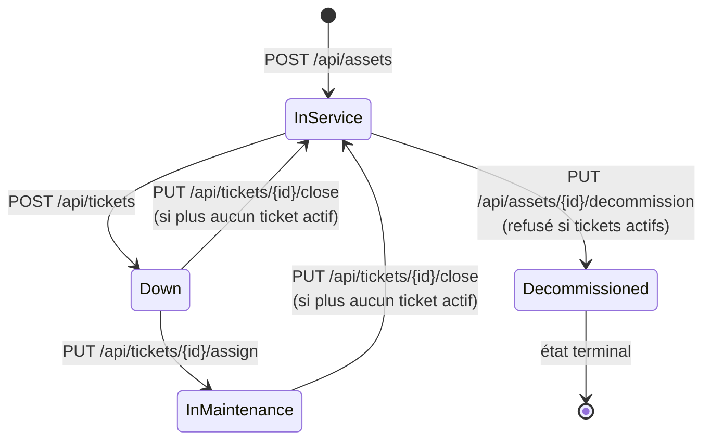
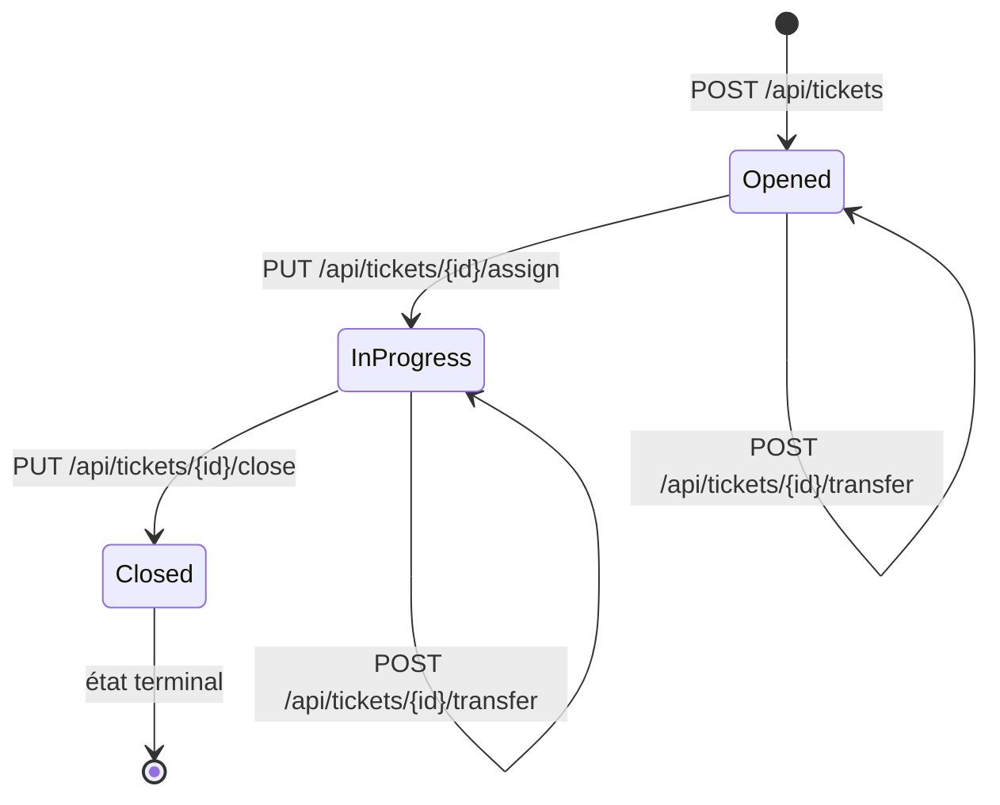

# AssetFlow Core — Spécification de l'API REST

Documentation de référence de l'API HTTP exposée par `AssetFlowCore.WebApi`, destinée aux consommateurs de l'API (notamment le frontend Angular).

> **Portée et fiabilité de ce document.** Tout ce qui suit a été relevé directement dans le code source le **2026-08-04** (controllers, commandes, validateurs FluentValidation, handlers, entités, configurations EF Core, middleware d'exception). Les comportements documentés sont ceux **réellement implémentés**, y compris lorsqu'ils s'écartent des attributs `ProducesResponseType` déclarés sur les controllers. La section [Écarts et limitations connus](#9-écarts-et-limitations-connus) recense ces divergences.

## Sommaire

1. [Aperçu](#1-aperçu)
2. [Conventions](#2-conventions)
3. [Gestion des erreurs](#3-gestion-des-erreurs)
4. [Modèle de données](#4-modèle-de-données)
5. [Endpoints — Assets](#5-endpoints--assets)
6. [Endpoints — Tickets](#6-endpoints--tickets)
7. [Endpoints — Teams](#7-endpoints--teams)
8. [Temps réel — SignalR](#8-temps-réel--signalr)
9. [Écarts et limitations connus](#9-écarts-et-limitations-connus)
10. [Comportements transverses](#10-comportements-transverses)
11. [Endpoints techniques](#11-endpoints-techniques)
12. [Annexes](#12-annexes)

---

## 1. Aperçu

| Élément | Valeur |
|---|---|
| Framework | ASP.NET Core (.NET 8), controllers MVC |
| Base d'URL en développement | `http://localhost:5046` · `https://localhost:7138` |
| Base d'URL en conteneur | `http://localhost:8080` (docker-compose) |
| Préfixe des routes | `/api/[controller]` → `/api/assets`, `/api/tickets`, `/api/teams` |
| Versioning | **Aucun** — pas de segment de version ni d'en-tête de version |
| Format d'échange | JSON (`application/json`), erreurs en `application/problem+json` |
| Documentation interactive | Swagger UI sur `/swagger` — **Development uniquement** |
| Authentification | **Aucune** (voir [§9](#authentification-absente)) |
| Pagination / filtrage / tri | Non implémentés |

### Ressources et opérations

| Ressource | Opérations disponibles |
|---|---|
| **Assets** (actifs matériels) | lister, créer, mettre au rebut |
| **Tickets** (incidents de maintenance) | créer, consulter par id, prendre en charge, clôturer, transférer |
| **Teams** (équipes d'astreinte) | consulter par id, créer, modifier, supprimer |

---

## 2. Conventions

### Nommage JSON

- **Propriétés en `camelCase`** (comportement par défaut d'ASP.NET Core) : `AssetResponseDto.SerialNumber` est sérialisé `serialNumber`.
- **Valeurs d'énumérations en chaînes `PascalCase`.** `Program.cs` enregistre `JsonStringEnumConverter` **sans politique de nommage** : les valeurs circulent telles qu'écrites en C# (`"InService"`, `"NetworkDevice"`, `"High"`). La conversion camelCase ne s'applique qu'aux **noms de propriétés**, jamais aux valeurs d'enums.
- En entrée, les valeurs d'enums sont acceptées **sans respect de la casse** (`Enum.Parse(..., ignoreCase: true)` dans les handlers, `IsEnumName(caseSensitive: false)` dans les validateurs) : `"server"`, `"SERVER"` et `"Server"` sont équivalents.

### Types

| Type C# | JSON | Remarque |
|---|---|---|
| `Guid` | `string` | format `"3fa85f64-5717-4562-b3fc-2c963f66afa6"` |
| `Guid?` | `string \| null` | |
| `DateTime` | `string` | ISO 8601 UTC, ex. `"2026-08-04T09:12:33.1234567Z"` (toutes les dates sont produites par `DateTime.UtcNow`) |
| `string?` | `string \| null` | la propriété est présente avec la valeur `null`, elle n'est pas omise |
| `IEnumerable<T>` | `T[]` | |

### Codes de statut réellement renvoyés

| Code | Quand |
|---|---|
| `200 OK` | lectures (`GET /api/assets`, `GET /api/tickets/{id}`, `GET /api/teams/{id}`) |
| `201 Created` | création d'un asset, d'un ticket, d'une équipe — **et mise à jour d'une équipe** (voir [§9](#codes-de-statut-inattendus)) |
| `204 No Content` | mise au rebut, prise en charge, clôture, transfert, suppression d'équipe |
| `400 Bad Request` | échec de validation, violation d'une règle métier, **et ressource introuvable** |
| `409 Conflict` | conflit de concurrence optimiste |
| `500 Internal Server Error` | toute autre exception non gérée |

`201 Created` est produit par `StatusCode(201, result)` : **aucun en-tête `Location`** n'est renvoyé.

---

## 3. Gestion des erreurs

Toutes les erreurs sont produites par un middleware unique (`ExceptionHandlingMiddleware`) au format **ProblemDetails (RFC 7807)**, avec `Content-Type: application/problem+json`.

| Exception levée | Code | `title` |
|---|---|---|
| `FluentValidation.ValidationException` | 400 | `Validation de la requête échouée` |
| `ArgumentException` (et dérivées) | 400 | `Données d'entrée invalides` |
| `DomainException` | 400 | `Règle métier violée` |
| `DbUpdateConcurrencyException` | 409 | `Concurrence d'accès détectée` |
| autre | 500 | `Erreur interne du serveur` |

Les règles métier du domaine — y compris les transitions d'état d'un incident — lèvent toutes une `DomainException` et produisent donc un **400**.

Les champs `type` et `instance` de ProblemDetails ne sont pas alimentés par le middleware. `title`, `status` et `detail` le sont systématiquement.

### Erreur de validation (400)

L'extension `errors` est un dictionnaire `{ "NomDePropriété": ["message", ...] }`. **Les clés sont les noms de propriétés C# en `PascalCase`**, pas en camelCase.

```json
{
  "title": "Validation de la requête échouée",
  "status": 400,
  "detail": "Une ou plusieurs erreurs de validation se sont produites.",
  "errors": {
    "Title": ["Le titre du ticket est obligatoire."]
  }
}
```

### Règle métier violée (400)

```json
{
  "title": "Règle métier violée",
  "status": 400,
  "detail": "Ce numéro de série constructeur est déjà enregistré dans le parc."
}
```

### Conflit de concurrence (409)

```json
{
  "title": "Concurrence d'accès détectée",
  "status": 409,
  "detail": "Cette ressource a été mise à jour par un autre utilisateur. Veuillez recharger les données."
}
```

### Erreur interne (500)

Le `detail` est un message générique : le message d'exception est **journalisé côté serveur, jamais renvoyé**. L'extension `traceId` reprend l'identifiant de trace de la requête et permet de retrouver l'entrée de journal correspondante.

```json
{
  "title": "Erreur interne du serveur",
  "status": 500,
  "detail": "Une erreur inattendue s'est produite. Contactez le support en communiquant l'identifiant de trace.",
  "traceId": "0HN7Q1G4K5V2A:00000003"
}
```

---

## 4. Modèle de données

### Énumérations

| Enum | Valeurs (chaînes transmises) |
|---|---|
| `AssetType` | `Server` · `Laptop` · `NetworkDevice` |
| `AssetStatus` | `InService` · `Down` · `InMaintenance` · `Decommissioned` |
| `TicketCriticality` | `Low` · `Medium` · `High` |
| `TicketStatus` | `Opened` · `InProgress` · `Resolved` · `Closed` |

> `TicketStatus.Resolved` existe dans le modèle mais **aucun endpoint ne l'attribue** : le cycle réel est `Opened → InProgress → Closed`.

### `AssetResponseDto`

| Propriété JSON | Type | Description |
|---|---|---|
| `id` | `string` (Guid) | identifiant de l'actif |
| `name` | `string` | libellé, max. 100 caractères |
| `serialNumber` | `string` | numéro de série **normalisé** (trim + majuscules), unique dans le parc |
| `type` | `AssetType` | |
| `status` | `AssetStatus` | |
| `createdAt` | `string` (date-heure) | UTC |

### `TicketResponseDto`

| Propriété JSON | Type | Description |
|---|---|---|
| `id` | `string` (Guid) | |
| `assetId` | `string` (Guid) | actif concerné |
| `title` | `string` | max. 150 caractères |
| `criticality` | `TicketCriticality` | |
| `status` | `TicketStatus` | |
| `assignedTeamId` | `string \| null` | équipe résolue par le moteur d'assignation |
| `assignedTeamName` | `string` | nom de l'équipe |

> Ce DTO **n'expose pas** `description`, `resolutionComment`, `assistanceNote`, `isAiProcessing` ni `createdAt`. Voir [§9](#champs-absents-des-dtos).

### `TeamResponseDto`

| Propriété JSON | Type | Description |
|---|---|---|
| `id` | `string` (Guid) | |
| `name` | `string` | **unique** en base, max. 100 caractères |
| `description` | `string \| null` | max. 500 caractères |
| `isActive` | `boolean` | |
| `createdAt` | `string` (date-heure) | UTC |

> Ce DTO **n'expose ni `assetType` ni `ticketCriticality`**, alors que la création et la mise à jour les manipulent. Voir [§9](#champs-absents-des-dtos).

### Contraintes de persistance (SQL Server)

| Table | Contrainte |
|---|---|
| `t_assets` | `name` requis (100) · `serial_num` requis (50) **unique** |
| `t_teams` | `name` requis (100) **unique** (`IX_t_teams_name`) · `asset_type` requis (100) · `ticket_criticality` requis (100) · `description` (500) · index sur `is_active` |
| `t_maintenance_tickets` | `title` requis (150) · `description` requis (`nvarchar(max)`) · `asset_id` et `assigned_team_id` requis · `row_version` = jeton de concurrence · index `(asset_id, status)` et `assigned_team_id` · suppression des équipes et actifs référencés en `RESTRICT` |

---

## 5. Endpoints — Assets

### 5.1 `GET /api/assets` — Lister les actifs

Retourne l'inventaire complet, sans pagination ni filtre.

- **Réponse `200 OK`** : `AssetResponseDto[]`
- **Mise en cache** : réponse servie depuis un cache mémoire de **5 minutes** — voir [§10.1](#101-cache-mémoire-et-fraîcheur-des-données), qui décrit un cas de données périmées après création.

```bash
curl https://localhost:7138/api/assets
```

```json
[
  {
    "id": "8f14e45f-ceea-467a-9c33-1b2f3c4d5e6f",
    "name": "Serveur de sauvegarde",
    "serialNumber": "SRV-00042",
    "type": "Server",
    "status": "InService",
    "createdAt": "2026-08-01T14:22:07.4512345Z"
  }
]
```

### 5.2 `POST /api/assets` — Enregistrer un actif

**Corps** (`RegisterAssetRequest`)

| Champ | Type | Obligatoire | Contraintes |
|---|---|---|---|
| `name` | `string` | oui | non vide (après trim), max. 100 en base |
| `serialNumber` | `string` | oui | **5 à 50 caractères**, normalisé en majuscules sans espaces de bord, unique |
| `type` | `AssetType` | oui | `Server` · `Laptop` · `NetworkDevice` (casse indifférente) |

- **Réponse `201 Created`** : `AssetResponseDto` (statut initial `InService`)

```bash
curl -X POST https://localhost:7138/api/assets \
  -H "Content-Type: application/json" \
  -d '{"name":"Poste comptabilité","serialNumber":"lpt-00871","type":"laptop"}'
```

```json
{
  "id": "b1c2d3e4-f5a6-47b8-9c0d-1e2f3a4b5c6d",
  "name": "Poste comptabilité",
  "serialNumber": "LPT-00871",
  "type": "Laptop",
  "status": "InService",
  "createdAt": "2026-08-04T09:12:33.1234567Z"
}
```

**Erreurs `400`** — cet endpoint n'a **aucun validateur FluentValidation** : les erreurs proviennent du domaine, une seule à la fois, et n'ont donc **pas** de dictionnaire `errors`.

| Cause | `title` | `detail` |
|---|---|---|
| numéro de série déjà pris | `Règle métier violée` | `Ce numéro de série constructeur est déjà enregistré dans le parc.` |
| `serialNumber` vide | `Données d'entrée invalides` | `Le numéro de série ne peut pas être vide.` |
| `serialNumber` hors bornes | `Données d'entrée invalides` | `Le numéro de série doit contenir entre 5 et 50 caractères.` |
| `type` hors énumération | `Données d'entrée invalides` | message de `Enum.Parse` (ex. `Requested value 'Desktop' was not found.`) |
| `name` vide | `Données d'entrée invalides` | `Le nom de l'actif ne peut pas être vide.` |

> La vérification d'unicité précède la validation du format : un `serialNumber` de moins de 5 caractères déjà présent en base renvoie l'erreur de doublon, pas l'erreur de longueur.

### 5.3 `PUT /api/assets/{id}/decommission` — Mettre au rebut

Passe l'actif en `Decommissioned`. Opération **irréversible** (aucun endpoint ne remet un actif en service).

- **Paramètre** : `id` (Guid, contraint par la route)
- **Réponse `204 No Content`**

```bash
curl -X PUT https://localhost:7138/api/assets/8f14e45f-ceea-467a-9c33-1b2f3c4d5e6f/decommission
```

**Erreurs `400`**

| Cause | `detail` |
|---|---|
| actif inexistant | `L'actif {id} est introuvable.` |
| incidents en cours | `Action interdite : l'actif fait l'objet de N incident(s) en cours de traitement.` |

> Un incident « en cours » est un ticket au statut `Opened` ou `InProgress`.

---

## 6. Endpoints — Tickets

### 6.1 `POST /api/tickets` — Ouvrir un ticket

Crée l'incident, **résout automatiquement l'équipe d'astreinte** (pattern Strategy) et bascule l'actif en `Down`. La demande d'assistance IA est ensuite mise en file d'attente de façon asynchrone ([§10.4](#104-assistance-ia-asynchrone)).

**Corps** (`CreateTicketRequest`)

| Champ | Type | Obligatoire | Contraintes |
|---|---|---|---|
| `assetId` | `string` (Guid) | oui (`[JsonRequired]`) | non vide |
| `title` | `string` | oui | max. **150** caractères |
| `description` | `string` | oui | non vide (stocké en `nvarchar(max)`) |
| `criticality` | `TicketCriticality` | oui | `Low` · `Medium` · `High` (casse indifférente) |

- **Réponse `201 Created`** : `TicketResponseDto` (statut `Opened`)
- **Effets de bord** : `asset.status` → `Down` ; notification SignalR `ReceiveNewTicket` au groupe de l'équipe assignée ; ticket mis en file pour analyse IA (`isAiProcessing = true` en base).

```bash
curl -X POST https://localhost:7138/api/tickets \
  -H "Content-Type: application/json" \
  -d '{"assetId":"8f14e45f-ceea-467a-9c33-1b2f3c4d5e6f","title":"Disque système saturé","description":"Le volume C: est à 99 %, les sauvegardes échouent.","criticality":"High"}'
```

```json
{
  "id": "c9d8e7f6-a5b4-43c2-91d0-2e3f4a5b6c7d",
  "assetId": "8f14e45f-ceea-467a-9c33-1b2f3c4d5e6f",
  "title": "Disque système saturé",
  "criticality": "High",
  "status": "Opened",
  "assignedTeamId": "5d6e7f80-1a2b-4c3d-8e9f-0a1b2c3d4e5f",
  "assignedTeamName": "Infrastructure-Serveurs"
}
```

**Erreurs `400` de validation** (avec dictionnaire `errors`)

| Champ | Message |
|---|---|
| `AssetId` | `L'identifiant de l'actif cible (AssetId) est obligatoire.` |
| `Title` | `Le titre du ticket est obligatoire.` / `Le titre du ticket ne doit pas dépasser 150 caractères.` |
| `Description` | `La description détaillée de l'anomalie est obligatoire.` |
| `Criticality` | `La criticité fournie n'est pas valide. Valeurs autorisées : Low, Medium, High.` |

> Deux particularités du validateur : il est configuré en `ClassLevelCascadeMode = CascadeMode.Stop`, donc **`errors` ne contient qu'un seul champ à la fois** (le premier en échec) ; et la règle sur `Criticality` ne vérifie **que la présence** — malgré son message, une valeur hors énumération passe la validation et échoue plus loin dans le handler avec `title` = `Données d'entrée invalides` et le message de `Enum.Parse`.

**Erreurs `400` métier**

| Cause | `detail` |
|---|---|
| actif inexistant | `L'actif cible {assetId} n'existe pas.` |
| actif au rebut | `Opération interdite : impossible d'ouvrir un incident sur un actif mis au rebut.` |
| aucune équipe pour le couple (type, criticité) | `L'équipe est introuvable en base. Vérifiez que les données de référence sont à jour.` |
| équipe résolue absente de la base | `L'équipe '{nom}' n'existe pas dans la base de données. Vérifiez que les données de référence ont bien été insérées via la migration.` |

> ⚠️ **Prérequis de données** : sans équipes de référence en base pour le couple `(AssetType, TicketCriticality)` demandé, **toute création de ticket échoue en 400**. Voir [§10.3](#103-moteur-dassignation-automatique).

### 6.2 `GET /api/tickets/{id}` — Consulter un ticket

- **Réponse `200 OK`** : `TicketResponseDto`
- **Erreurs `400`** : `Le ticket avec l'ID {id} est introuvable.` · `Le team avec l'ID {id} est introuvable.` (équipe assignée absente)

```bash
curl https://localhost:7138/api/tickets/c9d8e7f6-a5b4-43c2-91d0-2e3f4a5b6c7d
```

### 6.3 `PUT /api/tickets/{id}/assign` — Prendre en charge

Passe le ticket en `InProgress` et l'actif lié en `InMaintenance`. **Aucun corps de requête** : l'endpoint ne désigne pas de technicien, malgré son nom interne (`AssignTicketToTechnician`).

- **Réponse `204 No Content`**

```bash
curl -X PUT https://localhost:7138/api/tickets/c9d8e7f6-a5b4-43c2-91d0-2e3f4a5b6c7d/assign
```

**Erreurs**

| Cause | Code | `title` / `detail` |
|---|---|---|
| ticket inexistant | 400 | `Règle métier violée` — `Ticket introuvable.` |
| actif lié inexistant | 400 | `Règle métier violée` — `Actif lié introuvable.` |
| ticket pas au statut `Opened` | 400 | `Règle métier violée` — `Seul un ticket ouvert peut être pris en charge.` |
| actif pas au statut `Down` | 400 | `Règle métier violée` — `L'actif doit être en panne avant d'entrer en maintenance.` |
| modification concurrente | 409 | `Concurrence d'accès détectée` |

### 6.4 `PUT /api/tickets/{id}/close` — Clôturer

Passe le ticket en `Closed` et, **s'il ne reste aucun autre ticket actif sur l'actif**, remet celui-ci `InService`.

**Corps** (`CloseTicketRequest`)

| Champ | Type | Obligatoire | Contraintes |
|---|---|---|---|
| `resolutionComment` | `string` | oui | non vide (validé par l'entité, pas par un validateur) |

- **Réponse `204 No Content`**

```bash
curl -X PUT https://localhost:7138/api/tickets/c9d8e7f6-a5b4-43c2-91d0-2e3f4a5b6c7d/close \
  -H "Content-Type: application/json" \
  -d '{"resolutionComment":"Purge des journaux et extension du volume système."}'
```

**Erreurs**

| Cause | Code | `detail` |
|---|---|---|
| ticket inexistant | 400 | `Ticket introuvable.` |
| actif associé inexistant | 400 | `Actif associé introuvable.` |
| ticket pas au statut `InProgress` | 400 | `Seul un ticket en cours peut être clôturé.` |
| `resolutionComment` vide | 400 | `Un commentaire de résolution est obligatoire.` |
| modification concurrente | 409 | — |

### 6.5 `POST /api/tickets/{id}/transfer` — Transférer à une autre équipe

Réaffecte le ticket à une équipe **désignée par son nom** et journalise le motif **en l'ajoutant à la description du ticket** (`\n\n---\n\n**Motif du transfert :** {reason}`).

**Corps** (`TransferTicketRequest`)

| Champ | Type | Obligatoire | Contraintes |
|---|---|---|---|
| `targetTeam` | `string` | oui | nom exact d'une équipe **active** |
| `reason` | `string` | non validé | concaténé à la description |

- **Réponse `204 No Content`**

```bash
curl -X POST https://localhost:7138/api/tickets/c9d8e7f6-a5b4-43c2-91d0-2e3f4a5b6c7d/transfer \
  -H "Content-Type: application/json" \
  -d '{"targetTeam":"Réseau-Télécom","reason":"Cause racine identifiée sur le commutateur."}'
```

**Erreurs `400`**

| Cause | Message |
|---|---|
| `TicketId` vide | `L'identifiant du ticket est requis.` (validation, avec `errors`) |
| `TeamName` vide | `L'équipe cible est requise.` (validation, avec `errors`) |
| ticket inexistant | `Ticket introuvable.` |
| équipe inexistante ou inactive | `Équipe introuvable.` |
| ticket déjà clôturé | `Impossible de transférer un ticket clôturé.` |
| équipe cible identique à l'actuelle | `Le ticket est déjà assigné à l'équipe '{nom}'.` |

---

## 7. Endpoints — Teams

Les équipes portent le couple `(assetType, ticketCriticality)` qui permet au moteur d'assignation de router les tickets. Ces deux champs sont stockés **en texte** et comparés au nom de la valeur d'enum.

### 7.1 `GET /api/teams/{id}` — Consulter une équipe

- **Réponse `200 OK`** : `TeamResponseDto`
- **Erreur `400`** : `Le team avec l'ID {id} est introuvable.`

### 7.2 `POST /api/teams` — Créer une équipe

**Corps** (`CreateTeamRequest`)

| Champ | Type | Obligatoire | Contraintes |
|---|---|---|---|
| `name` | `string` | oui | max. 100 caractères, **unique en base** |
| `assetType` | `string` | oui | nom valide de `AssetType` (casse indifférente) |
| `ticketCriticality` | `string` | oui | nom valide de `TicketCriticality` (casse indifférente) |
| `description` | `string \| null` | non | max. 500 caractères |

- **Réponse `201 Created`** : `TeamResponseDto` (`isActive` = `true`)

```bash
curl -X POST https://localhost:7138/api/teams \
  -H "Content-Type: application/json" \
  -d '{"name":"Infrastructure-Serveurs","assetType":"Server","ticketCriticality":"High","description":"Astreinte serveurs critiques"}'
```

**Erreurs `400` de validation** (avec `errors`)

| Champ | Message |
|---|---|
| `Name` | `Le nom de l'équipe est obligatoire.` / `Le nom ne doit pas dépasser 100 caractères.` |
| `AssetType` | `Le type d'asset est obligatoire.` / `Le type d'asset doit être l'un des suivants : Server, Laptop ou NetworkDevice.` |
| `TicketCriticality` | `La criticité prise en charge par l'équipe est obligatoire.` / `La criticité doit être l'une des suivantes : Low, Medium ou High.` |
| `Description` | `La description ne doit pas dépasser 500 caractères.` |

**Erreur `400` de règle métier** : `Une équipe nommée '{nom}' existe déjà.` — l'unicité du nom est contrôlée avant la persistance, l'index unique `IX_t_teams_name` ne sert plus que de garde-fou.

### 7.3 `PUT /api/teams/{id}` — Modifier une équipe

Mise à jour **partielle** : chaque champ omis ou `null` est laissé inchangé.

**Corps** (`UpdateTeamRequest`) — tous les champs sont nullables

| Champ | Type | Contraintes |
|---|---|---|
| `name` | `string \| null` | max. 100 caractères |
| `assetType` | `string \| null` | si fourni, nom valide de `AssetType` |
| `ticketCriticality` | `string \| null` | si fourni, nom valide de `TicketCriticality` |
| `description` | `string \| null` | max. 500 caractères |

- **Réponse `201 Created`** : `TeamResponseDto` — ⚠️ **201 et non 200**, voir [§9](#codes-de-statut-inattendus)

```bash
# Mise à jour de la seule description : les autres champs sont omis
curl -X PUT https://localhost:7138/api/teams/5d6e7f80-1a2b-4c3d-8e9f-0a1b2c3d4e5f \
  -H "Content-Type: application/json" \
  -d '{"description":"Astreinte 24/7"}'
```

**Comportement `null` vs chaîne vide** — distinction importante :

| Valeur envoyée pour `assetType` | Résultat |
|---|---|
| champ omis ou `null` | champ ignoré, valeur existante conservée (`200`/`201`) |
| `""` (chaîne vide) | **`400`** — la règle `IsEnumName` rejette la chaîne vide |

**Erreurs `400`** : `Le teamId est obligatoire.` · messages de validation ci-dessus · `Le team avec l'ID {id} est introuvable.` · `Une équipe nommée '{nom}' existe déjà.` lorsque le renommage vise le nom d'une autre équipe.

> La réponse n'exposant ni `assetType` ni `ticketCriticality`, un client ne peut pas confirmer la prise en compte de ces deux champs.

### 7.4 `DELETE /api/teams/{id}` — Supprimer une équipe

Suppression **physique** (pas de désactivation logique, bien que `isActive` existe).

- **Réponse `204 No Content`**

**Erreurs `400`**

| Cause | `detail` |
|---|---|
| équipe inexistante | `Team introuvable.` |
| tickets actifs assignés | `Impossible de supprimer le team : des tickets actifs lui sont assignes.` |

> Un ticket **clôturé** rattaché à l'équipe ne bloque pas la vérification métier, mais la clé étrangère `assigned_team_id` est en `ON DELETE RESTRICT` : la suppression échoue alors au niveau base et remonte en **500**.

---

## 8. Temps réel — SignalR

| Élément | Valeur |
|---|---|
| Endpoint du hub | `/ticketHub` |
| Client recommandé | `@microsoft/signalr` |
| Méthode serveur appelable | `JoinTeamGroup(teamName: string)` — abonne la connexion au groupe de l'équipe |
| Événement reçu | `ReceiveNewTicket` avec un `TicketResponseDto` |
| Déclenchement | après `POST /api/tickets`, diffusé **au seul groupe de l'équipe assignée** |

```ts
const connexion = new signalR.HubConnectionBuilder()
  .withUrl('https://localhost:7138/ticketHub')
  .withAutomaticReconnect()
  .build();

connexion.on('ReceiveNewTicket', (ticket) => { /* ... */ });

await connexion.start();
await connexion.invoke('JoinTeamGroup', 'Infrastructure-Serveurs');
```

Le nom de groupe est le **nom de l'équipe**, tel que renvoyé dans `assignedTeamName`. Aucune notification n'est émise lors de la prise en charge, de la clôture ou du transfert d'un ticket.

---

## 9. Écarts et limitations connus

Points relevés dans le code au 2026-08-05, après le lot de corrections backend à faible risque (Lot 1). Ils décrivent le comportement **réel** de l'API et doivent être pris en compte par les clients.

### Aucun 404 n'est renvoyé

Les controllers déclarent `ProducesResponseType(404)`, mais **aucun `NotFound()` n'existe dans le code** : une ressource introuvable lève une `DomainException`, traduite en **400**. Un client ne doit pas brancher sa logique « ressource absente » sur un 404.

### Codes de statut inattendus

- `PUT /api/teams/{id}` répond **`201 Created`** au lieu de `200 OK`.
- Les réponses `201` ne comportent **pas d'en-tête `Location`**.

### Endpoints manquants

| Manque | Conséquence pour un client |
|---|---|
| pas de `GET /api/teams` (liste) | impossible d'alimenter une liste déroulante d'équipes ; le transfert exige de connaître le **nom exact** de l'équipe |
| pas de `GET /api/tickets` (liste) | aucun tableau de bord des tickets possible ; consultation par id uniquement |
| pas de `GET /api/assets/{id}` | la fiche d'un actif doit être extraite de la liste complète |
| pas de remise en service d'un actif | `Decommissioned` est un état terminal |

### Champs absents des DTOs

| DTO | Champs non exposés | Conséquence |
|---|---|---|
| `TicketResponseDto` | `description`, `resolutionComment`, `assistanceNote`, `isAiProcessing`, `createdAt` | la **note d'assistance IA** générée en tâche de fond est inaccessible via l'API ; la description saisie n'est jamais relue |
| `TeamResponseDto` | `assetType`, `ticketCriticality` | un formulaire d'édition d'équipe ne peut pas préremplir ces champs |
| `AssetResponseDto` | tickets liés | pas de vue consolidée actif + incidents |

### Authentification absente

Aucun `[Authorize]`, aucun `AddAuthentication` / `AddJwtBearer`, aucun endpoint d'émission de jeton. `Program.cs` appelle `UseAuthorization()` **sans schéma d'authentification** : toutes les opérations, y compris les créations et la suppression d'équipes, sont **accessibles anonymement**.

### CORS

La politique CORS (`Cors:AllowedOrigins`, `["*"]` par défaut) n'est appliquée **qu'en environnement Development**. Hors Development, aucune politique n'est active : un appel navigateur depuis une autre origine échoue. Prévoir une même origine derrière un reverse proxy, ou un proxy de développement côté client.

### Annulation des requêtes

Chaque action de controller accepte un `CancellationToken`, propagé jusqu'aux dépôts : l'abandon d'une requête HTTP interrompt les lectures et écritures en cours. Deux traitements en sont volontairement exclus car ils suivent la persistance et ne doivent pas être annulés par le départ du client : la **notification SignalR** et la **mise en file de l'analyse IA**.

---

## 10. Comportements transverses

### 10.1 Cache mémoire et fraîcheur des données

Les **listes** d'actifs et d'équipes sont servies par des décorateurs de cache (`IMemoryCache`, **expiration absolue de 5 minutes**). `IUnitOfWork` résout ses dépôts par le conteneur d'injection : les écritures traversent donc les décorateurs et invalident les clés concernées. Les mutations d'entités suivies qui n'appellent aucune méthode de dépôt (mise au rebut, passage en panne, retour en service) sont détectées à la persistance et invalident elles aussi la liste correspondante.

| Scénario | Effet |
|---|---|
| `POST /api/assets` puis `GET /api/assets` | le nouvel actif est **présent immédiatement** |
| `PUT /api/assets/{id}/decommission` puis `GET /api/assets` | le statut `Decommissioned` est **visible immédiatement** |
| `POST` / `PUT` / `DELETE /api/teams` puis lecture | la liste des équipes actives est rechargée à la lecture suivante |

Les lectures **par identifiant** d'un actif ne sont pas mises en cache : elles alimentent des cas d'usage d'écriture et doivent rester suivies par le contexte de persistance.

### 10.2 Transactions et concurrence

- Un cas d'usage = **un seul `SaveChangesAsync`** (Unit of Work) : l'opération est atomique.
- Les tickets portent un jeton `row_version` : une modification concurrente d'un même ticket produit un **409**. Le client doit recharger puis rejouer.

### 10.3 Moteur d'assignation automatique

À la création d'un ticket, l'équipe est résolue par un moteur de stratégies selon le couple `(AssetType, TicketCriticality)` :

| Type d'actif | Criticité | Stratégie retenue |
|---|---|---|
| `Laptop` | `High` | `LaptopHighCriticalityStrategy` |
| `Laptop` | `Low` · `Medium` | `LaptopStandardStrategy` |
| `NetworkDevice` | toutes | `NetworkAssignmentStrategy` |
| `Server` | toutes | `ServerAssignmentStrategy` |
| aucune correspondance | — | repli sur `LaptopStandardStrategy` |

Chaque stratégie interroge la base pour trouver une équipe **active** dont `assetType` et `ticketCriticality` correspondent. **Sans données de référence adéquates, la création de ticket échoue en 400.** Une couverture complète nécessite une équipe active par combinaison utilisée, soit 9 équipes (3 types × 3 criticités).

Ces 9 équipes sont amorcées par la migration `SeedReferenceTeams`. Le processus n'appliquant **aucune migration au démarrage**, une base neuve doit être mise à jour explicitement :

```powershell
dotnet ef database update --project AssetFlowCore.Infrastructure --startup-project AssetFlowCore.WebApi
```

### 10.4 Assistance IA asynchrone

À la création d'un ticket, `isAiProcessing` passe à `true` et l'identifiant du ticket est déposé dans une file en mémoire. Un worker d'arrière-plan génère une note d'assistance Markdown (via Azure OpenAI ou Ollama selon la configuration) puis repasse `isAiProcessing` à `false`.

Ce traitement est **invisible depuis l'API** : aucun endpoint n'expose `assistanceNote` ni `isAiProcessing`, et aucune notification n'est émise à la fin du traitement. La file étant en mémoire, les demandes en attente sont **perdues au redémarrage** du processus.

---

## 11. Endpoints techniques

| Endpoint | Description | Disponibilité |
|---|---|---|
| `/swagger` | Swagger UI | **Development uniquement** |
| `/swagger/v1/swagger.json` | document OpenAPI | **Development uniquement** |
| `/health` | état complet (toutes les sondes) | tous environnements |
| `/alive` | vivacité (sondes marquées `live`) | tous environnements |
| `/ticketHub` | hub SignalR | tous environnements |

Les deux sondes répondent `200 Healthy` dans tous les environnements : le `HEALTHCHECK` du [Dockerfile](../Dockerfile) et celui de [docker-compose.yml](../docker-compose.yml) interrogent `http://localhost:8080/health` avec `ASPNETCORE_ENVIRONMENT=Production`. Elles ne divulguent aucune donnée métier, mais restent à protéger d'un accès externe par le reverse proxy de production.

En développement, l'API impose également une redirection HTTPS (`UseHttpsRedirection`) : les appels en HTTP sont redirigés vers le port sécurisé.

---

## 12. Annexes

### 12.1 Cycle de vie d'un actif



Un actif reste en `Down` ou `InMaintenance` tant qu'au moins un ticket `Opened` ou `InProgress` lui est rattaché.

### 12.2 Cycle de vie d'un ticket



Le transfert réaffecte l'équipe **sans changer le statut**, et est refusé sur un ticket `Closed`. Le statut `Resolved` n'est jamais atteint par l'API.

### 12.3 Récapitulatif des opérations

| Verbe | Route | Succès | Corps |
|---|---|---|---|
| `GET` | `/api/assets` | 200 | — |
| `POST` | `/api/assets` | 201 | `{ name, serialNumber, type }` |
| `PUT` | `/api/assets/{id}/decommission` | 204 | — |
| `POST` | `/api/tickets` | 201 | `{ assetId, title, description, criticality }` |
| `GET` | `/api/tickets/{id}` | 200 | — |
| `PUT` | `/api/tickets/{id}/assign` | 204 | — |
| `PUT` | `/api/tickets/{id}/close` | 204 | `{ resolutionComment }` |
| `POST` | `/api/tickets/{id}/transfer` | 204 | `{ targetTeam, reason }` |
| `GET` | `/api/teams/{id}` | 200 | — |
| `POST` | `/api/teams` | 201 | `{ name, assetType, ticketCriticality, description? }` |
| `PUT` | `/api/teams/{id}` | 201 | mêmes champs, tous optionnels |
| `DELETE` | `/api/teams/{id}` | 204 | — |

### 12.4 Sources dans le code

| Élément documenté | Fichier |
|---|---|
| Routes et codes de statut | [AssetFlowCore.WebApi/Controllers/](../AssetFlowCore.WebApi/Controllers/) |
| Corps de requête | [AssetFlowCore.WebApi/Requests/](../AssetFlowCore.WebApi/Requests/) |
| DTOs de réponse | [AssetFlowCore.Application/DTOs/](../AssetFlowCore.Application/DTOs/) |
| Règles de validation | `**/UseCases/**/*Validator.cs` |
| Règles métier | `**/UseCases/**/*Handler.cs` et [AssetFlowCore.Domain/Entities/](../AssetFlowCore.Domain/Entities/) |
| Traduction des erreurs | [ExceptionHandlingMiddleware.cs](../AssetFlowCore.WebApi/Middlewares/ExceptionHandlingMiddleware.cs) |
| Sérialisation, CORS, endpoints techniques | [Program.cs](../AssetFlowCore.WebApi/Program.cs), [Extensions.cs](../AssetFlowCore.Aspire/AssetFlowCore.Aspire.ServiceDefaults/Extensions.cs) |
| Contraintes de base | [AssetFlowCore.Infrastructure/Configuration/](../AssetFlowCore.Infrastructure/Configuration/) |
| Cache et fraîcheur | [AssetFlowCore.Infrastructure/Cache/](../AssetFlowCore.Infrastructure/Cache/) |
| Temps réel | [SignalRNotificationService.cs](../AssetFlowCore.Infrastructure/Notifications/SignalRNotificationService.cs), [TicketHub.cs](../AssetFlowCore.Infrastructure/Notifications/TicketHub.cs) |
