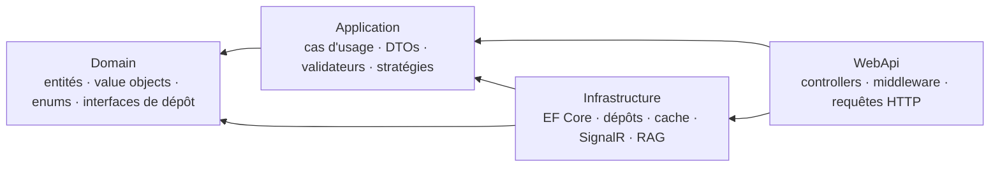
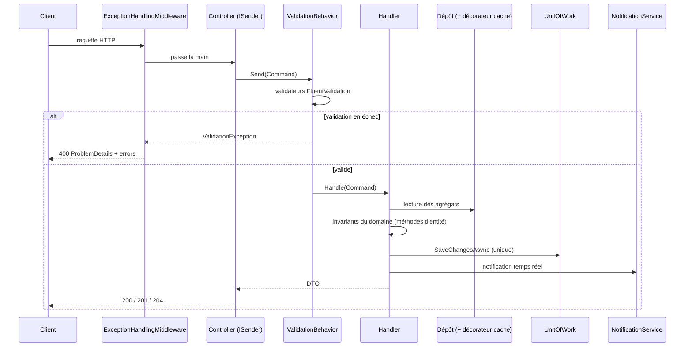
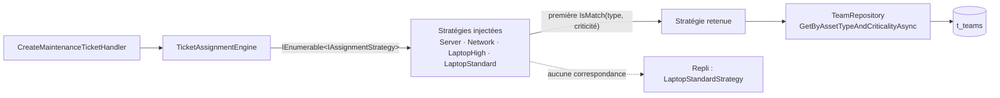
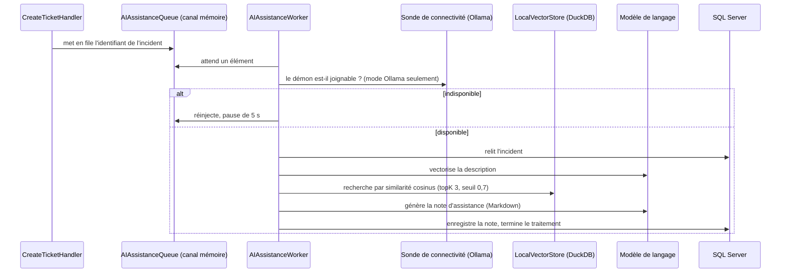
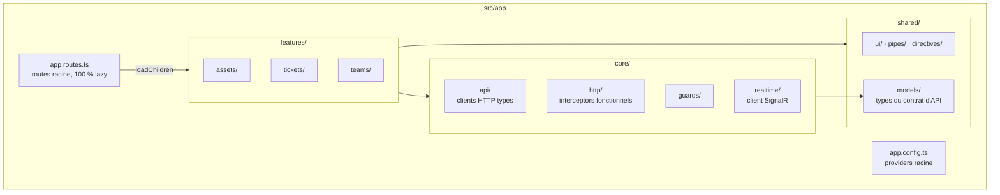
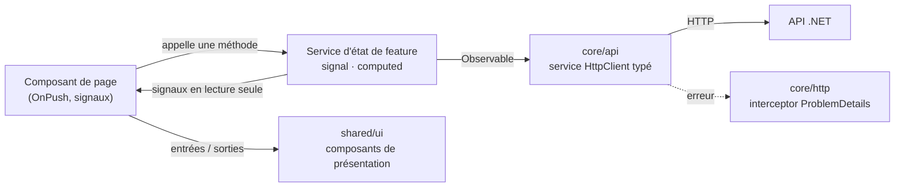
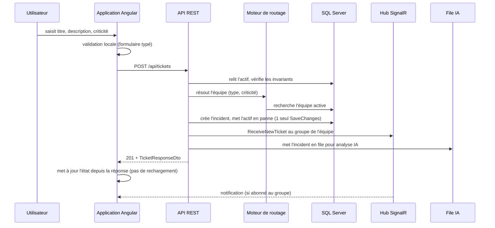
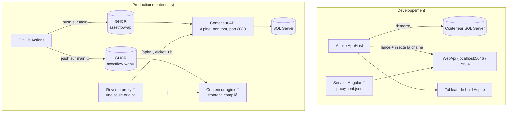

# AssetFlow Core — Architecture (backend et frontend)

**Objet** — Vue structurelle du système : découpage en couches, règles de dépendances, patrons employés, flux de bout en bout, architecture frontend cible, intégration des deux, décisions d'architecture et points de fragilité.

Documents liés : [PRODUCT-REQUIREMENTS.md](PRODUCT-REQUIREMENTS.md) · [PRODUCT-SPECIFICATIONS.md](PRODUCT-SPECIFICATIONS.md) · [TECHNICAL-SPECIFICATION.md](TECHNICAL-SPECIFICATION.md) · [API-Specification.md](API-Specification.md)

> **Provenance.** La partie backend est **relevée dans le code** le 2026-08-04. La partie frontend est une **cible 🎯** : aucun workspace Angular n'existe encore.

---

## 1. Vue d'ensemble

```mermaid
flowchart TB
    subgraph client["Poste utilisateur"]
        SPA["Application Angular 22<br/>(standalone, Signals, zoneless)<br/>socle ✅ · écrans 🎯"]
    end

    subgraph api["AssetFlowCore.WebApi (.NET 8)"]
        REST["API REST<br/>/api/assets · /api/tickets · /api/teams"]
        HUB["Hub SignalR<br/>/ticketHub"]
        WORKER["Worker d'assistance IA<br/>(BackgroundService)"]
    end

    subgraph donnees["Persistance"]
        SQL[("SQL Server<br/>t_assets · t_teams · t_maintenance_tickets")]
        DUCK[("DuckDB local<br/>rag_vectors")]
    end

    LLM["Fournisseur de modèle<br/>Azure OpenAI ou Ollama"]
    OTEL["Collecteur OTLP<br/>(tableau de bord Aspire en dev)"]

    SPA -- "HTTP/JSON" --> REST
    SPA -- "WebSocket" --> HUB
    REST --> SQL
    REST -- "met en file" --> WORKER
    WORKER --> SQL
    WORKER --> DUCK
    WORKER --> LLM
    REST -. "traces, métriques, journaux" .-> OTEL
    WORKER -. .-> OTEL
```

**Caractéristiques structurantes**

- Un **seul processus** héberge l'API REST, le hub temps réel et le worker d'analyse IA : pas de service séparé, pas de courtier de messages.
- La file d'analyse IA est un **canal en mémoire** : elle ne franchit pas la frontière du processus et ne survit pas à un redémarrage.
- La base vectorielle est un **fichier local** : elle n'est pas partagée entre instances, ce qui interdit une mise à l'échelle horizontale de l'analyse IA en l'état.
- L'orchestration locale est assurée par **.NET Aspire**, qui démarre SQL Server en conteneur et injecte la chaîne de connexion.

## 2. Backend — Clean Architecture

### 2.1 Couches et sens des dépendances



Le **domaine ne dépend de rien**. L'application ne connaît ni EF Core ni ASP.NET : elle exprime ses besoins par des interfaces (`IAssetRepository`, `IUnitOfWork`, `INotificationService`, `IAIAssistanceQueue`…) que l'infrastructure implémente. L'inversion de dépendance est donc réelle, pas décorative.

### 2.2 Règles exécutables

Ces règles ne sont pas des conventions écrites : elles sont **vérifiées par `AssetFlowCore.ArchitectureTests` (ArchUnitNET)** et bloquent l'intégration continue.

| Règle | Portée |
|---|---|
| `Domain` ne dépend ni de `Application`, ni de `Infrastructure`, ni de `WebApi` | dépendances |
| `Application` ne dépend ni de `Infrastructure` ni de `WebApi` | dépendances |
| `Infrastructure` ne dépend pas de `WebApi` | dépendances |
| Les propriétés des entités du domaine n'ont **ni setter public ni setter protected** | encapsulation DDD |
| Toute classe `*Handler` réside dans `AssetFlowCore.Application.*` | CQRS |
| Les propriétés des `*Command` et `*Query` sont immuables | CQRS |
| Les dépôts d'infrastructure ne dépendent que d'interfaces de `Domain` ou `Application` | couplage |
| `WebApi` ne dépend d'aucun type `*Repository` | couplage |
| Les interfaces de `Domain` et `Application` sont préfixées `I` | nommage |

Un test vérifie en outre que l'AppHost Aspire déclare bien une ressource SQL Server et un projet exécutable pour l'API.

### 2.3 Flux d'une requête



Points structurants :

- Les controllers n'injectent que `ISender` : ils traduisent une requête HTTP en commande et ne contiennent aucune logique.
- La validation de surface est un **comportement de pipeline** MediatR, pas du code de handler.
- **L'exception est le canal d'erreur** : les handlers lèvent, un middleware unique traduit en `ProblemDetails`.
- **Une seule validation transactionnelle par cas d'usage** (`Unit of Work`), donc atomicité.

### 2.4 Patrons employés

| Patron | Emplacement | Rôle |
|---|---|---|
| **CQRS / tranches verticales** | `Application/UseCases/<Domaine>/<CasDUsage>/` | un dossier = une commande ou requête + son handler + son validateur |
| **Médiateur** | MediatR, `ISender` dans les controllers | découple le point d'entrée du cas d'usage |
| **Comportement de pipeline** | `ValidationBehavior` | validation transverse avant tout handler |
| **Stratégie** | `IAssignmentStrategy` + `TicketAssignmentEngine` | routage des incidents extensible sans modification du code existant |
| **Décorateur** | `CachedAssetRepository`, `CachedTeamRepository` | cache mémoire transparent autour des dépôts EF |
| **Unit of Work** | `UnitOfWork` | validation transactionnelle unique, accès groupé aux dépôts |
| **Dépôt** | `Domain/Repositories` + implémentations EF | isole la persistance du domaine |
| **Value Object** | `SerialNumber` | normalisation et invariants du numéro de série |
| **Options** | `DatabaseOptions` | configuration typée |
| **File + worker** | `AIAssistanceQueue` (canal) + `AIAssistanceWorker` | sortie du traitement IA du chemin de requête |
| **Abstraction de notification** | `INotificationService` | SignalR en production, implémentation neutre en benchmark |

### 2.5 Moteur de routage (Stratégie)



Deux propriétés à connaître :

- **L'ordre d'enregistrement dans le conteneur d'injection fait office de priorité** : le moteur retient la *première* stratégie correspondante. Réordonner les enregistrements change le comportement fonctionnel.
- Le couple (type d'actif, criticité) est stocké **en texte** sur l'équipe et comparé au nom de la valeur d'énumération. L'extensibilité est donc totale (ajouter une stratégie + des données), mais le typage fort s'arrête à la frontière de la base.

### 2.6 Pipeline d'assistance IA



Chaque incident est traité dans une **portée d'injection dédiée** (`CreateAsyncScope`), ce qui libère proprement la connexion DuckDB (`IAsyncDisposable`). La bascule Azure OpenAI / Ollama se fait par configuration ; la sonde de connectivité n'est enregistrée qu'en mode Ollama et le worker la résout de façon facultative.

⚠️ **Aucun code de production n'alimente `rag_vectors`** : la recherche de similarité ne retourne jamais rien et la note est produite sans contexte historique. Le mécanisme est complet, le corpus est vide.

### 2.7 Persistance

- Un `DbContext` par requête, fourni par Aspire ; configurations `IEntityTypeConfiguration` découvertes par assembly.
- Énumérations converties en chaînes, `SerialNumber` en type possédé, index uniques sur le numéro de série et le nom d'équipe, clés étrangères en `RESTRICT`.
- **Concurrence optimiste** sur les incidents (`row_version`) ; conflit traduit en 409.
- Lectures d'inventaire en `AsNoTracking` derrière un cache mémoire de 5 minutes ; lectures destinées à une mutation **suivies** par le change tracker (`GetByIdAsync` tracké, `GetByIdWithTrackingAsync` pour l'accès explicite).
- Les mises à jour et suppressions d'équipes utilisent `ExecuteUpdate`/`ExecuteDelete` en relationnel, avec un chemin de repli pour le fournisseur InMemory des tests.

## 3. Frontend — Architecture ✅ socle en place (2026-08-05)

Le workspace `AssetFlowCore.WebUI` matérialise ce découpage depuis le Lot 3 : `core/` (api, http, auth, realtime), `shared/` (models) et `features/` existent, les écrans restant à produire au Lot 5. Les règles de dépendances ci-dessous sont **contrôlées par une commande** (`npm run verifier:dependances`), à l'image des tests ArchUnitNET du backend.

### 3.1 Découpage orienté fonctionnalités



**Règles de dépendances** (miroir frontend des règles backend) : `features/` → `shared/` + `core/` ; `shared/` sans dépendance métier ni réseau ; `core/` sans dépendance à `features/` ; **aucun import croisé entre deux features** — ce qui est partagé remonte dans `shared/`.

### 3.2 Flux de données dans une feature



- L'état vit dans un **service de feature** exposant des signaux en lecture seule ; le composant ne fait que lire et déclencher.
- Les composants de `shared/` sont **purement présentationnels** : ils reçoivent des données et émettent des intentions, sans connaître ni HTTP ni routeur.
- Les erreurs sont normalisées une seule fois, dans un interceptor.

### 3.3 Propriété des zones de code

Le dépôt définit des agents spécialisés dont les périmètres délimitent l'architecture (`.claude/agents/`) :

| Zone | Responsable |
|---|---|
| workspace, configuration globale, routing racine | `angular-architect` |
| `features/` : écrans, logique, navigation | `angular-feature-dev` |
| `shared/` : design system, styles, thèmes, accessibilité | `ui-ux-designer` |
| `shared/models/`, `core/api/`, `core/http/`, `core/realtime/` | `dotnet-api-bridge` |
| revue de code | `angular-code-reviewer` · `dotnet-code-reviewer` |

## 4. Intégration backend ↔ frontend

### 4.1 Ouverture d'un incident, de bout en bout



### 4.2 Contraintes de couplage

| Sujet | Contrainte architecturale |
|---|---|
| **CORS** | politique active **en Development uniquement** → en production, même origine reconstituée par un reverse proxy devant deux images (`AD-23`) ; en développement, proxy du serveur Angular |
| **Contrat de types** | dérivé du C# ; propriétés `camelCase`, **valeurs d'enums `PascalCase`** ; aucune génération automatisée en place hors skill `/sync-api-dtos` |
| **Versioning d'API** | `AD-21` : URL sous `/api/v1/...`, à appliquer **avant** la construction des écrans. Sans période de dépréciation : une rupture reste coordonnée dans le même changement que la mise à jour du contrat documenté et des types frontend |
| **Authentification** | `AD-22` : jeton `JWT Bearer` obtenu de l'annuaire d'entreprise. Le frontend ne détient aucun secret ; les rôles arrivent en revendication et pilotent aussi bien les guards de route que le masquage des actions |
| **Codes de statut** | 404 pour une ressource absente de l'URI, 400 pour une référence invalide du corps : le client distingue les deux cas sans lire le message |
| **Cohérence de lecture** | cache serveur de 5 minutes sur les **listes**, invalidé par les écritures : une relecture après écriture est fiable |
| **Temps réel** | le groupe d'abonnement est un **nom d'équipe** ; sans notion d'utilisateur, l'appartenance à une équipe n'est pas déterminable côté client |
| **Sécurité** | `AD-22` réalisée (Lot 7) côté API : JWT Bearer requis, rôles vérifiés côté serveur. Côté frontend, MSAL alimente le contexte utilisateur, mais reste **inerte** tant que le tenant Entra ID n'est pas enregistré (étape 7.0) |

## 5. Déploiement



**Décision 0.13 (`AD-23`)** : deux images sont publiées et réunies par un reverse proxy frontal, qui reconstitue la **même origine** — frontend en racine, API sous `/api/v1`, WebSockets passés vers `/ticketHub`. Ce proxy n'est pas une commodité : hors Development l'API n'applique aucune politique CORS, donc sans lui l'appel navigateur échoue.

Le pipeline enchaîne compilation et vérification de format, tests d'architecture, tests unitaires et d'intégration, benchmarks, portail qualité SonarCloud, puis publication de l'image. Détail dans [TECHNICAL-SPECIFICATION.md](TECHNICAL-SPECIFICATION.md#19-intégration-continue).

## 6. Décisions d'architecture

| # | Décision | Contexte | Conséquences |
|---|---|---|---|
| AD-01 | **Clean Architecture en quatre couches** | isoler le métier des choix techniques | dépendances contrôlées et **vérifiées automatiquement** ; coût : plus de fichiers, indirections par interfaces |
| AD-02 | **CQRS en tranches verticales avec MediatR** | un cas d'usage = un dossier autonome | ajout de fonctionnalité sans toucher l'existant ; les handlers sont enregistrés **deux fois** (scan MediatR + `AddScoped` explicite pour les benchmarks), ce qui doit être maintenu de pair |
| AD-03 | **Validation par comportement de pipeline** | éviter la validation dispersée dans les handlers | contrôle systématique et homogène ; la validation métier profonde reste dans les entités |
| AD-04 | **L'exception comme canal d'erreur** | simplicité des handlers, traduction centralisée | code de cas d'usage lisible ; toute exception non prévue par le middleware devient un 500, d'où la règle : une règle métier lève une `DomainException`, jamais une exception technique |
| AD-05 | **Routage par stratégies + données de référence** | ouvrir l'extension sans modifier le code | nouvelle règle = nouvelle classe + nouvelle équipe ; dépendance forte à un référentiel complet, et priorité déterminée par l'ordre d'injection |
| AD-06 | **Cache par décorateur** plutôt que dans les dépôts | garder les dépôts ignorants du cache | gain mesuré considérable en lecture ; **l'invalidation reste une responsabilité manuelle** à tenir dans chaque décorateur, complétée par une invalidation des listes à la persistance ; le cache porte sur les listes, jamais sur un actif lu par identifiant en vue d'une mutation |
| AD-07 | **Mapping DTO manuel** | éviter la réflexion d'un mapper | coût CPU quasi nul, contrat explicite ; maintenance à la main à chaque évolution de DTO |
| AD-08 | **Concurrence optimiste sur les incidents** | plusieurs techniciens sur le même incident | conflit détecté et traduit en 409 ; le client doit savoir recharger |
| AD-09 | **Orchestration Aspire en développement** | démarrer la base et l'API d'un seul geste | expérience de développement fluide, télémétrie intégrée ; la clé de chaîne de connexion devient `assetflow-db`, ce qui complique l'exécution hors Aspire |
| AD-10 | **Base vectorielle DuckDB locale** | pas de service vectoriel externe à exploiter | aucune dépendance d'infrastructure ; fichier **local**, donc pas de partage entre instances ni de mise à l'échelle horizontale |
| AD-11 | **File d'analyse IA en mémoire** | sortir l'IA du chemin de requête sans courtier | réponse HTTP non pénalisée ; **demandes perdues au redémarrage**, aucune reprise |
| AD-12 | **Frontend Angular standalone + Signals** ✅ (2026-08-05) | aligner sur les pratiques Angular 22 | pas de `NgModule`, réactivité fine, moins de RxJS ; NgRx SignalStore indisponible en stable pour Angular 22, donc Signals natifs |
| AD-15 | **Détection de changement zoneless** ✅ (2026-08-05) | défaut d'Angular 22, cohérent avec Signals + `OnPush` partout | `zone.js` absent du lot livré ; en contrepartie, tout état modifié hors d'un signal ne déclenche aucun rendu — contrainte à tenir dans chaque feature |
| AD-16 | **Erreurs d'API normalisées une seule fois, dans un intercepteur** ✅ (2026-08-05) | éviter que chaque écran réinterprète les codes HTTP et le format `ProblemDetails` | les écrans reçoivent une `ApiError` porteuse d'une nature et d'un dictionnaire par champ ; en contrepartie, un appelant qui attendrait un `HttpErrorResponse` ne le trouvera plus |
| AD-17 | **Règles de dépendances du frontend vérifiées par une commande** ✅ (2026-08-05) | une convention qu'aucune commande ne contrôle finit enfreinte sans que personne ne le voie | `npm run verifier:dependances`, pendant de `AssetFlowCore.ArchitectureTests` ; contrôle textuel des imports **relatifs**, moins fin qu'une analyse du graphe de modules |
| AD-18 | **Tailwind 4 sans bibliothèque de composants** ✅ (2026-08-05) | garder la main sur le rendu, les jetons et l'accessibilité ; les composants réellement demandés (table basculant en cartes, badges métier) n'existent dans aucune bibliothèque | contrôle total et lot livré léger ; en contrepartie, **chaque état** (survol, focus, désactivé, invalide) est à écrire, et l'accessibilité repose sur nous — `@angular/cdk` n'est pris que pour le piège de focus |
| AD-19 | **Jetons de couleur déclarés une seule fois avec `light-dark()`** ✅ (2026-08-05) | un thème sombre maintenu dans un bloc parallèle dérive du thème clair sans que rien ne le signale | une seule déclaration par jeton, et `color-scheme` arbitre ; la bascule explicite l'emporte dans les deux sens. Contrepartie : dépend d'une fonction CSS récente (indisponible avant Safari 17.5), et les contrastes doivent être calculés — d'où `npm run verifier:contrastes` |
| AD-20 | **Composants de formulaire recevant le `FormControl` en entrée** (approche A) ✅ (2026-08-05) | éviter le contrat implicite de `ControlValueAccessor`, dont un `setDisabledState` oublié casse silencieusement | API typée de bout en bout, `disable()` opérant sans code ; en contrepartie, les composants ne s'utilisent **pas** avec `formControlName` ni `ngModel` |
| ~~AD-13~~ | ~~**Absence de versioning d'API**~~ — **révisée le 2026-08-05 par AD-21** | contexte de projet unique | simplicité immédiate ; toute évolution de contrat était cassante pour le client |
| ~~AD-14~~ | ~~**Aucune authentification** (état de fait, non décidé)~~ — **tranchée le 2026-08-05 par AD-22, appliquée au Lot 7** | portée initiale d'exemple | API ouverte : incompatible avec une mise en service, et bloquant pour tout écran contextualisé. **N'est plus l'état du code** depuis le Lot 7 — seul le tenant Entra ID réel (étape 7.0) reste à enregistrer |
| AD-21 | **URL d'API versionnées** ✅ (2026-08-05, décision 0.15) | une rupture de contrat non annoncée casse le client sans avertissement, et le Lot 2 en a produit plusieurs | les 15 endpoints passent sous `/api/v1/...` avant la construction des écrans. Coût immédiat : routes, documentation, tests d'intégration, 3 services frontend, relevé du skill `/sync-api-dtos`. Pas de période de dépréciation : le seul client est livré depuis ce dépôt. Révise `AD-13` |
| AD-22 | **Authentification déléguée à l'annuaire d'entreprise** (2026-08-05, décision 0.1) — **appliquée au Lot 7** | les utilisateurs d'un back-office interne existent déjà dans l'annuaire ; gérer des mots de passe dans l'API serait la surface d'attaque la plus large pour le moindre bénéfice | OIDC, jetons `JWT Bearer` validés côté API (`AddJwtBearer`, `[Authorize]` sur les trois contrôleurs et le hub SignalR), rôles dérivés des groupes d'annuaire (revendication `roles`) ; aucun secret d'utilisateur en base. En contrepartie, une dépendance d'exploitation forte : sans tenant ni enregistrement d'application réel (étape 7.0), toute requête protégée échoue. Remplace `AD-14` |
| AD-23 | **Frontend en conteneur nginx dédié** (2026-08-05, décision 0.13) | séparer les cycles de livraison du frontend et de l'API, et maîtriser les en-têtes de cache | deux images publiées vers GHCR. En contrepartie, la contrainte de **même origine n'est pas résolue par construction** : un reverse proxy frontal devient obligatoire (étape 8.5), l'API n'appliquant aucune politique CORS hors Development |
| AD-24 | **Historique de transferts en entité dédiée** (2026-08-05, décision 0.5) | le motif était concaténé à `Description`, ce qui détruit le texte saisi par le technicien et rend le routage inauditable | une entité de plus et une migration ; en retour, la description redevient immuable et l'historique de routage devient exploitable — c'est la donnée qui révèle un référentiel mal configuré (`RM-12`) |
| AD-25 | **Corpus vectoriel alimenté à la clôture** (2026-08-05, décision 0.7) | `UpsertVectorAsync` n'était appelé par aucun code de production : la recherche de similarité ne pouvait rien retourner | l'assistance au diagnostic s'appuie enfin sur des cas comparables, au prix d'un embedding supplémentaire par clôture et d'une commande de rétro-indexation. La limite d'`AD-10` demeure : le fichier DuckDB est local, donc ni partagé ni cohérent entre répliques |
| AD-26 | **Actif au rebut réversible** (2026-08-05, décision 0.4) | l'unicité du numéro de série s'étend aux actifs au rebut : un rebut par erreur rendait l'équipement définitivement non réenregistrable | `Decommissioned` cesse d'être un état terminal — une transition de retour, réservée à un rôle et portant un motif, s'ajoute au cycle de vie de l'actif. En contrepartie, l'invariant « l'état de l'actif n'est jamais saisi » admet désormais une exception explicite |

## 7. Points de fragilité architecturale

Classés par cause racine, avec la conséquence observable et la piste de correction.

| Cause racine | Conséquence | Piste |
|---|---|---|
| **Fin de traitement asynchrone non notifiée** : `is_ai_processing` et `assistance_note` sont exposés, mais leur évolution n'est annoncée par aucun événement | l'interface doit relire l'incident pour découvrir la note | émettre une notification temps réel en fin d'analyse |
| **Corpus vectoriel jamais alimenté** | recherche de similarité systématiquement vide | ✅ **décidé** (`AD-25`) : indexation à la clôture et rétro-indexation des incidents déjà clos — Lot 6 |
| **Description d'incident utilisée comme journal** : `TransferToTeam` concatène le motif de transfert à `Description` | le texte saisi par le technicien est altéré définitivement, et le routage est inauditable | ✅ **décidé** (`AD-24`) : entité d'historique dédiée — §5.1 du plan |
| **Numéro de série réservé par un actif au rebut**, alors que l'état est terminal | un rebut par erreur interdit définitivement de réenregistrer la machine | ✅ **décidé** (`AD-26`) : remise en service réservée à un administrateur — §5.1 du plan |
| **Portée du processus unique** : API, hub et worker ensemble ; file et base vectorielle locales | mise à l'échelle horizontale impossible sans perte de fonctionnalité | file et vecteurs externalisés si la charge le justifie |
| **Configuration à trois noms de clé pour une même chaîne de connexion** | exécution par composition Docker inopérante sans ajustement | une clé unique, documentée |
| **Migrations non appliquées au démarrage** | une base neuve n'a ni schéma ni équipes de référence tant que `dotnet ef database update` n'a pas été lancé | intégrer l'application des migrations au processus de déploiement |
| **Cache d'équipe mis à jour avant persistance** : les décorateurs réécrivent l'entrée de cache dans `AddAsync`/`UpdateAsync`, avant `SaveChangesAsync` | un échec de persistance laisse une valeur non persistée en cache jusqu'à 5 minutes | invalider plutôt que réécrire, ou déplacer la réécriture après la persistance |
| **Tests empruntant un chemin distinct de la production** (dépôts d'équipe, fournisseur InMemory) | faux sentiment de couverture | tests d'intégration sur un vrai SQL Server (conteneur éphémère) |

Aucune de ces fragilités n'est bloquante pour le fonctionnement nominal en développement ; celle du numéro de série réservé (`AD-26`) reste à traiter avant toute mise en service — l'authentification (`AD-22`) qui devait l'accompagner est, elle, appliquée depuis le Lot 7.

Les fragilités marquées ✅ **décidé** ont reçu leur arbitrage au Lot 0 le 2026-08-05 : la décision est écrite et ordonnancée, le code reste à écrire.

### Fragilités levées par le Lot 2 (2026-08-05)

| Cause racine | Correction appliquée |
|---|---|
| **Ressources introuvables traitées comme des violations métier** | `NotFoundException` dédiée, mappée en 404 ; une référence invalide portée par le corps reste un 400, la distinction étant explicite dans le contrat |
| **Contrat de sortie incomplet** : incidents et équipes amputés de champs déjà persistés | DTOs enrichis, fiche d'actif et endpoints de liste ajoutés — 7 écrans sur 9 deviennent réalisables |
| **Lecture des incidents limitée à l'unité** | recherche paginée avec filtres et tri, le décompte total étant renvoyé avec la page |

### Fragilités levées par le Lot 1 (2026-08-05)

| Cause racine | Correction appliquée |
|---|---|
| **Deux chemins vers la même abstraction** : `IUnitOfWork` instanciait les dépôts EF directement | `UnitOfWork` reçoit ses dépôts du conteneur ; les listes en cache sont invalidées à la persistance, y compris pour les mutations d'entités suivies |
| **Exceptions métier non homogènes** : `MaintenanceTicket` levait `InvalidOperationException` | les transitions d'état lèvent une `DomainException`, traduite en 400 |
| **Invariants d'unicité délégués à la base** : nom d'équipe unique en index seulement | contrôle applicatif à la création et au renommage, l'index restant un garde-fou |
| **Sondes de santé conditionnées à l'environnement** | `/health` et `/alive` exposées dans tous les environnements |
| **Absence de jeton d'annulation aux points d'entrée** | `CancellationToken` propagé du controller aux dépôts ; notification SignalR et mise en file IA volontairement exclues, car postérieures à la persistance |
| **Absence de données de référence** : aucune équipe sur une base neuve | migration `SeedReferenceTeams` couvrant les 9 combinaisons (type × criticité) |
| **Message d'exception brut renvoyé en 500** | `detail` générique et `traceId`, message journalisé côté serveur |
