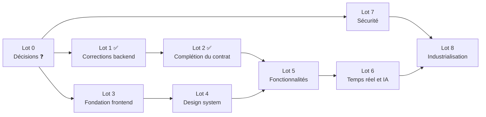
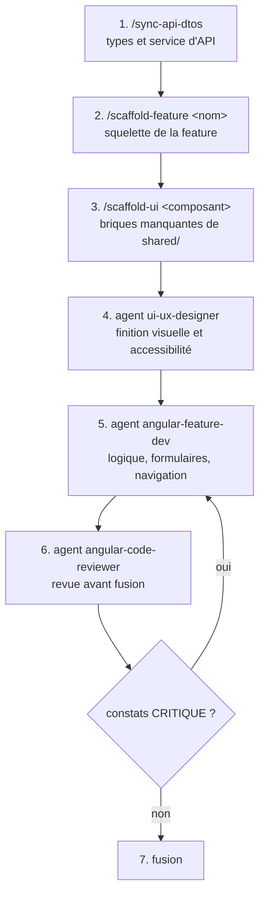

# AssetFlow Core — Plan d'implémentation

**Objet** — Stratégie d'exécution, séquencement des lots, étapes détaillées avec l'agent ou le skill à mobiliser, et règles d'acceptation. Ce document est **opérationnel** : il indique quoi faire, dans quel ordre, par quel moyen, et à quelle condition c'est terminé.

Documents de référence : [PRODUCT-REQUIREMENTS.md](PRODUCT-REQUIREMENTS.md) (exigences `EF-xx` / `ENF-xx`) · [PRODUCT-SPECIFICATIONS.md](PRODUCT-SPECIFICATIONS.md) (règles `RM-xx`, écrans `E-xx`, parcours `P-xx`) · [ARCHITECTURE.md](ARCHITECTURE.md) (décisions `AD-xx`, fragilités) · [TECHNICAL-SPECIFICATION.md](TECHNICAL-SPECIFICATION.md) · [API-Specification.md](API-Specification.md)

**Légende** : ✅ fait · 🎯 à faire · ⛔ bloquant · ❓ décision attendue · Charge relative **S** (petit) / **M** (moyen) / **L** (important)

> **Aucune date n'est engagée dans ce document.** Les charges relatives comparent les lots entre eux ; leur traduction en calendrier dépend de l'équipe affectée et doit être établie par elle.

---

## 1. Point de départ

| Domaine | État vérifié au 2026-08-05 |
|---|---|
| Backend | ✅ fonctionnel : 15 endpoints, 216 tests unitaires verts, tests d'architecture et d'intégration, benchmarks, CI/CD complète, déploiement conteneurisé ; **Lots 1 et 2 appliqués** |
| Contrat d'API | ✅ complété : listes d'incidents (paginée) et d'équipes, fiche d'actif, DTOs enrichis, 404 pour les ressources absentes, `Location` sur les créations |
| Sécurité | ⛔ aucune authentification ni autorisation |
| Frontend | ✅ socle en place : workspace Angular 22 `AssetFlowCore.WebUI` (standalone, Signals, zoneless, Vitest), types du contrat, 3 services d'API, intercepteurs d'erreurs et de jeton, client SignalR, 47 tests verts ; **Lot 3 appliqué**. Aucun écran produit (`E-01`→`E-09` au Lot 5) |
| Assistance IA | 🟡 mécanisme complet mais corpus vectoriel vide et état non exposé |
| Documentation | ✅ produit, fonctionnel, technique, architecture, contrat d'API |
| Outillage Claude Code | ✅ 6 agents, 3 skills |

## 2. Stratégie d'exécution

**Principe 1 — Corriger le contrat avant de le consommer.** Le frontend consomme des types dérivés du C#. Toute évolution de contrat effectuée *après* la construction d'un écran provoque une reprise du typage, des services et des tests. Les lots de complétion du contrat (Lot 2) passent donc **avant** les lots de fonctionnalités (Lot 5).

**Principe 2 — Paralléliser ce qui ne partage pas de contrat.** La fondation du frontend (Lot 3) et le design system (Lot 4) ne dépendent d'aucun endpoint : ils démarrent immédiatement, en parallèle des lots backend.

**Principe 3 — Traiter d'abord les corrections à fort effet et faible risque.** L'invalidation du cache, les sondes de santé et l'homogénéisation des exceptions (Lot 1) sont de petites modifications qui suppriment des comportements trompeurs. Les faire tôt évite de construire des contournements dans le frontend.

**Principe 4 — Ne jamais livrer un écran sur un endpoint absent.** Un parcours dont l'endpoint manque est reporté, jamais simulé avec des données fictives. Les agents ont cette consigne inscrite dans leur définition.

**Principe 5 — La vérification fait partie de l'étape.** Une étape n'est pas terminée sur une affirmation : elle l'est sur une sortie de commande (compilation, tests) et, pour l'interface, sur le passage de la liste de contrôle d'accessibilité.

**Principe 6 — Chaque lot passe par un relecteur avant fusion.** `dotnet-code-reviewer` pour le backend, `angular-code-reviewer` pour le frontend. Ces agents sont en lecture seule : ils produisent des constats, la correction reste à la charge de l'implémenteur.

**Séquencement retenu**

**Point d'attention sur les ressources** : il n'existe **aucun agent d'implémentation backend**. Les lots 1, 2, 6 et 7 sont réalisés en session principale ou par un développeur, avec `dotnet-code-reviewer` en relecture. Créer un agent `dotnet-dev` est une option si le volume backend augmente.

---

## 3. Lot 0 — Décisions préalables ⛔

**Objectif** : lever les sept questions produit et les huit questions techniques qui conditionnent les lots suivants. **Aucun code n'est écrit dans ce lot.**

| # | Décision | Bloque | Charge |
|---|---|---|---|
| 0.1 | Niveau d'authentification visé (interne, annuaire d'entreprise, fournisseur d'identité externe) | Lot 7 entier | S |
| 0.2 | Techniciens nominatifs ou prise en charge collective | forme de `EF-21`, contrat des incidents | S |
| 0.3 | Sort du statut `Resolved` (étape réelle ou suppression) | Lot 2, cycle de vie | S |
| 0.4 | Irréversibilité de la mise au rebut | `EF-09` | S |
| 0.5 | Historisation séparée du motif de transfert | `RM-21`, contrat des incidents | S |
| 0.6 | Désactivation d'équipe en remplacement de la suppression | `EF-28` | S |
| 0.7 | Indexation des incidents clôturés dans la base vectorielle | Lot 6, valeur de l'IA | M |
| ~~0.8~~ | ~~Nom du dossier du workspace frontend~~ — **tranchée le 2026-08-05** : dossier `AssetFlowCore.WebUI/`, projet npm `assetflow-webui` (les majuscules et le point sont interdits dans un nom de paquet npm, d'où la dissociation) | Lot 3 | S |
| 0.9 | Framework CSS (Tailwind · Material · DaisyUI+Tailwind · SCSS) | Lot 4 | M |
| ~~0.10~~ | ~~Rendu serveur (SSR) ou application cliente seule~~ — **tranchée le 2026-08-05** : **application cliente seule**, pas de SSR (back-office interne destiné à passer derrière authentification, aucun enjeu de référencement ni de premier affichage public ; déploiement statique aligné sur la contrainte de même origine) | Lot 3, Lot 8 | M |
| ~~0.11~~ | ~~Runner de tests frontend~~ — **tranchée le 2026-08-05** : **Vitest** (voie moderne du CLI, aucun navigateur à piloter en CI, couverture lcov directement exploitable par SonarCloud) | Lot 3 | S |
| 0.12 | Stratégie d'état (Signals natifs — défaut — ou SignalStore en préversion) | Lot 5 | S |
| 0.13 | Mode de déploiement du frontend (conteneur dédié, servi par l'API, statique + reverse proxy) | Lot 8, contrainte CORS | M |
| ~~0.14~~ | ~~Périmètre de la pagination et du filtrage serveur des listes~~ — **tranchée le 2026-08-05** : enveloppe JSON paginée sur `GET /api/tickets` (filtres état, criticité, équipe, actif ; tri ; taille de page ≤ 100) ; inventaire et équipes servis en intégralité | Lot 2 | M |
| 0.15 | Politique de rupture de contrat (versioning d'API ou coordination directe) | Lot 2 | S |

**Étapes**

1. Faire relire [PRODUCT-REQUIREMENTS.md](PRODUCT-REQUIREMENTS.md) §8 et [TECHNICAL-SPECIFICATION.md](TECHNICAL-SPECIFICATION.md) §2.6 par le responsable produit et le responsable technique.
2. Consigner chaque arbitrage **dans le document concerné**, en remplaçant le marqueur ❓ par la décision et sa date.
3. Pour les décisions techniques 0.9 à 0.13, mobiliser l'agent `angular-architect` (0.8, 0.10, 0.11, 0.13) et `ui-ux-designer` (0.9) afin qu'ils présentent les options avec leurs conséquences — ils ont pour consigne de ne rien installer sans validation.

**Critères d'acceptation**

- Les 15 décisions sont tranchées et écrites, aucun ❓ résiduel sur le périmètre des lots 1 à 5.
- Les documents affectés sont mis à jour dans le même lot.

---

## 4. Lot 1 — Corrections backend à faible risque, fort effet ✅ (2026-08-05)

**Objectif** : supprimer les comportements trompeurs avant que le frontend ne se construise autour. **Aucune rupture de contrat.**

| # | Étape | Réalisation | Vérification | Charge |
|---|---|---|---|---|
| 1.1 ✅ | **Invalider le cache d'inventaire lors des écritures** — faire résoudre les dépôts de `UnitOfWork` par le conteneur d'injection au lieu de les instancier (`new AssetRepository(context)`), afin que les décorateurs de cache soient traversés | session principale | `AssetInventoryCacheTests` (2 tests) · `UnitOfWorkCompositionTests` (2 tests) | M |
| 1.2 ✅ | **Exposer les sondes de santé hors Development** — `MapDefaultEndpoints` conditionne `/health` et `/alive` à l'environnement, alors que le Dockerfile et la composition Docker les interrogent en Production | session principale | `HealthEndpointsTests` — `/health` et `/alive` en environnement `Production` | S |
| 1.3 ✅ | **Homogénéiser les exceptions métier** — `MaintenanceTicket.AssignToTechnician()` et `Close()` lèvent `InvalidOperationException`, remontée en 500 ; basculer sur `DomainException` (ou étendre le middleware) | session principale | `AssignTicket_WhenAlreadyAssigned` et `CloseTicket_WhenNotInProgress` → **400** | S |
| 1.4 ✅ | **Contrôler l'unicité du nom d'équipe applicativement** — `ExistsWithNameAsync` existe mais n'est pas appelée ; le doublon remonte en 500 par violation d'index | session principale | `CreateTeam_WithDuplicateName` et `UpdateTeam_WithNameOfAnotherTeam` → 400 avec message métier | S |
| 1.5 ✅ | **Corriger les messages de validation de criticité** — copiés depuis le type d'actif dans `CreateTeamCommandValidator` et `UpdateTeamCommandValidator` | session principale | 3 tests de validateur sur les messages attendus | S |
| 1.6 ✅ | **Valider réellement la criticité à l'ouverture d'un incident** — la règle actuelle ne contrôle que la présence, malgré son message ; ajouter `IsEnumName` | session principale | `CreateMaintenanceTicketValidatorTests` — criticité `Urgent` rejetée sur le champ | S |
| 1.7 ✅ | **Ne plus divulguer le message d'exception brut** en réponse 500, tout en le journalisant | session principale | `Request_WhenUnhandledExceptionIsThrown_ShouldReturn500WithoutLeakingMessage` | S |
| 1.8 ✅ | **Propager `CancellationToken`** depuis les controllers jusqu'aux dépôts (compléter `ITeamRepository` et `IMaintenanceTicketRepository`) | session principale | `CancellationTokenPropagationTests` (5 tests) | M |
| 1.9 ✅ | **Amorcer les équipes de référence** — jusqu'à 9 combinaisons (type × criticité) ; migration de données ou commande d'amorçage documentée | session principale | migration `SeedReferenceTeams` · `SeedReferenceTeamsTests` (3 tests) : les 9 combinaisons résolvent une équipe | M |
| 1.10 ✅ | **Relecture du lot** | session principale (aucun agent sollicité) | `dotnet format --verify-no-changes` sans écart · 3 suites vertes · vérification que chaque test ajouté échoue sur le code d'origine | S |
| 1.11 ✅ | **Mise à jour documentaire** — [API-Specification.md](API-Specification.md) §9, [ARCHITECTURE.md](ARCHITECTURE.md) §7, [TECHNICAL-SPECIFICATION.md](TECHNICAL-SPECIFICATION.md) §5 | session principale | les constats corrigés ne figurent plus comme écarts | S |

**Écarts assumés du lot**

- `Program.cs` n'applique toujours aucune migration au démarrage : l'amorçage de 1.9 suppose `dotnet ef database update` (étape 8.6).
- La vérification de 1.2 par `docker compose up` n'a pas été exécutée (Docker non sollicité) ; elle est couverte par un test d'intégration en environnement `Production`.
- Corrections adjacentes nécessaires à 1.1, hors énoncé initial : `UpdateTeamCommandHandler` appelle désormais `ITeamRepository.UpdateAsync` (l'équipe étant lue sans suivi de modifications, la mise à jour n'était pas persistée), et les lectures d'actif par identifiant ne sont plus mises en cache (elles alimentent des cas d'usage d'écriture).

**Critères d'acceptation du lot**

- `dotnet build` et les trois suites de tests passent ; `dotnet format --verify-no-changes --severity warn` sans écart ; portail SonarCloud franchi.
- Chaque correction est couverte par **au moins un test** qui échouait avant.
- Aucun endpoint existant ne change de forme de requête ni de code de succès.
- Les documents cités en 1.11 ne mentionnent plus les écarts corrigés.

---

## 5. Lot 2 — Complétion du contrat d'API ✅ (2026-08-05)

**Objectif** : rendre réalisables les 6 écrans aujourd'hui impossibles ou dégradés. **Ce lot introduit des ruptures de contrat assumées** (décision 0.15).

| # | Étape | Exigence levée | Charge |
|---|---|---|---|
| 2.1 ✅ | `GET /api/tickets` — liste avec filtres (état, criticité, équipe, actif), tri et **pagination** — enveloppe `{ items, page, pageSize, totalCount, totalPages }`, taille de page bornée à 100 (décision 0.14 tranchée le 2026-08-05) | `EF-19`, écran `E-06`, parcours `P-03` | L |
| 2.2 ✅ | `GET /api/teams` — liste des équipes, avec l'état actif ; `?onlyActive=true` pour le sélecteur de transfert | `EF-27`, écran `E-07`, parcours `P-05`/`P-08` | M |
| 2.3 ✅ | Enrichir `TicketResponseDto` : `description`, `resolutionComment`, `createdAt`, `assistanceNote`, `isAiProcessing` | `EF-20`, `EF-34`, `EF-35`, écrans `E-05`/`E-08` | M |
| 2.4 ✅ | Enrichir `TeamResponseDto` : `assetType`, `ticketCriticality` | écran `E-07` (préremplissage du formulaire) | S |
| 2.5 ✅ | `GET /api/assets/{id}` — fiche unitaire, avec ses incidents du plus récent au plus ancien | `EF-06`, écran `E-03` | M |
| 2.6 ✅ | Sémantique **404** pour les ressources introuvables — `NotFoundException` mappée ; une référence invalide du **corps** reste un 400 | cohérence REST, `E-01`→`E-09` | M |
| 2.7 ✅ | Aligner `PUT /api/teams/{id}` sur **200** au lieu de 201 | cohérence REST | S |
| 2.8 ✅ | Ajouter l'en-tête `Location` sur les réponses 201 | cohérence REST | S |
| 2.9 ⛔ | Décisions 0.3, 0.5, 0.6 appliquées si retenues (statut `Resolved`, motif de transfert isolé, désactivation d'équipe) | `EF-17`, `EF-28` | M |
| 2.10 ✅ | **Relecture** | session principale (aucun agent sollicité) | S |
| 2.11 ✅ | **Mise à jour du contrat documenté** — [API-Specification.md](API-Specification.md) intégralement | S |
| 2.12 ✅ | **Resynchronisation des types frontend** — réalisée au Lot 3, étape 3.6, une fois le workspace créé | conventions du skill **`/sync-api-dtos`** appliquées aux 3 controllers | S |

**Critères d'acceptation du lot**

- ✅ Chaque nouvel endpoint est couvert par un test d'intégration (cas nominal + cas d'erreur) et documenté dans [API-Specification.md](API-Specification.md).
- ✅ La pagination expose le nombre total d'éléments (`totalCount`), indépendant de la page reçue.
- ✅ Les ressources introuvables renvoient 404 sur **tous** les endpoints à identifiant, sans exception résiduelle.
- ✅ Les types frontend du contrat sont générés (Lot 3, étape 3.6) : `shared/models/` couvre les 3 ressources, l'enveloppe de pagination et `ProblemDetails`.
- ✅ Les écrans `E-05`, `E-06`, `E-07` sont déclarés réalisables dans [PRODUCT-SPECIFICATIONS.md](PRODUCT-SPECIFICATIONS.md) §7 ; `E-08` reste dégradé, la fin d'analyse IA n'étant pas notifiée (Lot 6, étape 6.4).

**Écarts assumés du lot**

- **2.9 reportée** : les décisions 0.3, 0.5 et 0.6 n'étant pas tranchées, le statut `Resolved` reste inatteignable, le motif de transfert reste concaténé à la description et aucune équipe ne peut être désactivée par l'API. Le filtre `onlyActive` et le champ `isActive` sont néanmoins en place pour accueillir la décision 0.6.
- **2.12 reportée puis levée** : aucun workspace Angular n'existait à la clôture du Lot 2 ; la synchronisation a été réalisée au Lot 3, étape 3.6.
- Pagination livrée sur `GET /api/tickets` uniquement ; l'inventaire et les équipes restent des collections complètes, leur volume ne le justifiant pas.

---

## 6. Lot 3 — Fondation frontend ✅ (2026-08-05)

**Objectif** : un workspace Angular 22 qui compile, se teste et appelle l'API en développement.

**Décisions appliquées** : 0.8 → dossier `AssetFlowCore.WebUI/` (projet npm `assetflow-webui`) · 0.10 → application cliente seule · 0.11 → Vitest · mode **zoneless** retenu (défaut d'Angular 22, `zone.js` absent des dépendances), ce qui lève le « à évaluer » de [TECHNICAL-SPECIFICATION.md](TECHNICAL-SPECIFICATION.md) §2.3.

| # | Étape | Réalisation | Vérification | Charge |
|---|---|---|---|---|
| 3.1 ✅ | Créer le workspace (Angular 22.1.0, CLI 22.1.3, standalone, sans SSR, Vitest, zoneless, SCSS) | session principale | `npx ng build` et `npx ng test --watch=false` verts | M |
| 3.2 ✅ | Arborescence `core/` · `shared/` · `features/` et règles de dépendances | session principale | conforme à [ARCHITECTURE.md](ARCHITECTURE.md) §3.1 · règles **vérifiées mécaniquement** par `npm run verifier:dependances` | S |
| 3.3 ✅ | `app.config.ts` : `provideRouter` (+ `withComponentInputBinding`), `provideHttpClient(withFetch(), withInterceptors([...]))`, détection de changement zoneless | session principale | application servie et interrogée sans erreur ; console navigateur **non relevée** (voir écarts) | S |
| 3.4 ✅ | Environnements `environment.ts` / `environment.development.ts` (+ `environment.model.ts` qui interdit la divergence des clés), `fileReplacements` dans `angular.json` | session principale | `apiBaseUrl` consommé par les 3 services et le client SignalR, aucune URL en dur | S |
| 3.5 ✅ | `proxy.conf.json` vers `https://localhost:7138` (`/api` et `/ticketHub`, `secure: false`, `ws: true`), branché sur la cible `serve` | session principale | appel réel traversant le proxy jusqu'à la **vraie API** : 400 de validation et 500 authentiques, sans erreur CORS ni refus de certificat. Succès sur données réelles **non vérifié** (voir écarts) | S |
| 3.6 ✅ | Modèles de contrat et services d'API des 3 ressources | conventions du skill **`/sync-api-dtos`**, contrat relu dans le C# (post-Lot 2) | types conformes, JSDoc par méthode (verbe, route, code de succès réel, erreurs, fichier C# d'origine) | M |
| 3.7 ✅ | Intercepteur d'erreurs `ProblemDetails` et modèle d'erreur partagé `ApiError` (`validation`, `business`, `notFound`, `conflict`, `server`, `network`) | session principale | 9 tests avec `provideHttpClientTesting()` : 400 avec `errors`, 400 métier, 404, 409, 500, absence de réponse, corps non JSON | M |
| 3.8 ✅ | Squelette d'intercepteur de jeton + `AuthTokenService` sans source | session principale | 4 tests : sans effet sans jeton, en-tête posé dès qu'un jeton existe, jamais hors de l'API | S |
| 3.9 ✅ | Client temps réel typé (`@microsoft/signalr` 10.0.11) sur `/ticketHub`, état en signal, restauration des groupes après reconnexion | session principale | 9 tests sur double de connexion · connexion réelle établie à travers le proxy et `JoinTeamGroup` accepté par le hub | M |
| 3.10 ✅ | **Relecture** | session principale (aucun agent sollicité) | `prettier --check` sans écart · 47 tests verts · règles de dépendances vérifiées | S |

**Critères d'acceptation du lot**

- ✅ `npx ng build` et `npx ng test --watch=false` verts (8 fichiers, **47 tests**), sortie de commande fournie.
- ✅ Aucun `NgModule`, aucune injection par constructeur, aucun `any`, aucun `*ngIf`/`*ngFor` ; `OnPush` sur chaque composant.
- 🟡 Un appel réel à l'API aboutit depuis l'application : la chaîne complète (serveur de développement → proxy → API réelle → intercepteur) est vérifiée, mais **aucune réponse 200 sur données réelles** n'a pu l'être, faute de base de données sur le poste (voir écarts).
- ✅ Une erreur 400 produit un objet exploitable par un formulaire : `ApiError.fieldErrors` convertit les clés `PascalCase` du backend en `camelCase`, vérifié sur une réponse **réelle** (`PageSize`, `Status`, `SortBy`).
- ✅ `shared/models/` contient les types dérivés du C#, chaque fichier portant ses sources et sa commande de resynchronisation.

**Écarts assumés du lot**

- **Aucune réponse 200 sur données réelles.** Le poste n'a ni Docker (donc pas d'orchestration Aspire) ni instance SQL Server exploitable : LocalDB est installé mais son processus SQL refuse de démarrer. L'API a donc été lancée avec une base injoignable. Sont vérifiés sur la **vraie API** à travers le proxy : `/alive` (200), `GET /api/assets` (500 authentique, `traceId` inclus), `GET /api/tickets` avec paramètres invalides (400 avec dictionnaire `errors` réel), négociation et connexion `/ticketHub` avec `JoinTeamGroup` accepté. Reste à confirmer sur une base amorcée (étape 8.6).
- **Console du navigateur non relevée** (vérification annoncée en 3.3) : aucun outil de pilotage de navigateur n'était disponible dans la session. Le rendu et les quatre états sont couverts par les tests de composant (jsdom), et l'application a été servie et interrogée sans erreur côté serveur de développement.
- **Un écran hors périmètre produit** : `features/diagnostic/` existe pour prouver la chaîne complète, exigence du critère d'acceptation. Ce n'est aucun des écrans `E-01`→`E-09` ; il doit être supprimé et sa route racine réaffectée à l'inventaire au Lot 5.
- **Aucun agent sollicité** : le lot a été réalisé en session principale, les définitions d'agents servant de référentiel de conventions. Les contrats d'API qu'elles contiennent sont **antérieurs au Lot 2** et ont été ignorés au profit du code C# ; ils gagneraient à être mis à jour (voir §13).
- **Écart de format d'erreur relevé sur l'API** : les réponses d'erreur sortent avec `Content-Type: application/json`, non `application/problem+json` comme l'annonce [API-Specification.md](API-Specification.md) §3 — `WriteAsJsonAsync` écrase le type posé par le middleware. Sans effet sur le frontend (l'intercepteur ne filtre pas sur le type de contenu), mais à corriger côté code ou côté documentation.
- **Framework CSS non installé** (décision 0.9 en attente) : le workspace est en SCSS nu, sans jeton de design ni habillage. C'est le périmètre du Lot 4 ; l'écran de diagnostic est donc sans style.

---

## 7. Lot 4 — Design system 🎯 (dépend de 0.9, parallélisable avec le Lot 2)

**Objectif** : les briques visuelles nécessaires aux écrans, accessibles et cohérentes.

| # | Étape | Réalisation | Charge |
|---|---|---|---|
| 4.1 | Installer et configurer le framework CSS retenu (0.9), après vérification des peer dependencies avec Angular 22 | agent **`ui-ux-designer`** | M |
| 4.2 | Définir les **jetons de design** (couleurs, typographie, espacements, rayons, durées) et le fichier de styles racine | agent **`ui-ux-designer`** | M |
| 4.3 | Mettre en place le **thème clair/sombre** : `prefers-color-scheme` **plus** bascule explicite prioritaire dans les deux sens | agent **`ui-ux-designer`** | M |
| 4.4 | Composants de base : bouton, champ de saisie, sélecteur, zone de texte, case à cocher | skill **`/scaffold-ui`** puis agent **`ui-ux-designer`** | L |
| 4.5 | Composants de structure : carte, table responsive (bascule en cartes sous seuil), modale avec piège et restitution du focus, fil d'ariane | skill **`/scaffold-ui`** puis agent **`ui-ux-designer`** | L |
| 4.6 | Composants d'état : badge d'état et de criticité (couleur **plus** libellé), indicateur de chargement, message vide, message d'erreur, notification | skill **`/scaffold-ui`** puis agent **`ui-ux-designer`** | M |
| 4.7 | Traduction française des valeurs d'énumérations de l'API (pipe ou table de correspondance dans `shared/`) | agent **`ui-ux-designer`** | S |
| 4.8 | **Relecture** | agent **`angular-code-reviewer`** | S |

**Critères d'acceptation du lot**

- Chaque composant passe la **liste de contrôle en 5 points** du skill `/scaffold-ui` : utilisable au clavier seul, nom accessible sur chaque contrôle, focus visible et prévisible, information non portée par la seule couleur, aucune dépendance à `core/` ou `features/`.
- Contraste vérifié **dans les deux thèmes** (≥ 4,5:1 texte, ≥ 3:1 éléments d'interface).
- Rendu correct de **320 px** de large et à **200 % de zoom**, sans débordement horizontal.
- Composants de formulaire compatibles `ReactiveFormsModule` : approche A (contrôle en entrée) ou B (`ControlValueAccessor` complet, `setDisabledState` inclus).
- Aucune couleur, taille ou durée codée en dur hors jetons ; aucun `!important`, aucun `::ng-deep` non justifié.
- API publique de chaque composant documentée (entrées, sorties, valeurs par défaut).

---

## 8. Lot 5 — Fonctionnalités 🎯 (dépend des lots 2, 3 et 4)

**Ordre imposé** : `assets` d'abord (les 2 écrans réalisables aujourd'hui, donc validation la plus rapide de la chaîne complète), puis `tickets` (cœur métier), puis `teams` (administration).

### 5.A Feature `assets`

| # | Étape | Réalisation | Exigences |
|---|---|---|---|
| 5.A.1 | Générer le squelette de la feature | skill **`/scaffold-feature assets`** | — |
| 5.A.2 | Écran inventaire `E-01` : liste, filtrage et tri **côté client** (ou serveur si 0.14 le prévoit), états chargement/vide/erreur | agent **`angular-feature-dev`** | `EF-04` |
| 5.A.3 | Formulaire d'actif `E-02` : validation locale alignée sur `RM-01`→`RM-05`, report des erreurs serveur sur les champs | agent **`angular-feature-dev`** | `EF-01`→`EF-03` |
| 5.A.4 | Mise au rebut avec **confirmation explicite** et message de refus détaillant le nombre d'incidents actifs | agent **`angular-feature-dev`** | `EF-05`, `RM-06` |
| 5.A.5 | Fiche d'actif `E-03` (après 2.5) | agent **`angular-feature-dev`** | `EF-06` |
| 5.A.6 | **Relecture** | agent **`angular-code-reviewer`** | — |

**Critères d'acceptation** : les critères de `P-01` de [PRODUCT-SPECIFICATIONS.md](PRODUCT-SPECIFICATIONS.md) §9 sont tous vérifiés, dont **la liste mise à jour depuis le corps de la réponse `201`** et non par rechargement (jusqu'à correction 1.1, puis à conserver comme bonne pratique).

### 5.B Feature `tickets`

| # | Étape | Réalisation | Exigences |
|---|---|---|---|
| 5.B.1 | Générer le squelette | skill **`/scaffold-feature tickets`** | — |
| 5.B.2 | File de travail `E-06` : liste filtrable et paginée | agent **`angular-feature-dev`** | `EF-19` (après 2.1) |
| 5.B.3 | Formulaire d'ouverture `E-04` : criticité en liste fermée, compteur sur le titre (150), affichage de l'équipe retenue **après** création | agent **`angular-feature-dev`** | `EF-10`→`EF-12` |
| 5.B.4 | Fiche d'incident `E-05` : description, compte rendu, équipe, état | agent **`angular-feature-dev`** | `EF-18`, `EF-20` (après 2.3) |
| 5.B.5 | Actions prise en charge et clôture, avec compte rendu obligatoire et annonce du retour en service de l'actif | agent **`angular-feature-dev`** | `EF-14`→`EF-16` |
| 5.B.6 | Transfert avec **sélecteur d'équipe** (après 2.2) et motif | agent **`angular-feature-dev`** | `EF-17` |
| 5.B.7 | Gestion du **conflit 409** : proposition de rechargement **sans perte de la saisie** | agent **`angular-feature-dev`** | `EF-22`, `RM-22` |
| 5.B.8 | **Relecture** | agent **`angular-code-reviewer`** | — |

**Critères d'acceptation** : critères de `P-02` et `P-04` vérifiés ; distinction visible entre erreur de saisie et **anomalie de configuration du référentiel** (`RM-12`) ; aucune branche de code conditionnée à un 404 avant la livraison de 2.6.

### 5.C Feature `teams`

| # | Étape | Réalisation | Exigences |
|---|---|---|---|
| 5.C.1 | Générer le squelette | skill **`/scaffold-feature teams`** | — |
| 5.C.2 | Écran d'administration `E-07` : liste, création, modification partielle, suppression avec confirmation | agent **`angular-feature-dev`** | `EF-23`→`EF-26` (après 2.2 et 2.4) |
| 5.C.3 | **Contrôle de couverture des 9 combinaisons** (type × criticité) avec alerte sur les combinaisons non couvertes | agent **`angular-feature-dev`** | prérequis de `RM-12` |
| 5.C.4 | Activation / désactivation si retenue en 0.6 | agent **`angular-feature-dev`** | `EF-28` |
| 5.C.5 | **Relecture** | agent **`angular-code-reviewer`** | — |

**Critères d'acceptation** : `P-08` réalisable de bout en bout ; l'écran signale explicitement toute combinaison non couverte, cause première des refus d'ouverture d'incident.

### Critères d'acceptation communs au Lot 5

- Chaque écran gère et distingue **quatre états** : chargement, vide, erreur, contenu.
- Aucune action destructive sans confirmation ; tout déclencheur d'action longue est désactivé pendant l'appel.
- Parcours complet **au clavier seul**, libellés en français, valeurs d'énumérations traduites.
- Aucun `HttpClient` dans un composant ; aucun composant de présentation dupliqué (réutilisation de `shared/`).
- `OnPush` partout, `track` sur chaque `@for`, aucun abonnement non fermé, aucune dérivation par `effect()`.
- Tests : validation de formulaire, dérivations, gestion d'erreur, avec `provideHttpClientTesting()`.

---

## 9. Lot 6 — Temps réel et assistance IA 🎯

| # | Étape | Réalisation | Exigences | Charge |
|---|---|---|---|---|
| 6.1 | Émettre des notifications sur les changements d'état (prise en charge, clôture, transfert), pas seulement à l'ouverture | session principale | `EF-31` | M |
| 6.2 | Indexer les incidents à la clôture dans la base vectorielle (`UpsertVectorAsync` n'est appelé par aucun code de production) | session principale | `EF-33`, décision 0.7 | M |
| 6.3 | Rendre la file d'analyse IA persistante (table d'attente ou file externe) | session principale | `EF-36`, `ENF-15` | L |
| 6.4 | Notifier la fin d'analyse IA d'un incident | session principale | `EF-35` | M |
| 6.5 | Affichage de la note d'assistance `E-08`, avec état « analyse en cours » | agent **`angular-feature-dev`** | `EF-34` | M |
| 6.6 | Abonnement au groupe temps réel de l'équipe de l'utilisateur | agent **`angular-feature-dev`** | `EF-30`, dépend du Lot 7 pour connaître l'équipe | M |
| 6.7 | Reconnexion et information de l'utilisateur en cas de coupure | agent **`angular-feature-dev`** | — | S |
| 6.8 | **Relectures** | agents **`dotnet-code-reviewer`** et **`angular-code-reviewer`** | — | S |

**Critères d'acceptation** : un incident clôturé est retrouvable par similarité pour un incident ultérieur comparable ; un redémarrage du service ne perd aucune demande d'analyse ; la note s'affiche sans rechargement manuel ; une coupure temps réel est visible pour l'utilisateur et suivie d'une reconnexion.

---

## 10. Lot 7 — Sécurité ⛔ avant toute mise en service

**Objectif** : `ENF-01` et `ENF-02`. Dépend entièrement de la décision 0.1.

| # | Étape | Réalisation | Charge |
|---|---|---|---|
| 7.1 | Mettre en place le schéma d'authentification retenu côté API (`AddAuthentication`, `AddJwtBearer` ou équivalent) et l'activer avant `UseAuthorization` | session principale | L |
| 7.2 | Protéger les endpoints (`[Authorize]`), en distinguant lecture et écriture | session principale | M |
| 7.3 | Définir les rôles et les habilitations par opération, en cohérence avec les personas du PRD | session principale | M |
| 7.4 | Introduire la notion d'utilisateur et son rattachement à une équipe (prérequis de 6.6, lié à la décision 0.2) | session principale | L |
| 7.5 | Activer l'interceptor de jeton (3.8), gérer l'expiration et la reconnexion temps réel authentifiée | agent **`dotnet-api-bridge`** | M |
| 7.6 | Guards de route et masquage des actions non autorisées | agent **`angular-feature-dev`** | M |
| 7.7 | **Revue de sécurité** dédiée | agent **`dotnet-code-reviewer`** (grille OWASP) puis `angular-code-reviewer` | M |

**Critères d'acceptation** : aucun endpoint accessible anonymement hors sondes et documentation ; un jeton expiré produit un comportement défini côté interface ; une opération non autorisée renvoie 403 et l'action correspondante est absente de l'interface ; aucun secret dans le code ni dans la configuration versionnée.

---

## 11. Lot 8 — Industrialisation 🎯

| # | Étape | Réalisation | Charge |
|---|---|---|---|
| 8.1 | Ajouter les jobs frontend à `.github/workflows/ci-cd.yml` : installation, `ng build`, `ng test`, vérification de format | session principale | M |
| 8.2 | Intégrer la couverture frontend au portail SonarCloud | session principale | M |
| 8.3 | Rendre explicite la version de SDK requise par `.slnx` (`global.json`) | session principale | S |
| 8.4 | Construire et publier l'artefact frontend selon la décision 0.13 (conteneur, servi par l'API ou hébergement statique) | session principale | M |
| 8.5 | Reverse proxy et **même origine** en production (l'API n'applique aucune politique CORS hors Development) | session principale | M |
| 8.6 | Amorçage des données de référence dans le processus de déploiement (suite de 1.9) | session principale | S |
| 8.7 | Vérifier les sondes de santé de bout en bout en conteneur (suite de 1.2) | session principale | S |

**Critères d'acceptation** : un `push` sur `main` produit une image API **et** un artefact frontend cohérents ; le pipeline échoue si le frontend ne compile pas ou si ses tests échouent ; une base neuve devient exploitable sans intervention manuelle ; les conteneurs se déclarent `healthy`.

---

## 12. Règles d'acceptation

### 12.1 Définition de terminé — toute tâche

1. Le code compile : sortie de commande fournie, pas une affirmation.
2. Les tests concernés passent, et **au moins un test échouait avant** la correction d'une anomalie.
3. Le périmètre demandé est couvert **intégralement**, ou l'écart est explicitement énoncé avec sa raison.
4. Un relecteur (`dotnet-code-reviewer` ou `angular-code-reviewer`) a rendu un verdict, et les constats `CRITIQUE` sont traités.
5. La documentation affectée est mise à jour **dans le même lot** (statuts ✅/🟡/⛔/🎯 revus).
6. Aucun secret introduit dans le code ni dans la configuration versionnée.

### 12.2 Spécifique backend

- `dotnet format --verify-no-changes --severity warn` sans écart (**gate CI**).
- Les tests d'architecture ArchUnitNET passent (**gate CI**).
- Portail qualité SonarCloud franchi (**gate CI**).
- Aucune erreur métier nouvelle remontant en 500.
- Toute méthode asynchrone accepte **et propage** un `CancellationToken`.
- Toute nouvelle méthode d'écriture sur un dépôt décoré **invalide les clés de cache** correspondantes.
- Le contrat modifié est reporté dans [API-Specification.md](API-Specification.md) **et** resynchronisé côté frontend via `/sync-api-dtos`.

### 12.3 Spécifique frontend

- `npx ng build` et `npx ng test --watch=false` verts.
- Aucun `NgModule`, aucune injection par constructeur, aucun `*ngIf`/`*ngFor`, aucun `any`.
- `OnPush` sur chaque composant ; `track` sur chaque `@for` avec un identifiant stable.
- Aucun abonnement RxJS non fermé ; aucune dérivation d'état par `effect()`.
- Formulaires typés (`NonNullableFormBuilder`, `FormControl<T>`).
- Aucun appel `HttpClient` hors `core/api/` ; aucune URL d'API en dur.
- Les types du contrat proviennent de `shared/models/`, jamais redéfinis localement.
- Quatre états gérés par écran : chargement, vide, erreur, contenu.

### 12.4 Spécifique interface et accessibilité

- Parcours complet **au clavier seul**, sans `tabindex` positif.
- Nom accessible non vide sur chaque contrôle ; icônes décoratives en `aria-hidden`.
- Focus visible, et **restitué au déclencheur** à la fermeture d'un élément transitoire.
- Aucune information portée par la seule couleur.
- Contraste ≥ 4,5:1 (texte) et ≥ 3:1 (éléments d'interface), **vérifié dans les deux thèmes**.
- Rendu correct de 320 px à 200 % de zoom ; cibles interactives ≥ 44 px.
- `prefers-reduced-motion` respecté.

### 12.5 Portes de fusion

| Porte | Condition |
|---|---|
| Intégration continue | tous les jobs verts, y compris format, architecture et portail qualité |
| Revue automatisée | verdict du relecteur, constats `CRITIQUE` traités, `AVERTISSEMENT` traités ou justifiés |
| Cohérence du contrat | `/sync-api-dtos` ne signale aucune dérive |
| Documentation | statuts et écarts à jour dans les documents concernés |
| Décisions | aucun ❓ résiduel sur le périmètre livré |

---

## 13. Utilisation des agents et des skills

### 13.1 Répartition des responsabilités

| Zone de code | Agent propriétaire | Ne doit jamais être modifié par |
|---|---|---|
| Backend .NET (`*.cs`, `*.csproj`, CI backend) | *aucun agent d'implémentation* — session principale ou développeur | tous les agents frontend (lecture seule sur le backend) |
| `angular.json`, `tsconfig*`, `app.config.ts`, routing racine, environnements | `angular-architect` | `angular-feature-dev`, `ui-ux-designer` |
| `features/**` (écrans, logique, navigation) | `angular-feature-dev` | `ui-ux-designer` |
| `shared/**` (design system, styles, thèmes) | `ui-ux-designer` | `angular-feature-dev` |
| `shared/models/`, `core/api/`, `core/http/`, `core/realtime/` | `dotnet-api-bridge` | `angular-feature-dev` |
| Revue backend | `dotnet-code-reviewer` (lecture seule) | — |
| Revue frontend | `angular-code-reviewer` (lecture seule) | — |

### 13.2 Quel skill pour quelle étape

| Skill | Invocation | Utilisé aux étapes |
|---|---|---|
| **`/sync-api-dtos`** | `/sync-api-dtos AssetFlowCore.WebApi/Controllers/TicketsController.cs` | 3.6 (initial), 2.12 (resynchronisation après toute évolution de contrat) |
| **`/scaffold-feature`** | `/scaffold-feature tickets` | 5.A.1, 5.B.1, 5.C.1 |
| **`/scaffold-ui`** | `/scaffold-ui status-badge` | 4.4, 4.5, 4.6 (un appel par composant) |

Les trois skills s'arrêtent d'eux-mêmes si `angular.json` est absent : ils ne sont exploitables qu'**après l'étape 3.1**.

### 13.3 Ordre d'appel type pour une fonctionnalité complète

### 13.4 Règles d'usage

1. **Un skill avant un agent** quand un squelette conforme existe : `/scaffold-feature` et `/scaffold-ui` produisent la structure, l'agent l'affine. Ne pas demander à un agent de repartir de zéro.
2. **Ne jamais confier une modification backend à un agent frontend** : leurs définitions le leur interdisent, ils s'arrêteront et signaleront le besoin.
3. **Les relecteurs ne corrigent pas** : ils rendent des constats classés `CRITIQUE` / `AVERTISSEMENT` / `SUGGESTION` avec un extrait de correction. L'application revient à l'implémenteur.
4. **Une décision structurante ne se prend pas dans un agent** : `angular-architect` et `ui-ux-designer` présentent les options (0.9 à 0.13) mais n'installent rien sans validation.
5. **Toute évolution de contrat déclenche `/sync-api-dtos`** avant la reprise du code d'écran, sinon la dérive se propage silencieusement.
6. **Redémarrage requis** après ajout ou modification d'un agent ou d'un skill : les définitions sont chargées au démarrage de la session.
7. **Le code C# prime sur les contrats recopiés dans les définitions.** `angular-architect`, `dotnet-api-bridge` et le skill `/sync-api-dtos` embarquent un relevé du contrat daté du 2026-08-04, donc **antérieur au Lot 2** : il ignore `GET /api/tickets`, `GET /api/teams`, `GET /api/assets/{id}`, les champs ajoutés aux DTOs, le 200 de `PUT /api/teams/{id}` et la sémantique 404. Ces relevés sont à rafraîchir ; en attendant, toute génération part des fichiers `.cs`, comme les définitions le prescrivent elles-mêmes.

---

## 14. Traçabilité exigences → lots

| Lot | Exigences couvertes |
|---|---|
| Lot 1 | `ENF-04`, `ENF-09`, `ENF-13`, `ENF-16`, `RM-05`, `RM-13`, `RM-15`, `RM-23`, `RM-24`, prérequis de `RM-12` |
| Lot 2 | `EF-06`, `EF-17`, `EF-19`, `EF-20`, `EF-27`, `EF-28`, `EF-34`, `EF-35` |
| Lot 3 | `EF-37` (socle), `ENF-22` (socle) |
| Lot 4 | `EF-41`, `EF-42`, `ENF-20`, `ENF-21`, `ENF-23` |
| Lot 5 | `EF-01`→`EF-05`, `EF-10`→`EF-18`, `EF-22`→`EF-26`, `EF-37`→`EF-39` |
| Lot 6 | `EF-30`→`EF-36`, `EF-40`, `ENF-15` |
| Lot 7 | `ENF-01`, `ENF-02`, `EF-21` (selon 0.2) |
| Lot 8 | `ENF-13` (validation), `ENF-18` (frontend), prérequis de déploiement |
| Non couvert | `EF-07` (recherche serveur), `EF-08` (modification d'actif), `EF-09` (remise en service) — dépendent des décisions 0.4 et 0.14 |

## 15. Risques d'exécution

| Risque | Effet sur le plan | Mesure |
|---|---|---|
| Lot 0 non tranché | les lots 2, 4, 5 et 7 démarrent sur des hypothèses et se reprennent | traiter le Lot 0 comme un jalon bloquant, avec un décideur nommé |
| Lot 2 livré après le Lot 5 | reprise du typage, des services et des tests d'écran | respecter le Principe 1 ; à défaut, geler les écrans concernés |
| Ruptures de contrat non coordonnées | client cassé sans avertissement (aucun versioning d'API) | décision 0.15, et `/sync-api-dtos` en porte de fusion |
| Framework CSS choisi tardivement | reprise du style de tous les composants du Lot 4 | trancher 0.9 avant l'étape 4.1, jamais après |
| SignalStore introduit en préversion | dépendance instable au cœur de l'état | s'en tenir aux Signals natifs sauf décision explicite (0.12) |
| Sécurité repoussée en fin de parcours | interface construite sans contexte utilisateur, reprise des guards et de l'abonnement temps réel | trancher 0.1 tôt, même si la réalisation du Lot 7 vient plus tard |
| Absence d'agent d'implémentation backend | les lots 1, 2, 6 et 7 reposent sur la session principale | créer un agent `dotnet-dev` si le volume le justifie |
