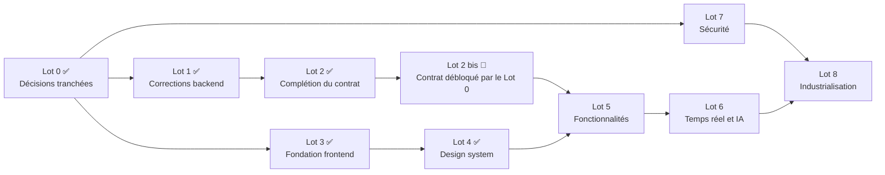
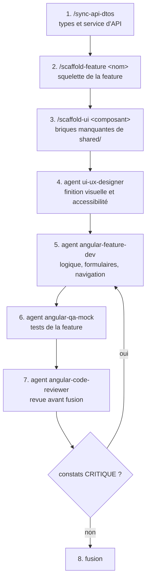

# AssetFlow Core — Plan d'implémentation

**Objet** — Stratégie d'exécution, séquencement des lots, étapes détaillées avec l'agent ou le skill à mobiliser, et règles d'acceptation. Ce document est **opérationnel** : il indique quoi faire, dans quel ordre, par quel moyen, et à quelle condition c'est terminé.

Documents de référence : [PRODUCT-REQUIREMENTS.md](PRODUCT-REQUIREMENTS.md) (exigences `EF-xx` / `ENF-xx`) · [PRODUCT-SPECIFICATIONS.md](PRODUCT-SPECIFICATIONS.md) (règles `RM-xx`, écrans `E-xx`, parcours `P-xx`) · [ARCHITECTURE.md](ARCHITECTURE.md) (décisions `AD-xx`, fragilités) · [TECHNICAL-SPECIFICATION.md](TECHNICAL-SPECIFICATION.md) · [API-Specification.md](API-Specification.md)

**Légende** : ✅ fait · 🎯 à faire · ⛔ bloquant · ❓ décision attendue · Charge relative **S** (petit) / **M** (moyen) / **L** (important)

> **Aucune date n'est engagée dans ce document.** Les charges relatives comparent les lots entre eux ; leur traduction en calendrier dépend de l'équipe affectée et doit être établie par elle.

---

## 1. Point de départ

| Domaine | État vérifié au 2026-08-05 |
|---|---|
| Backend | ✅ fonctionnel : 15 endpoints (authentifiés depuis le Lot 7), 220 tests unitaires verts, 80 tests d'intégration, 10 tests d'architecture, benchmarks, CI/CD complète, déploiement conteneurisé ; **Lots 1, 2 et 7 appliqués** |
| Contrat d'API | ✅ complété : listes d'incidents (paginée) et d'équipes, fiche d'actif, DTOs enrichis, 404 pour les ressources absentes, `Location` sur les créations |
| Sécurité | ✅ **Lot 7 appliqué** (2026-08-05) : JWT Bearer Entra ID/OIDC, rôles, traçabilité auteur — décision 0.1 ; 🟡 tenant Entra ID réel non enregistré (étape 7.0, opérationnelle) |
| Décisions | ✅ **Lot 0 clos le 2026-08-05** : 16 décisions écrites, aucun ❓ résiduel ; cinq d'entre elles créent un reliquat de contrat à livrer avant le Lot 5 (§5.1) |
| Frontend | ✅ socle, design system **et sécurité** en place : workspace Angular 22 `AssetFlowCore.WebUI` (standalone, Signals, zoneless, Vitest, Tailwind 4), types du contrat, 3 services d'API, intercepteurs, client SignalR authentifié, MSAL en bibliothèque de flux, garde de route, 18 composants partagés, thème clair/sombre, 169 tests verts ; **Lots 3, 4 et 7 (7.5-7.7) appliqués**. 🟡 inerte tant que le tenant Entra ID n'est pas enregistré (étape 7.0). Aucun écran produit (`E-01`→`E-09` au Lot 5) |
| Assistance IA | 🟡 mécanisme complet mais corpus vectoriel vide et état non exposé |
| Documentation | ✅ produit, fonctionnel, technique, architecture, contrat d'API |
| Outillage Claude Code | ✅ **8 agents**, 3 skills — `angular-qa-mock` (tests, mocks MSW, E2E) et `angular-security-auth` (sécurité, authentification, état) ajoutés le 2026-08-05 |

## 2. Stratégie d'exécution

**Principe 1 — Corriger le contrat avant de le consommer.** Le frontend consomme des types dérivés du C#. Toute évolution de contrat effectuée *après* la construction d'un écran provoque une reprise du typage, des services et des tests. Les lots de complétion du contrat (Lot 2) passent donc **avant** les lots de fonctionnalités (Lot 5).

**Principe 2 — Paralléliser ce qui ne partage pas de contrat.** La fondation du frontend (Lot 3) et le design system (Lot 4) ne dépendent d'aucun endpoint : ils démarrent immédiatement, en parallèle des lots backend.

**Principe 3 — Traiter d'abord les corrections à fort effet et faible risque.** L'invalidation du cache, les sondes de santé et l'homogénéisation des exceptions (Lot 1) sont de petites modifications qui suppriment des comportements trompeurs. Les faire tôt évite de construire des contournements dans le frontend.

**Principe 4 — Ne jamais livrer un écran sur un endpoint absent.** Un parcours dont l'endpoint manque est reporté, jamais simulé avec des données fictives. Les agents ont cette consigne inscrite dans leur définition.

**Principe 5 — La vérification fait partie de l'étape.** Une étape n'est pas terminée sur une affirmation : elle l'est sur une sortie de commande (compilation, tests) et, pour l'interface, sur le passage de la liste de contrôle d'accessibilité.

**Principe 6 — Chaque lot passe par un relecteur avant fusion.** `dotnet-code-reviewer` pour le backend, `angular-code-reviewer` pour le frontend. Ces agents sont en lecture seule : ils produisent des constats, la correction reste à la charge de l'implémenteur.

**Séquencement retenu**

**Point d'attention sur les ressources** : il n'existe **aucun agent d'implémentation backend**. Les lots 1, 2, 6 et 7 sont réalisés en session principale ou par un développeur, avec `dotnet-code-reviewer` en relecture. Créer un agent `dotnet-dev` est une option si le volume backend augmente.

**Deux angles frontend couverts depuis le 2026-08-05** : les tests et les mocks (`angular-qa-mock`) et la sécurité, l'authentification et l'état (`angular-security-auth`). Ils comblent deux manques que les lots 3 et 4 avaient absorbés en session principale — les 129 tests existants ont été écrits sans agent dédié, et le socle d'authentification du Lot 3 (étape 3.8) a été posé sans propriétaire déclaré. Ces deux agents portent chacun une part du Lot 7 (§10) et du Lot 5 (§8).

---

## 3. Lot 0 — Décisions préalables ✅ (2026-08-05)

**Objectif** : lever les questions produit et techniques qui conditionnent les lots suivants. **Aucun code n'est écrit dans ce lot** — le livrable est un jeu de décisions écrites et la mise à jour des documents affectés.

**16 décisions tranchées** : 0.8 à 0.11 et 0.14 l'étaient déjà avant les lots 3 et 4 ; 0.12 avait été appliquée au Lot 3 sans être reportée ici ; les neuf restantes, plus l'internationalisation (0.16, ❓ résiduel de [TECHNICAL-SPECIFICATION.md](TECHNICAL-SPECIFICATION.md) §2.6), le sont ce jour.

| # | Décision arrêtée le 2026-08-05 | Motif et conséquence | Bloquait |
|---|---|---|---|
| 0.1 | **Annuaire d'entreprise (Microsoft Entra ID)** — OIDC, jetons `JWT Bearer`, rôles dérivés des groupes d'annuaire ; aucun mot de passe n'est géré par l'API | Les utilisateurs d'un back-office interne existent déjà dans l'annuaire, et l'`authTokenInterceptor` du Lot 3 n'a qu'à être alimenté. Prérequis d'exploitation : un tenant et un enregistrement d'application (client public + audience d'API) | Lot 7 entier |
| 0.2 | **Prise en charge collective, auteur tracé** — l'affectation reste au niveau de l'équipe ; l'identité de qui prend en charge et de qui clôture est enregistrée pour l'audit | `EF-21` (affectation dirigée vers une personne, file « mes incidents ») reste **hors périmètre** : elle glisse vers la planification, explicitement exclue. Les champs d'auteur sont **additifs** au contrat des incidents et subordonnés au Lot 7, qui apporte l'identité | forme de `EF-21`, contrat des incidents |
| 0.3 | **`TicketStatus.Resolved` supprimé** — le cycle reste `Opened → InProgress → Closed` | Une étape « résolu en attente de validation » exigerait un acteur validateur, que le produit n'a pas. Rupture de contrat assumée (union TypeScript, filtre `status`, projection de tri) **sans aucune donnée à migrer**, la valeur n'ayant jamais été produite | cycle de vie |
| 0.4 | **Mise au rebut réversible, réservée à un rôle d'administrateur** — transition `Decommissioned → InService`, motif obligatoire, opération tracée | Ouvre `EF-09`. Motif déterminant : `AssetRepository.ExistsWithSerialNumberAsync` ne filtre **pas** sur l'état, donc le numéro de série d'un actif au rebut reste réservé — un rebut par erreur interdit définitivement de réenregistrer la machine. L'endpoint peut précéder le Lot 7, l'habilitation en dépend | `EF-09` |
| 0.5 | **Historique de transferts dédié** — entité (incident, équipe d'origine, équipe cible, motif, date), exposée sur la fiche d'incident | `MaintenanceTicket.TransferToTeam` écrit aujourd'hui dans `Description` et **altère irréversiblement** le texte saisi par le technicien. L'historique de routage est par ailleurs la donnée qui révèle un référentiel mal configuré, cause première des refus d'ouverture (`RM-12`) | `RM-21`, contrat des incidents |
| 0.6 | **Désactivation ajoutée, suppression conservée** | `Team.Activate()` / `Deactivate()` existent déjà dans le domaine et `isActive` / `onlyActive` sont déjà dans le contrat : il ne manque qu'un endpoint. La suppression, de fait impossible dès qu'un incident **même clôturé** référence l'équipe (`RM-26`), reste ouverte aux équipes créées par erreur — `EF-26` n'est donc pas retirée | `EF-28` |
| 0.7 | **Indexation à la clôture, avec rétro-indexation** — `UpsertVectorAsync` appelé à la clôture (titre, description, compte rendu) et commande de reprise des incidents déjà clos | Sans corpus, la recherche de similarité ne renvoie jamais rien et `EF-33` est nul. Limite assumée : la base DuckDB est un **fichier local**, non partagé entre instances (`AD-10`) — à externaliser si l'API passe à plusieurs répliques | Lot 6, valeur de l'IA |
| ~~0.8~~ | ~~Nom du dossier du workspace frontend~~ — **tranchée le 2026-08-05** : dossier `AssetFlowCore.WebUI/`, projet npm `assetflow-webui` (les majuscules et le point sont interdits dans un nom de paquet npm, d'où la dissociation) | appliquée au Lot 3 | Lot 3 |
| ~~0.9~~ | ~~Framework CSS~~ — **tranchée le 2026-08-05** : **Tailwind 4 + `@angular/cdk`** (utilitaires pour le style, CDK pour l'accessibilité). Motif : contrôle total du rendu et jetons en variables CSS, là où Material imposerait son apparence et une thématisation par mixins ; les composants réellement demandés (table basculant en cartes, badges métier, message vide) n'existent de toute façon dans aucune bibliothèque | appliquée au Lot 4 | Lot 4 |
| ~~0.10~~ | ~~Rendu serveur (SSR) ou application cliente seule~~ — **tranchée le 2026-08-05** : **application cliente seule**, pas de SSR (back-office interne destiné à passer derrière authentification, aucun enjeu de référencement ni de premier affichage public) | appliquée au Lot 3 | Lot 3, Lot 8 |
| ~~0.11~~ | ~~Runner de tests frontend~~ — **tranchée le 2026-08-05** : **Vitest** (voie moderne du CLI, aucun navigateur à piloter en CI, couverture lcov directement exploitable par SonarCloud) | appliquée au Lot 3 | Lot 3 |
| 0.12 | **Signals natifs** — `@ngrx/signals` n'est pas installé | Sa ligne 22 n'existe qu'en préversion : une dépendance instable au cœur de l'état est écartée. Décision **déjà appliquée** au Lot 3 et consignée dans [TECHNICAL-SPECIFICATION.md](TECHNICAL-SPECIFICATION.md) §2.6 ; reportée ici pour clore le tableau | Lot 5 |
| 0.13 | **Conteneur nginx dédié**, derrière un reverse proxy frontal | Deux images publiées (API et frontend), cycles de livraison séparés, cache HTTP maîtrisé. Conséquence directe : l'étape **8.5 reste obligatoire** — la même origine est reconstituée par le proxy frontal, faute de quoi l'appel navigateur échoue, l'API n'appliquant aucune politique CORS hors Development | Lot 8, contrainte CORS |
| ~~0.14~~ | ~~Périmètre de la pagination et du filtrage serveur des listes~~ — **tranchée le 2026-08-05** : enveloppe JSON paginée sur `GET /api/tickets` (filtres état, criticité, équipe, actif ; tri ; taille de page ≤ 100) ; inventaire et équipes servis en intégralité | appliquée au Lot 2 | Lot 2 |
| 0.15 | **Versioning des URL dès maintenant** — `/api/v1/...` | Révise `AD-13`. Coût immédiat : les 15 endpoints, la documentation, les tests d'intégration, les 3 services frontend et le relevé du skill `/sync-api-dtos`. Reprise planifiée en **§5.1**, obligatoirement **avant** le premier écran du Lot 5, sans quoi chaque écran serait à reprendre | Lot 2 |
| 0.16 | **Multilingue dès le Lot 5** — extraction des messages et gestion des locales | ❓ résiduel de [TECHNICAL-SPECIFICATION.md](TECHNICAL-SPECIFICATION.md) §2.6, hors liste initiale mais soumis à la porte de fusion « aucun ❓ résiduel ». Les libellés du Lot 4 sont déjà centralisés dans `shared/i18n/` et servent de point de départ ; les valeurs d'énumérations de l'API restent traduites à l'affichage dans tous les cas | Lot 5 |

**Étapes réalisées**

1. Relecture de [PRODUCT-REQUIREMENTS.md](PRODUCT-REQUIREMENTS.md) §8 et [TECHNICAL-SPECIFICATION.md](TECHNICAL-SPECIFICATION.md) §2.6, options et conséquences présentées décision par décision, arbitrage rendu en session.
2. Chaque arbitrage consigné **dans le document concerné**, marqueur ❓ remplacé par la décision et sa date : ce tableau, [PRODUCT-REQUIREMENTS.md](PRODUCT-REQUIREMENTS.md) §8, [PRODUCT-SPECIFICATIONS.md](PRODUCT-SPECIFICATIONS.md) §2 à §8, [TECHNICAL-SPECIFICATION.md](TECHNICAL-SPECIFICATION.md) §2.6 / §3 / §5, [ARCHITECTURE.md](ARCHITECTURE.md) §4.2 / §5 / §6 / §7, [API-Specification.md](API-Specification.md) §9.
3. Deux vérifications de code menées pour étayer les options, et déterminantes dans les arbitrages 0.4 et 0.5 : `AssetRepository.ExistsWithSerialNumberAsync` ne filtre pas sur l'état de l'actif, et `MaintenanceTicket.TransferToTeam` écrit dans `Description`.
4. Le travail créé par les décisions est inscrit et ordonnancé : **§5.1** (contrat, avant le Lot 5), Lot 5, Lot 6, Lot 7 et Lot 8 mis à jour en conséquence.

**Critères d'acceptation**

- ✅ Les 16 décisions sont tranchées et écrites ; **aucun ❓ résiduel** dans les six documents de `doc/` (`PRODUCT-REQUIREMENTS` §8, `TECHNICAL-SPECIFICATION` §2.6 et les marqueurs `EF-09` / `EF-21` inclus).
- ✅ Les documents affectés sont mis à jour dans le même lot.
- ✅ Aucun code écrit : le travail induit est planifié, pas réalisé.

**Écarts assumés du lot**

- **Trois décisions s'écartent de la recommandation formulée** : 0.13 (conteneur dédié plutôt que statiques servis par l'API), 0.15 (versioning immédiat plutôt que coordination directe) et 0.16 (multilingue plutôt que français seul). Elles sont retenues telles quelles ; leur surcoût est inscrit là où il tombe — §5.1 pour 0.15, étapes 8.4 et 8.5 pour 0.13, Lot 5 pour 0.16 — et non lissé.
- **0.2 et 0.4 sont partiellement subordonnées au Lot 7** : la traçabilité de l'auteur exige une identité, et l'habilitation d'administrateur exige des rôles. Les endpoints correspondants peuvent précéder, leur restriction non.
- **Aucun agent sollicité** (`angular-architect`, `ui-ux-designer`) : les décisions restantes étaient à dominante produit, et les deux décisions techniques (0.13, 0.15) relevaient d'un arbitrage d'exploitation, non d'une comparaison d'options frontend.

---

## 3.1 Conséquences des décisions sur les lots suivants

Récapitulatif du travail **créé** par le Lot 0, avec son point de chute. Aucune de ces lignes n'existait avant l'arbitrage.

| Décision | Travail créé | Où il est inscrit |
|---|---|---|
| 0.15 | Versionner les URL en `/api/v1/...` | §5.1, étape 2b.1 — **prioritaire**, avant tout écran |
| 0.3 | Supprimer `Resolved` du domaine, du filtre, du tri et du contrat | §5.1, étape 2b.2 |
| 0.5 | Entité d'historique de transferts et exposition | §5.1, étape 2b.3 |
| 0.6 | Endpoints d'activation / désactivation d'équipe | §5.1, étape 2b.4 |
| 0.4 | Endpoint de remise en service, motif obligatoire | §5.1, étape 2b.5 |
| 0.4 | Confirmation et action de remise en service côté interface | Lot 5, étape 5.A.6 |
| 0.5 | Affichage de l'historique de routage sur la fiche d'incident | Lot 5, étape 5.B.8 |
| 0.6 | Bascule d'activation dans l'écran d'administration | Lot 5, étape 5.C.4 (confirmée) |
| 0.16 | Mise en place de l'internationalisation avant le premier écran | Lot 5, étape 5.0 |
| 0.7 | Indexation à la clôture **et** commande de rétro-indexation | Lot 6, étapes 6.2 et 6.2 bis |
| 0.1 | Schéma OIDC / Entra ID, enregistrement d'application, rôles par groupes | Lot 7, étapes 7.0 à 7.3 (API et exploitation), puis 7.5 à 7.6 (frontend) |
| 0.2 | Identité de l'auteur de la prise en charge et de la clôture | Lot 7, étape 7.4 |
| 0.4 | Restriction de la remise en service au rôle d'administrateur | Lot 7, étape 7.2 |
| 0.13 | Image nginx dédiée, et reverse proxy pour la même origine | Lot 8, étapes 8.4 et 8.5 |

---

## 4. Lot 1 — Corrections backend à faible risque, fort effet ✅ (2026-08-05)

**Objectif** : supprimer les comportements trompeurs avant que le frontend ne se construise autour. **Aucune rupture de contrat.**

| # | Étape | Réalisation | Vérification | Charge |
|---|---|---|---|---|
| 1.1 ✅ | **Invalider le cache d'inventaire lors des écritures** — faire résoudre les dépôts de `UnitOfWork` par le conteneur d'injection au lieu de les instancier (`new AssetRepository(context)`), afin que les décorateurs de cache soient traversés | session principale | `AssetInventoryCacheTests` (2 tests) · `UnitOfWorkCompositionTests` (2 tests) | M |
| 1.2 ✅ | **Exposer les sondes de santé hors Development** — `MapDefaultEndpoints` conditionne `/health` et `/alive` à l'environnement, alors que le Dockerfile et la composition Docker les interrogent en Production | session principale | `HealthEndpointsTests` — `/health` et `/alive` en environnement `Production` | S |
| 1.3 ✅ | **Homogénéiser les exceptions métier** — `MaintenanceTicket.AssignToTechnician()` et `Close()` lèvent `InvalidOperationException`, remontée en 500 ; basculer sur `DomainException` (ou étendre le middleware) | session principale | `AssignTicket_WhenAlreadyAssigned` et `CloseTicket_WhenNotInProgress` → **400** | S |
| 1.4 ✅ | **Contrôler l'unicité du nom d'équipe applicativement** — `ExistsWithNameAsync` existe mais n'est pas appelée ; le doublon remonte en 500 par violation d'index | session principale | `CreateTeam_WithDuplicateName` et `UpdateTeam_WithNameOfAnotherTeam` → 400 avec message métier | S |
| 1.5 ✅ | **Corriger les messages de validation de criticité** — copiés depuis le type d'actif dans `CreateTeamCommandValidator` et `UpdateTeamCommandValidator` | session principale | 3 tests de validateur sur les messages attendus | S |
| 1.6 ✅ | **Valider réellement la criticité à l'ouverture d'un incident** — la règle actuelle ne contrôle que la présence, malgré son message ; ajouter `IsEnumName` | session principale | `CreateMaintenanceTicketValidatorTests` — criticité `Urgent` rejetée sur le champ | S |
| 1.7 ✅ | **Ne plus divulguer le message d'exception brut** en réponse 500, tout en le journalisant | session principale | `Request_WhenUnhandledExceptionIsThrown_ShouldReturn500WithoutLeakingMessage` | S |
| 1.8 ✅ | **Propager `CancellationToken`** depuis les controllers jusqu'aux dépôts (compléter `ITeamRepository` et `IMaintenanceTicketRepository`) | session principale | `CancellationTokenPropagationTests` (5 tests) | M |
| 1.9 ✅ | **Amorcer les équipes de référence** — jusqu'à 9 combinaisons (type × criticité) ; migration de données ou commande d'amorçage documentée | session principale | migration `SeedReferenceTeams` · `SeedReferenceTeamsTests` (3 tests) : les 9 combinaisons résolvent une équipe | M |
| 1.10 ✅ | **Relecture du lot** | session principale (aucun agent sollicité) | `dotnet format --verify-no-changes` sans écart · 3 suites vertes · vérification que chaque test ajouté échoue sur le code d'origine | S |
| 1.11 ✅ | **Mise à jour documentaire** — [API-Specification.md](API-Specification.md) §9, [ARCHITECTURE.md](ARCHITECTURE.md) §7, [TECHNICAL-SPECIFICATION.md](TECHNICAL-SPECIFICATION.md) §5 | session principale | les constats corrigés ne figurent plus comme écarts | S |

**Écarts assumés du lot**

- `Program.cs` n'applique toujours aucune migration au démarrage : l'amorçage de 1.9 suppose `dotnet ef database update` (étape 8.6).
- La vérification de 1.2 par `docker compose up` n'a pas été exécutée (Docker non sollicité) ; elle est couverte par un test d'intégration en environnement `Production`.
- Corrections adjacentes nécessaires à 1.1, hors énoncé initial : `UpdateTeamCommandHandler` appelle désormais `ITeamRepository.UpdateAsync` (l'équipe étant lue sans suivi de modifications, la mise à jour n'était pas persistée), et les lectures d'actif par identifiant ne sont plus mises en cache (elles alimentent des cas d'usage d'écriture).

**Critères d'acceptation du lot**

- `dotnet build` et les trois suites de tests passent ; `dotnet format --verify-no-changes --severity warn` sans écart ; portail SonarCloud franchi.
- Chaque correction est couverte par **au moins un test** qui échouait avant.
- Aucun endpoint existant ne change de forme de requête ni de code de succès.
- Les documents cités en 1.11 ne mentionnent plus les écarts corrigés.

---

## 5. Lot 2 — Complétion du contrat d'API ✅ (2026-08-05)

**Objectif** : rendre réalisables les 6 écrans aujourd'hui impossibles ou dégradés. **Ce lot introduit des ruptures de contrat assumées** (décision 0.15).

| # | Étape | Exigence levée | Charge |
|---|---|---|---|
| 2.1 ✅ | `GET /api/tickets` — liste avec filtres (état, criticité, équipe, actif), tri et **pagination** — enveloppe `{ items, page, pageSize, totalCount, totalPages }`, taille de page bornée à 100 (décision 0.14 tranchée le 2026-08-05) | `EF-19`, écran `E-06`, parcours `P-03` | L |
| 2.2 ✅ | `GET /api/teams` — liste des équipes, avec l'état actif ; `?onlyActive=true` pour le sélecteur de transfert | `EF-27`, écran `E-07`, parcours `P-05`/`P-08` | M |
| 2.3 ✅ | Enrichir `TicketResponseDto` : `description`, `resolutionComment`, `createdAt`, `assistanceNote`, `isAiProcessing` | `EF-20`, `EF-34`, `EF-35`, écrans `E-05`/`E-08` | M |
| 2.4 ✅ | Enrichir `TeamResponseDto` : `assetType`, `ticketCriticality` | écran `E-07` (préremplissage du formulaire) | S |
| 2.5 ✅ | `GET /api/assets/{id}` — fiche unitaire, avec ses incidents du plus récent au plus ancien | `EF-06`, écran `E-03` | M |
| 2.6 ✅ | Sémantique **404** pour les ressources introuvables — `NotFoundException` mappée ; une référence invalide du **corps** reste un 400 | cohérence REST, `E-01`→`E-09` | M |
| 2.7 ✅ | Aligner `PUT /api/teams/{id}` sur **200** au lieu de 201 | cohérence REST | S |
| 2.8 ✅ | Ajouter l'en-tête `Location` sur les réponses 201 | cohérence REST | S |
| 2.9 🎯 | Décisions 0.3, 0.5, 0.6 appliquées — **toutes trois retenues le 2026-08-05**, avec 0.4 et 0.15 en supplément : reportée en **§5.1** | `EF-17`, `EF-28` | M |
| 2.10 ✅ | **Relecture** | session principale (aucun agent sollicité) | S |
| 2.11 ✅ | **Mise à jour du contrat documenté** — [API-Specification.md](API-Specification.md) intégralement | S |
| 2.12 ✅ | **Resynchronisation des types frontend** — réalisée au Lot 3, étape 3.6, une fois le workspace créé | conventions du skill **`/sync-api-dtos`** appliquées aux 3 controllers | S |

**Critères d'acceptation du lot**

- ✅ Chaque nouvel endpoint est couvert par un test d'intégration (cas nominal + cas d'erreur) et documenté dans [API-Specification.md](API-Specification.md).
- ✅ La pagination expose le nombre total d'éléments (`totalCount`), indépendant de la page reçue.
- ✅ Les ressources introuvables renvoient 404 sur **tous** les endpoints à identifiant, sans exception résiduelle.
- ✅ Les types frontend du contrat sont générés (Lot 3, étape 3.6) : `shared/models/` couvre les 3 ressources, l'enveloppe de pagination et `ProblemDetails`.
- ✅ Les écrans `E-05`, `E-06`, `E-07` sont déclarés réalisables dans [PRODUCT-SPECIFICATIONS.md](PRODUCT-SPECIFICATIONS.md) §7 ; `E-08` reste dégradé, la fin d'analyse IA n'étant pas notifiée (Lot 6, étape 6.4).

**Écarts assumés du lot**

- **2.9 reportée en §5.1** : les décisions 0.3, 0.5 et 0.6 n'étaient pas tranchées à la clôture du lot. Elles le sont depuis le 2026-08-05 et le travail correspondant est ordonnancé en §5.1. En l'état du code, le statut `Resolved` reste inatteignable, le motif de transfert reste concaténé à la description et aucune équipe ne peut être désactivée par l'API. Le filtre `onlyActive` et le champ `isActive` sont en place pour accueillir la décision 0.6.
- **2.12 reportée puis levée** : aucun workspace Angular n'existait à la clôture du Lot 2 ; la synchronisation a été réalisée au Lot 3, étape 3.6.
- Pagination livrée sur `GET /api/tickets` uniquement ; l'inventaire et les équipes restent des collections complètes, leur volume ne le justifiant pas.

### 5.1 Lot 2 bis — Contrat débloqué par le Lot 0 🎯 (à livrer **avant** le Lot 5)

**Objectif** : appliquer les cinq décisions du Lot 0 qui touchent le contrat d'API, avant qu'un écran ne le consomme (Principe 1). **Ce lot introduit des ruptures de contrat assumées** — c'est le dernier moment où elles sont bon marché, aucun écran produit n'existant encore.

| # | Étape | Décision | Exigence | Charge |
|---|---|---|---|---|
| 2b.1 🎯 | **Versionner les URL en `/api/v1/...`** sur les 15 endpoints, puis répercuter sur [API-Specification.md](API-Specification.md), les tests d'intégration, les 3 services de `core/api/` et le relevé du skill `/sync-api-dtos`. `proxy.conf.json` intercepte `/api` par préfixe : aucun changement côté proxy de développement. À traiter **en premier**, l'étape touchant toutes les routes | 0.15 | `AD-13` révisée | M |
| 2b.2 🎯 | **Supprimer `TicketStatus.Resolved`** : énumération du domaine, message et règle `IsEnumName` de `GetTicketsQueryValidator`, projection de rang de `MaintenanceTicketRepository.ApplySort`, union TypeScript et libellés de `shared/i18n/` | 0.3 | — | S |
| 2b.3 🎯 | **Historiser le motif de transfert** : entité dédiée + migration, `TransferToTeam` cesse d'écrire dans `Description`, historique exposé sur la fiche d'incident. À vérifier au passage : `TransferToTeam` affecte `AssignedTeam` **sans** mettre à jour `AssignedTeamId`, ce que seule la correction de navigation d'EF rattrape aujourd'hui | 0.5 | `EF-17`, `RM-21` | M |
| 2b.4 🎯 | **Activer / désactiver une équipe** : endpoint(s) dédiés, invalidation des **deux** clés de cache d'équipe (`Teams_List_Active` et `Teams_List_All`, centralisée par `CachedTeamRepository.InvalidateLists()`) | 0.6 | `EF-28` | S |
| 2b.5 🎯 | **Remettre en service un actif au rebut** : transition de domaine, motif obligatoire, opération tracée. La restriction au rôle d'administrateur est posée au Lot 7, étape 7.2 — d'ici là l'endpoint est ouvert comme tous les autres | 0.4 | `EF-09` | M |
| 2b.6 🎯 | **Relecture**, resynchronisation `/sync-api-dtos` et mise à jour du contrat documenté | — | — | S |

**Critères d'acceptation du lot**

- Chaque changement de contrat est couvert par un test d'intégration (cas nominal + cas d'erreur) et reporté dans [API-Specification.md](API-Specification.md).
- Aucune route ne subsiste hors `/api/v1/` : les tests d'intégration et les 3 services frontend n'adressent plus l'ancienne forme.
- `Resolved` n'apparaît plus **nulle part** — ni domaine, ni validateur, ni tri, ni types TypeScript, ni libellés.
- Un incident transféré deux fois expose **deux** entrées d'historique, et sa description est exactement celle saisie à l'ouverture.
- Une équipe désactivée disparaît de `?onlyActive=true` **et** cesse de recevoir des incidents, sans être supprimée.
- Un actif remis en service redevient éligible à l'ouverture d'un incident, et son numéro de série reste unique.

---

## 6. Lot 3 — Fondation frontend ✅ (2026-08-05)

**Objectif** : un workspace Angular 22 qui compile, se teste et appelle l'API en développement.

**Décisions appliquées** : 0.8 → dossier `AssetFlowCore.WebUI/` (projet npm `assetflow-webui`) · 0.10 → application cliente seule · 0.11 → Vitest · mode **zoneless** retenu (défaut d'Angular 22, `zone.js` absent des dépendances), ce qui lève le « à évaluer » de [TECHNICAL-SPECIFICATION.md](TECHNICAL-SPECIFICATION.md) §2.3.

| # | Étape | Réalisation | Vérification | Charge |
|---|---|---|---|---|
| 3.1 ✅ | Créer le workspace (Angular 22.1.0, CLI 22.1.3, standalone, sans SSR, Vitest, zoneless, SCSS) | session principale | `npx ng build` et `npx ng test --watch=false` verts | M |
| 3.2 ✅ | Arborescence `core/` · `shared/` · `features/` et règles de dépendances | session principale | conforme à [ARCHITECTURE.md](ARCHITECTURE.md) §3.1 · règles **vérifiées mécaniquement** par `npm run verifier:dependances` | S |
| 3.3 ✅ | `app.config.ts` : `provideRouter` (+ `withComponentInputBinding`), `provideHttpClient(withFetch(), withInterceptors([...]))`, détection de changement zoneless | session principale | application servie et interrogée sans erreur ; console navigateur **non relevée** (voir écarts) | S |
| 3.4 ✅ | Environnements `environment.ts` / `environment.development.ts` (+ `environment.model.ts` qui interdit la divergence des clés), `fileReplacements` dans `angular.json` | session principale | `apiBaseUrl` consommé par les 3 services et le client SignalR, aucune URL en dur | S |
| 3.5 ✅ | `proxy.conf.json` vers `https://localhost:7138` (`/api` et `/ticketHub`, `secure: false`, `ws: true`), branché sur la cible `serve` | session principale | appel réel traversant le proxy jusqu'à la **vraie API** : 400 de validation et 500 authentiques, sans erreur CORS ni refus de certificat. Succès sur données réelles **non vérifié** (voir écarts) | S |
| 3.6 ✅ | Modèles de contrat et services d'API des 3 ressources | conventions du skill **`/sync-api-dtos`**, contrat relu dans le C# (post-Lot 2) | types conformes, JSDoc par méthode (verbe, route, code de succès réel, erreurs, fichier C# d'origine) | M |
| 3.7 ✅ | Intercepteur d'erreurs `ProblemDetails` et modèle d'erreur partagé `ApiError` (`validation`, `business`, `notFound`, `conflict`, `server`, `network`) | session principale | 9 tests avec `provideHttpClientTesting()` : 400 avec `errors`, 400 métier, 404, 409, 500, absence de réponse, corps non JSON | M |
| 3.8 ✅ | Squelette d'intercepteur de jeton + `AuthTokenService` sans source | session principale | 4 tests : sans effet sans jeton, en-tête posé dès qu'un jeton existe, jamais hors de l'API | S |
| 3.9 ✅ | Client temps réel typé (`@microsoft/signalr` 10.0.11) sur `/ticketHub`, état en signal, restauration des groupes après reconnexion | session principale | 9 tests sur double de connexion · connexion réelle établie à travers le proxy et `JoinTeamGroup` accepté par le hub | M |
| 3.10 ✅ | **Relecture** | session principale (aucun agent sollicité) | `prettier --check` sans écart · 47 tests verts · règles de dépendances vérifiées | S |

**Critères d'acceptation du lot**

- ✅ `npx ng build` et `npx ng test --watch=false` verts (8 fichiers, **47 tests**), sortie de commande fournie.
- ✅ Aucun `NgModule`, aucune injection par constructeur, aucun `any`, aucun `*ngIf`/`*ngFor` ; `OnPush` sur chaque composant.
- 🟡 Un appel réel à l'API aboutit depuis l'application : la chaîne complète (serveur de développement → proxy → API réelle → intercepteur) est vérifiée, mais **aucune réponse 200 sur données réelles** n'a pu l'être, faute de base de données sur le poste (voir écarts).
- ✅ Une erreur 400 produit un objet exploitable par un formulaire : `ApiError.fieldErrors` convertit les clés `PascalCase` du backend en `camelCase`, vérifié sur une réponse **réelle** (`PageSize`, `Status`, `SortBy`).
- ✅ `shared/models/` contient les types dérivés du C#, chaque fichier portant ses sources et sa commande de resynchronisation.

**Écarts assumés du lot**

- **Aucune réponse 200 sur données réelles.** Le poste n'a ni Docker (donc pas d'orchestration Aspire) ni instance SQL Server exploitable : LocalDB est installé mais son processus SQL refuse de démarrer. L'API a donc été lancée avec une base injoignable. Sont vérifiés sur la **vraie API** à travers le proxy : `/alive` (200), `GET /api/assets` (500 authentique, `traceId` inclus), `GET /api/tickets` avec paramètres invalides (400 avec dictionnaire `errors` réel), négociation et connexion `/ticketHub` avec `JoinTeamGroup` accepté. Reste à confirmer sur une base amorcée (étape 8.6).
- **Console du navigateur non relevée** (vérification annoncée en 3.3) : aucun outil de pilotage de navigateur n'était disponible dans la session. Le rendu et les quatre états sont couverts par les tests de composant (jsdom), et l'application a été servie et interrogée sans erreur côté serveur de développement.
- **Un écran hors périmètre produit** : `features/diagnostic/` existe pour prouver la chaîne complète, exigence du critère d'acceptation. Ce n'est aucun des écrans `E-01`→`E-09` ; il doit être supprimé et sa route racine réaffectée à l'inventaire au Lot 5.
- **Aucun agent sollicité** : le lot a été réalisé en session principale, les définitions d'agents servant de référentiel de conventions. Les contrats d'API qu'elles contiennent sont **antérieurs au Lot 2** et ont été ignorés au profit du code C# ; ils gagneraient à être mis à jour (voir §13).
- **Écart de format d'erreur relevé sur l'API** : les réponses d'erreur sortent avec `Content-Type: application/json`, non `application/problem+json` comme l'annonce [API-Specification.md](API-Specification.md) §3 — `WriteAsJsonAsync` écrase le type posé par le middleware. Sans effet sur le frontend (l'intercepteur ne filtre pas sur le type de contenu), mais à corriger côté code ou côté documentation.
- **Framework CSS non installé** (décision 0.9 en attente) : le workspace est en SCSS nu, sans jeton de design ni habillage. C'est le périmètre du Lot 4 ; l'écran de diagnostic est donc sans style.

---

## 7. Lot 4 — Design system ✅ (2026-08-05)

**Objectif** : les briques visuelles nécessaires aux écrans, accessibles et cohérentes.

**Décision appliquée** : 0.9 → **Tailwind 4.3.3 + `@angular/cdk` 22.1.1**. Compatibilités vérifiées avant installation (`@angular/material` 22.1.1 aurait aussi convenu ; DaisyUI 5 écarté, il n'apporte que du style et suit les majeures de Tailwind).

| # | Étape | Réalisation | Vérification | Charge |
|---|---|---|---|---|
| 4.1 ✅ | Tailwind 4 + `@angular/cdk` installés et configurés (`.postcssrc.json`, feuille racine en **CSS** — Tailwind 4 ne passe pas par un préprocesseur) | session principale | `ng build` vert ; CSS émis inspecté (jetons, bascule de thème et durées arbitraires bien présents) | M |
| 4.2 ✅ | Jetons de design : 23 jetons de couleur sémantiques, durées, cible tactile. Déclarés **une seule fois** avec leurs deux valeurs via `light-dark()` — aucun bloc de thème sombre à maintenir en parallèle | session principale | `npm run verifier:contrastes` : **38 paires** calculées dans les deux thèmes | M |
| 4.3 ✅ | Thème clair/sombre : `color-scheme: light dark` suit le système, `data-theme` l'emporte **dans les deux sens** ; `ThemeService` (`core/theme`) + `app-theme-toggle` présentationnel, jonction dans le shell | session principale | 8 tests, dont le forçage dans les deux sens et le stockage refusé (navigation privée) | M |
| 4.4 ✅ | Bouton, champ de saisie, sélecteur, zone de texte, case à cocher — **approche A** (`FormControl` en entrée) | conventions du skill **`/scaffold-ui`** | 28 tests : libellé associé, erreur seulement après interaction, `aria-invalid` + `aria-describedby`, état désactivé, compteur de caractères | L |
| 4.5 ✅ | Carte, table responsive (table ≥ `md`, cartes en dessous, bascule par CSS donc suivant aussi le zoom), modale (piège et **restitution** du focus par `cdkTrapFocus`, Échap, verrou de défilement), fil d'Ariane | session principale | 24 tests, dont le focus rendu au déclencheur et l'absence de double annonce | L |
| 4.6 ✅ | Badge générique + badges d'état d'actif, d'état d'incident et de criticité (couleur **et** libellé), indicateur de chargement, message vide, message d'erreur, région de notifications `aria-live` | session principale | 17 tests, dont la couverture de **toutes** les valeurs d'énumérations du contrat | M |
| 4.7 ✅ | Libellés français des 4 énumérations (`Record<Union, string>`, exhaustif par construction) + 4 pipes purs + messages de validation par défaut | session principale | 6 tests, dont l'absence de valeur laissée en anglais | S |
| 4.8 ✅ | **Relecture**, liste de contrôle d'accessibilité, documentation | session principale (aucun agent sollicité) | `ng build` · **129 tests** · `prettier --check` · règles de dépendances · contrastes | S |

**Critères d'acceptation du lot**

- ✅ Liste de contrôle en 5 points passée composant par composant (voir §7.1).
- ✅ Contraste vérifié **par calcul** dans les deux thèmes : 38 paires, marge la plus faible à 4,55:1 pour un seuil de 3:1. Reproductible par `npm run verifier:contrastes`, qui lit les jetons dans `styles.css` — une couleur modifiée sans repasser la vérification fait échouer la commande.
- 🟡 Rendu à **320 px** et à **200 % de zoom** : construit pour (styles mobile-first, `clamp` inutile car typographie relative, table basculant en cartes, cibles ≥ 44 px) mais **non observé** — aucun navigateur pilotable dans la session. La page `/design-system` existe pour que cette vérification se fasse en un coup d'œil.
- ✅ Formulaires compatibles `ReactiveFormsModule` par **approche A** (contrôle en entrée), retenue pour son typage complet et l'absence de contrat implicite.
- ✅ Aucune couleur, taille ni durée codée en dur hors jetons ; aucun `!important` hors la neutralisation d'animations sous `prefers-reduced-motion` ; aucun `::ng-deep`.
- ✅ API publique documentée composant par composant dans [src/app/shared/README.md](../AssetFlowCore.WebUI/src/app/shared/README.md).

### 7.1 Liste de contrôle d'accessibilité — résultat

| Point | Constat |
|---|---|
| Utilisable au clavier seul | Tous les contrôles sont **natifs** (`button`, `input`, `select`, `textarea`, `input[type=radio]`, `a`) : navigation, activation et navigation par flèches sont celles du navigateur. Aucun `tabindex` positif. La zone de défilement de la table est focusable (`tabindex="0"`). |
| Nom accessible sur chaque contrôle | `for`/`id` sur les cinq champs ; `aria-label` sur les boutons sans libellé visible (fermeture de modale, rejet de notification) ; `legend` sur le groupe de thème ; `caption` sur la table. |
| Focus visible et prévisible | Anneau `:focus-visible` global sur jeton dédié, jamais supprimé. Modale : focus déplacé sur le panneau à l'ouverture, piégé, **rendu au déclencheur** à la fermeture (test à l'appui). |
| Information non portée par la couleur | Chaque badge impose un libellé (`libelle` obligatoire) ; les champs en erreur portent `aria-invalid` **et** un message ; l'indicateur de chargement porte un libellé lu. |
| Aucune dépendance à `core/` ni `features/` | Vérifié par commande. Un seul écart, assumé et documenté : `RouterLink` dans le fil d'Ariane, indispensable à de vraies ancres. |

**Écarts assumés du lot**

- **Rendu visuel non observé** (320 px, 200 % de zoom, contraste perçu, ordre de tabulation réel) : aucun outil de pilotage de navigateur n'était disponible. Ces points sont construits et calculés, non vus. La page `/design-system` rassemble tous les composants pour cette revue.
- **Une page hors périmètre produit** : `features/design-system/` sert la revue visuelle exigée par les critères. Comme `features/diagnostic/`, elle doit être retirée au Lot 5.
- **Défaut corrigé dans l'outillage du Lot 3** : `verifier-dependances.mjs` signalait `@angular/core/testing` comme une violation (le motif `/core/` capturait le nom du paquet). Le contrôle ne porte désormais que sur les imports relatifs, et son pouvoir de détection a été revérifié sur une violation délibérée.
- **Télémétrie du CLI désactivée** : `ng new` avait inscrit un identifiant `analytics` dans `angular.json`, committé au Lot 3 sans être remarqué. Remis à `false` ; `ng analytics enable` la réactive.
- **Aucun agent sollicité** : lot réalisé en session principale, les définitions d'agents et de skills servant de référentiel de conventions.

---

## 8. Lot 5 — Fonctionnalités 🎯 (dépend des lots 2, **2 bis**, 3 et 4)

**Ordre imposé** : `assets` d'abord (les 2 écrans réalisables aujourd'hui, donc validation la plus rapide de la chaîne complète), puis `tickets` (cœur métier), puis `teams` (administration).

⛔ **Prérequis** : §5.1 livrée. Un écran construit sur `/api/...` non versionné, ou affichant un état `Resolved`, serait à reprendre intégralement (Principe 1).

### 5.0 Préalables — internationalisation (décision 0.16) et autonomie de développement

| # | Étape | Réalisation | Exigences |
|---|---|---|---|
| 5.0.1 | Installer et configurer l'internationalisation (`@angular/localize`, locales servies, `angular.json`), en reprenant les libellés déjà centralisés dans `shared/i18n/` (Lot 4) comme catalogue de départ | agent **`angular-architect`** | `ENF-22` |
| 5.0.2 | Fixer la règle d'écriture des écrans : **aucun texte visible en dur** dans un gabarit, y compris les messages d'erreur et les libellés d'accessibilité (`aria-label`) | agent **`angular-architect`** | `ENF-22` |
| 5.0.3 | ❓ **Décision de dépendance** puis, si retenue, mocks MSW dérivés du contrat : handlers typés contre `shared/models/`, scénarios d'erreur par nature d'`ApiError`, ticket en deux phases (`isAiProcessing` puis note). Racine des routes en constante unique pour absorber `/api/v1` (2b.1) | agent **`angular-qa-mock`** | — |

**Motif de l'antériorité de 5.0.1 et 5.0.2** : rétro-extraire les messages de neuf écrans coûte davantage que de poser le mécanisme d'abord, et les libellés d'accessibilité sont les premiers oubliés d'une extraction tardive.

**Motif de 5.0.3** : lancer l'API exige Docker, le secret du mot de passe SQL **et une base migrée** — sans la migration `SeedReferenceTeams`, toute création d'incident échoue. À défaut, l'API démarre mais **aucun endpoint de données ne répond 200**. Un jeu de mocks rend les neuf écrans développables et démontrables sans cette chaîne, et rend reproductibles les états dégradés (409, 5xx, hors ligne) qu'une API saine ne produit pas à la demande. Ce n'est **pas** une entorse au Principe 4 : les mocks servent le développement et les tests, jamais un écran livré sur un endpoint absent.

### 5.A Feature `assets`

| # | Étape | Réalisation | Exigences |
|---|---|---|---|
| 5.A.1 | Générer le squelette de la feature | skill **`/scaffold-feature assets`** | — |
| 5.A.2 | Écran inventaire `E-01` : liste, filtrage et tri **côté client** (ou serveur si 0.14 le prévoit), états chargement/vide/erreur | agent **`angular-feature-dev`** | `EF-04` |
| 5.A.3 | Formulaire d'actif `E-02` : validation locale alignée sur `RM-01`→`RM-05`, report des erreurs serveur sur les champs | agent **`angular-feature-dev`** | `EF-01`→`EF-03` |
| 5.A.4 | Mise au rebut avec **confirmation explicite** et message de refus détaillant le nombre d'incidents actifs. La confirmation n'annonce plus une opération irréversible (décision 0.4) mais une sortie du parc **annulable par un administrateur** | agent **`angular-feature-dev`** | `EF-05`, `RM-06` |
| 5.A.5 | Fiche d'actif `E-03` (après 2.5) | agent **`angular-feature-dev`** | `EF-06` |
| 5.A.6 | **Remise en service** d'un actif au rebut (après 2b.5) : action présente uniquement pour un profil habilité, motif obligatoire, confirmation | agent **`angular-feature-dev`** | `EF-09`, décision 0.4 |
| 5.A.7 | **Tests de la feature** : validation de `RM-01`→`RM-05`, report des erreurs serveur sur les champs, les quatre états d'écran, refus de mise au rebut avec incidents actifs | agent **`angular-qa-mock`** | — |
| 5.A.8 | **Relecture** | agent **`angular-code-reviewer`** | — |

**Critères d'acceptation** : les critères de `P-01` de [PRODUCT-SPECIFICATIONS.md](PRODUCT-SPECIFICATIONS.md) §9 sont tous vérifiés, dont **la liste mise à jour depuis le corps de la réponse `201`** et non par rechargement (jusqu'à correction 1.1, puis à conserver comme bonne pratique).

### 5.B Feature `tickets`

| # | Étape | Réalisation | Exigences |
|---|---|---|---|
| 5.B.1 | Générer le squelette | skill **`/scaffold-feature tickets`** | — |
| 5.B.2 | File de travail `E-06` : liste filtrable et paginée | agent **`angular-feature-dev`** | `EF-19` (après 2.1) |
| 5.B.3 | Formulaire d'ouverture `E-04` : criticité en liste fermée, compteur sur le titre (150), affichage de l'équipe retenue **après** création | agent **`angular-feature-dev`** | `EF-10`→`EF-12` |
| 5.B.4 | Fiche d'incident `E-05` : description, compte rendu, équipe, état | agent **`angular-feature-dev`** | `EF-18`, `EF-20` (après 2.3) |
| 5.B.5 | Actions prise en charge et clôture, avec compte rendu obligatoire et annonce du retour en service de l'actif | agent **`angular-feature-dev`** | `EF-14`→`EF-16` |
| 5.B.6 | Transfert avec **sélecteur d'équipe** (après 2.2) et motif | agent **`angular-feature-dev`** | `EF-17` |
| 5.B.7 | Gestion du **conflit 409** : proposition de rechargement **sans perte de la saisie** | agent **`angular-feature-dev`** | `EF-22`, `RM-22` |
| 5.B.8 | **Historique de routage** sur la fiche d'incident (après 2b.3) : équipe d'origine, équipe cible, motif et date de chaque transfert. La description affichée est celle saisie à l'ouverture, jamais un texte augmenté | agent **`angular-feature-dev`** | `RM-21`, décision 0.5 |
| 5.B.9 | **Tests de la feature** : construction des paramètres de filtrage et de pagination, **conflit 409 sans perte de saisie**, état « analyse IA en cours », distinction erreur de saisie / anomalie de référentiel (`RM-12`) | agent **`angular-qa-mock`** | — |
| 5.B.10 | **Relecture** | agent **`angular-code-reviewer`** | — |

**Critères d'acceptation** : critères de `P-02` et `P-04` vérifiés ; distinction visible entre erreur de saisie et **anomalie de configuration du référentiel** (`RM-12`) ; aucune branche de code conditionnée à un 404 avant la livraison de 2.6.

### 5.C Feature `teams`

| # | Étape | Réalisation | Exigences |
|---|---|---|---|
| 5.C.1 | Générer le squelette | skill **`/scaffold-feature teams`** | — |
| 5.C.2 | Écran d'administration `E-07` : liste, création, modification partielle, suppression avec confirmation | agent **`angular-feature-dev`** | `EF-23`→`EF-26` (après 2.2 et 2.4) |
| 5.C.3 | **Contrôle de couverture des 9 combinaisons** (type × criticité) avec alerte sur les combinaisons non couvertes — une équipe **désactivée** ne compte pas comme couvrante | agent **`angular-feature-dev`** | prérequis de `RM-12` |
| 5.C.4 | Activation / désactivation — **retenue en 0.6** (après 2b.4). La suppression est conservée en parallèle, avec son refus explicite dès qu'un incident référence l'équipe. **Avertir avant confirmation** lorsque la désactivation retire la dernière équipe d'un couple (type × criticité) : l'ouverture d'incidents devient alors impossible pour ce couple | agent **`angular-feature-dev`** | `EF-28`, `RM-12` |
| 5.C.5 | **Tests de la feature** : contrôle de couverture des 9 combinaisons (une équipe désactivée ne couvre pas), avertissement avant retrait de la dernière équipe d'un couple, refus de suppression référencée | agent **`angular-qa-mock`** | — |
| 5.C.6 | **Relecture** | agent **`angular-code-reviewer`** | — |

**Critères d'acceptation** : `P-08` réalisable de bout en bout ; l'écran signale explicitement toute combinaison non couverte, cause première des refus d'ouverture d'incident.

### Critères d'acceptation communs au Lot 5

- Chaque écran gère et distingue **quatre états** : chargement, vide, erreur, contenu.
- Aucune action destructive sans confirmation ; tout déclencheur d'action longue est désactivé pendant l'appel.
- Parcours complet **au clavier seul**, libellés en français (locale de référence), valeurs d'énumérations traduites.
- **Aucun texte visible en dur** dans un gabarit : tout message passe par le mécanisme d'internationalisation posé en 5.0, libellés d'accessibilité compris (décision 0.16).
- Aucun `HttpClient` dans un composant ; aucun composant de présentation dupliqué (réutilisation de `shared/`).
- `OnPush` partout, `track` sur chaque `@for`, aucun abonnement non fermé, aucune dérivation par `effect()`.
- Tests : validation de formulaire, dérivations, gestion d'erreur, avec `provideHttpClientTesting()` — étapes 5.A.7, 5.B.9 et 5.C.5, portées par `angular-qa-mock`.

---

## 9. Lot 6 — Temps réel et assistance IA 🎯

| # | Étape | Réalisation | Exigences | Charge |
|---|---|---|---|---|
| 6.1 | Émettre des notifications sur les changements d'état (prise en charge, clôture, transfert), pas seulement à l'ouverture | session principale | `EF-31` | M |
| 6.2 | Indexer les incidents à la clôture dans la base vectorielle (`UpsertVectorAsync` n'est appelé par aucun code de production) — **décision 0.7 retenue** : vecteur calculé sur titre, description et compte rendu | session principale | `EF-33`, décision 0.7 | M |
| 6.2 bis | **Rétro-indexer les incidents déjà clôturés** par une commande d'amorçage rejouable, sans quoi le corpus ne prend de la valeur qu'après des mois d'exploitation. À exécuter dans le processus de déploiement (voisin de 8.6) | session principale | `EF-33`, décision 0.7 | M |
| 6.3 | Rendre la file d'analyse IA persistante (table d'attente ou file externe) | session principale | `EF-36`, `ENF-15` | L |
| 6.4 | Notifier la fin d'analyse IA d'un incident | session principale | `EF-35` | M |
| 6.5 | Affichage de la note d'assistance `E-08`, avec état « analyse en cours » | agent **`angular-feature-dev`** | `EF-34` | M |
| 6.6 | Abonnement au groupe temps réel de l'équipe de l'utilisateur | agent **`angular-feature-dev`** | `EF-30`, dépend du Lot 7 pour connaître l'équipe | M |
| 6.7 | Reconnexion et information de l'utilisateur en cas de coupure | agent **`angular-feature-dev`** | — | S |
| 6.8 | **Relectures** | agents **`dotnet-code-reviewer`** et **`angular-code-reviewer`** | — | S |

**Critères d'acceptation** : un incident clôturé est retrouvable par similarité pour un incident ultérieur comparable ; **la rétro-indexation d'un parc existant est rejouable sans doublonner les vecteurs** ; un redémarrage du service ne perd aucune demande d'analyse ; la note s'affiche sans rechargement manuel ; une coupure temps réel est visible pour l'utilisateur et suivie d'une reconnexion.

**Limite assumée du lot** (décision 0.7) : la base DuckDB reste un **fichier local** au processus (`AD-10`). Le corpus n'est ni partagé ni cohérent entre plusieurs répliques d'API — son externalisation n'est pas au périmètre de ce lot et devient un prérequis de toute mise à l'échelle horizontale.

---

## 10. Lot 7 — Sécurité ✅ appliqué (2026-08-05), 🟡 tenant Entra ID réel non enregistré

**Objectif** : `ENF-01` et `ENF-02`. **Décision 0.1 tranchée le 2026-08-05 : annuaire d'entreprise (Microsoft Entra ID), OIDC, jetons `JWT Bearer`, rôles dérivés des groupes d'annuaire.**

| # | Étape | Réalisation | Charge |
|---|---|---|---|
| 7.0 | 🎯 **Prérequis d'exploitation, hors code, non réalisé** : enregistrement d'application dans le tenant (client public pour le frontend + audience d'API), déclaré en plateforme **« Single-page application »** — enregistré en « Web », l'échange de code contre jeton échoue en CORS ; attribution des groupes d'annuaire aux rôles définis en 7.3 ; publication des paramètres (`Authority`, `Audience`, `TenantId`) par la configuration — jamais dans le dépôt. **Tant que cette étape n'est pas faite, toute requête protégée échoue et le frontend reste inerte** | responsable technique | S |
| 7.1 | ✅ `AddAuthentication().AddJwtBearer(...)` sur l'autorité Entra ID, activé **avant** `UseAuthorization` (`Program.cs`) | session principale | L |
| 7.1 bis | ✅ Jeton du hub SignalR lu en chaîne de requête (`JwtBearerEvents.OnMessageReceived`), restreint aux chemins `/ticketHub` | session principale | M |
| 7.2 | ✅ `[Authorize]` sur les trois contrôleurs et sur `TicketHub`, distinguant lecture (authentifié) et écriture (authentifié, + rôle `Administrateur` sur `TeamsController`). 🎯 **La remise en service d'un actif au rebut (décision 0.4, étape 2b.5) n'a pas d'endpoint** : le rôle `Administrateur` est prêt à la restreindre dès sa création (Lot 2 bis) | session principale | M |
| 7.3 | ✅ Rôles `Administrateur`/`Technicien`/`GestionnaireDeParc`/`ResponsableEquipe` (`AssetFlowCore.WebApi/Authorization/Roles.cs`), dérivés des personas du PRD §3, portés par la revendication `roles` (clé configurable `Authentication:Entra:RoleClaimType`). Seule restriction posée : écritures d'équipes réservées à `Administrateur` | session principale | M |
| 7.4 | ✅ Entité `User` provisionnée « just-in-time » (`ICurrentUserService`/`IAuthenticatedUserAccessor`), `TeamId` nullable en fondation du Lot 6.6. `MaintenanceTicket.AssignedByUserId`/`ClosedByUserId` additifs. `EF-21` reste hors périmètre | session principale | L |
| 7.5 | ✅ **Décision de dépendance tranchée : `@azure/msal-browser` + `@azure/msal-angular`, en bibliothèque de flux uniquement** (PKCE, `acquireTokenSilent`), sans `MsalInterceptor` — `authTokenInterceptor`/`AuthTokenService` inchangés dans leur rôle. `EntraAuthService` mutualise connexion et renouvellement concurrents. `accessTokenFactory` sur SignalR, jeton frais à chaque (re)connexion | agent **`angular-security-auth`** | M |
| 7.5 bis | ✅ `ApiErrorKind` étendu de `unauthorized` (401, rejouable une fois après renouvellement) et `forbidden` (403, jamais rejoué), dans `error.interceptor.ts` seul ; rejeu porté par `sessionRenewalInterceptor`, placé en aval dans la chaîne | agent **`angular-security-auth`** | S |
| 7.6 | ✅ Garde `authGuard` (`CanMatchFn`), attend `pretAuthentification`, retourne une `UrlTree`, mémorise la destination (validée interne). Appliquée aux deux routes existantes (`diagnostic`, `design-system`) à titre de câblage de fondation — 🎯 **le masquage d'actions non autorisées attend les écrans du Lot 5**, qui n'existent pas encore | agent **`angular-security-auth`** | M |
| 7.7 | ✅ Tests : intercepteur de jeton avec/sans jeton, gardes sur les trois cas (authentifié, anonyme, initialisation en cours), rejeu unique après 401, absence de rejeu sur 403, persistance de session via renouvellement silencieux | agent **`angular-qa-mock`** | M |
| 7.8 | ✅ Revue de sécurité menée (grille OWASP côté backend, standards Angular côté frontend) ; constats `CRITIQUE`/`AVERTISSEMENT` corrigés (409 sur conflit de provisionnement JIT, contrôle d'appartenance minimal sur `TicketHub.JoinTeamGroup`, `RoleClaimType` configurable côté API ; construction du client MSAL sécurisée dans son `try`/`catch`, mutualisation du renouvellement, test du câblage réel d'`accessTokenFactory` côté frontend) | agent **`dotnet-code-reviewer`** puis `angular-code-reviewer` | M |

**Écarts assumés, hors périmètre de ce lot** : l'étape 7.0 (tenant réel) ; l'endpoint de remise en service (2b.5, Lot 2 bis) ; le rattachement opérationnel d'un `User` à une équipe (Lot 6.6) ; le masquage d'actions dans un écran (Lot 5, aucun écran construit).

**Critères d'acceptation** : aucun endpoint accessible anonymement hors sondes et documentation — ✅ vérifié par test d'intégration ; un jeton expiré produit un comportement défini côté interface — ✅ rejeu unique après 401 ; une opération non autorisée renvoie 403 — ✅ vérifié (écritures d'équipes) ; **toute restriction est vérifiée par l'API indépendamment de l'interface** — ✅, les gardes/masquages frontend restent de l'ergonomie ; aucun jeton ni revendication journalisé — ✅ vérifié en revue ; aucun secret dans le code ni dans la configuration versionnée — ✅ `Authentication:Entra:*` et `environment.entra.*` vides, jamais de vraie valeur commitée.

---

## 11. Lot 8 — Industrialisation 🎯

| # | Étape | Réalisation | Charge |
|---|---|---|---|
| 8.1 | Ajouter les jobs frontend à `.github/workflows/ci-cd.yml` : installation, `ng build`, `ng test`, vérification de format, plus les deux vérifications hors suite (`verifier:dependances`, `verifier:contrastes`). Si l'E2E est retenu (❓ décision de dépendance, cf. `angular-qa-mock`), un job dédié — il exige l'API **et une base migrée**, ce que le pipeline actuel ne monte pas ; à défaut, le faire tourner contre le worker MSW en assumant qu'il ne prouve rien du contrat réel | session principale | M |
| 8.2 | Intégrer la couverture frontend au portail SonarCloud | session principale | M |
| 8.3 | Rendre explicite la version de SDK requise par `.slnx` (`global.json`) | session principale | S |
| 8.4 | **Décision 0.13** : construire et publier une **image nginx dédiée** au frontend vers GHCR, à côté de l'image API — deux artefacts versionnés, cycles de livraison séparés, en-têtes de cache maîtrisés (fichiers d'empreinte immuables, `index.html` non caché) | session principale | M |
| 8.5 | ⛔ **Obligatoire du fait de 0.13** : reverse proxy frontal reconstituant la **même origine** (frontend en racine, API sous `/api/v1`) et le passage des WebSockets vers `/ticketHub`. L'API n'applique **aucune** politique CORS hors Development : sans ce proxy, l'appel navigateur échoue | session principale | M |
| 8.6 | Amorçage des données de référence dans le processus de déploiement (suite de 1.9) | session principale | S |
| 8.7 | Vérifier les sondes de santé de bout en bout en conteneur (suite de 1.2), **image frontend comprise** | session principale | S |
| 8.8 | Rétro-indexation du corpus vectoriel intégrée au déploiement (suite de 6.2 bis, décision 0.7) | session principale | S |

**Critères d'acceptation** : un `push` sur `main` produit une image API **et** une image frontend cohérentes ; le pipeline échoue si le frontend ne compile pas ou si ses tests échouent ; une base neuve devient exploitable sans intervention manuelle ; les conteneurs se déclarent `healthy` ; **un appel navigateur depuis l'origine du proxy aboutit sans en-tête CORS**.

---

## 12. Règles d'acceptation

### 12.1 Définition de terminé — toute tâche

1. Le code compile : sortie de commande fournie, pas une affirmation.
2. Les tests concernés passent, et **au moins un test échouait avant** la correction d'une anomalie.
3. Le périmètre demandé est couvert **intégralement**, ou l'écart est explicitement énoncé avec sa raison.
4. Un relecteur (`dotnet-code-reviewer` ou `angular-code-reviewer`) a rendu un verdict, et les constats `CRITIQUE` sont traités.
5. La documentation affectée est mise à jour **dans le même lot** (statuts ✅/🟡/⛔/🎯 revus).
6. Aucun secret introduit dans le code ni dans la configuration versionnée.

### 12.2 Spécifique backend

- `dotnet format --verify-no-changes --severity warn` sans écart (**gate CI**).
- Les tests d'architecture ArchUnitNET passent (**gate CI**).
- Portail qualité SonarCloud franchi (**gate CI**).
- Aucune erreur métier nouvelle remontant en 500.
- Toute méthode asynchrone accepte **et propage** un `CancellationToken`.
- Toute nouvelle méthode d'écriture sur un dépôt décoré **invalide les clés de cache** correspondantes.
- Le contrat modifié est reporté dans [API-Specification.md](API-Specification.md) **et** resynchronisé côté frontend via `/sync-api-dtos`.

### 12.3 Spécifique frontend

- `npx ng build` et `npx ng test --watch=false` verts.
- Aucun `NgModule`, aucune injection par constructeur, aucun `*ngIf`/`*ngFor`, aucun `any`.
- `OnPush` sur chaque composant ; `track` sur chaque `@for` avec un identifiant stable.
- Aucun abonnement RxJS non fermé ; aucune dérivation d'état par `effect()`.
- Formulaires typés (`NonNullableFormBuilder`, `FormControl<T>`).
- Aucun appel `HttpClient` hors `core/api/` ; aucune URL d'API en dur.
- Les types du contrat proviennent de `shared/models/`, jamais redéfinis localement.
- Quatre états gérés par écran : chargement, vide, erreur, contenu.
- Tests : aucun test tautologique ni de complaisance ; `HttpTestingController` toujours suivi de `verify()` ; entrées signaux pilotées par `fixture.componentRef.setInput(...)` — une affectation directe sur un `input()` rend le test **faussement vert**.
- Aucun contournement de jsdom (absence de `localStorage`, géométrie non calculée) introduit dans le code de production : il reste dans le test qui en a besoin.

### 12.4 Spécifique interface et accessibilité

- Parcours complet **au clavier seul**, sans `tabindex` positif.
- Nom accessible non vide sur chaque contrôle ; icônes décoratives en `aria-hidden`.
- Focus visible, et **restitué au déclencheur** à la fermeture d'un élément transitoire.
- Aucune information portée par la seule couleur.
- Contraste ≥ 4,5:1 (texte) et ≥ 3:1 (éléments d'interface), **vérifié dans les deux thèmes**.
- Rendu correct de 320 px à 200 % de zoom ; cibles interactives ≥ 44 px.
- `prefers-reduced-motion` respecté.

### 12.5 Portes de fusion

| Porte | Condition |
|---|---|
| Intégration continue | tous les jobs verts, y compris format, architecture et portail qualité |
| Revue automatisée | verdict du relecteur, constats `CRITIQUE` traités, `AVERTISSEMENT` traités ou justifiés |
| Cohérence du contrat | `/sync-api-dtos` ne signale aucune dérive |
| Documentation | statuts et écarts à jour dans les documents concernés |
| Décisions | aucun ❓ résiduel sur le périmètre livré |

---

## 13. Utilisation des agents et des skills

### 13.1 Répartition des responsabilités

| Zone de code | Agent propriétaire | Ne doit jamais être modifié par |
|---|---|---|
| Backend .NET (`*.cs`, `*.csproj`, CI backend) | *aucun agent d'implémentation* — session principale ou développeur | tous les agents frontend (lecture seule sur le backend) |
| `angular.json`, `tsconfig*`, `app.config.ts`, routing racine, environnements | `angular-architect` | `angular-feature-dev`, `ui-ux-designer` |
| `features/**` (écrans, logique, navigation) | `angular-feature-dev` | `ui-ux-designer` |
| `shared/**` (design system, styles, thèmes) | `ui-ux-designer` | `angular-feature-dev` |
| `shared/models/`, `core/api/`, `core/realtime/` | `dotnet-api-bridge` | `angular-feature-dev` |
| `core/auth/`, `core/http/` (intercepteurs), `*.guard.ts`, store d'authentification | `angular-security-auth` | `angular-feature-dev`, `ui-ux-designer` |
| `**/*.spec.ts`, `src/mocks/` (MSW), `e2e/` | `angular-qa-mock` | — (tout agent peut livrer ses propres tests, mais la suite est de son ressort) |
| Revue backend | `dotnet-code-reviewer` (lecture seule) | — |
| Revue frontend | `angular-code-reviewer` (lecture seule) | — |

**Deux frontières à tenir explicitement**, l'ajout de ces deux agents ayant créé des recouvrements :

- **`core/http/error.interceptor.ts`** est le seul interprète de `ProblemDetails` : il appartient à `angular-security-auth`, mais sa **table de correspondance statut → nature d'erreur suit le contrat**. L'y modifier (ajout des natures `unauthorized` / `forbidden` au Lot 7, étape 7.5 bis) est une évolution coordonnée avec `dotnet-api-bridge`, jamais un ajout unilatéral. Aucun second intercepteur ne relit `ProblemDetails`.
- **Les stores d'état de feature restent dans `features/**`**, donc à `angular-feature-dev`. `angular-security-auth` en fixe les conventions (signaux natifs, portée au niveau de la route, aucune dérivation par `effect()`) et ne possède que le store d'authentification, réellement racine.

### 13.2 Quel skill pour quelle étape

| Skill | Invocation | Utilisé aux étapes |
|---|---|---|
| **`/sync-api-dtos`** | `/sync-api-dtos AssetFlowCore.WebApi/Controllers/TicketsController.cs` | 3.6 (initial), 2.12 (resynchronisation après toute évolution de contrat) |
| **`/scaffold-feature`** | `/scaffold-feature tickets` | 5.A.1, 5.B.1, 5.C.1 |
| **`/scaffold-ui`** | `/scaffold-ui status-badge` | 4.4, 4.5, 4.6 (un appel par composant) |

Les trois skills s'arrêtent d'eux-mêmes si `angular.json` est absent : ils ne sont exploitables qu'**après l'étape 3.1**.

### 13.3 Ordre d'appel type pour une fonctionnalité complète

`angular-qa-mock` intervient **avant** le relecteur, non après : une suite verte fait partie de ce que la revue examine, et un défaut trouvé par un test coûte moins cher qu'un constat de revue. Il peut aussi être appelé **en amont** de l'étape 5, pour monter les mocks MSW quand l'API n'est pas joignable localement (ni Docker, ni base migrée).

### 13.4 Règles d'usage

1. **Un skill avant un agent** quand un squelette conforme existe : `/scaffold-feature` et `/scaffold-ui` produisent la structure, l'agent l'affine. Ne pas demander à un agent de repartir de zéro.
2. **Ne jamais confier une modification backend à un agent frontend** : leurs définitions le leur interdisent, ils s'arrêteront et signaleront le besoin.
3. **Les relecteurs ne corrigent pas** : ils rendent des constats classés `CRITIQUE` / `AVERTISSEMENT` / `SUGGESTION` avec un extrait de correction. L'application revient à l'implémenteur.
4. **Une décision structurante ne se prend pas dans un agent** : `angular-architect` et `ui-ux-designer` présentent les options (0.9 à 0.13) mais n'installent rien sans validation. La règle vaut aussi pour les **quatre dépendances qu'aucune décision ne couvre encore** : `msw` et `playwright` (`angular-qa-mock`), `@azure/msal-browser` et `@angular/localize` (`angular-security-auth` et étape 5.0). Ces agents les proposent avec leur arbitrage, ils ne les installent pas.
5. **Toute évolution de contrat déclenche `/sync-api-dtos`** avant la reprise du code d'écran, sinon la dérive se propage silencieusement.
6. **Redémarrage requis** après ajout ou modification d'un agent ou d'un skill : les définitions sont chargées au démarrage de la session.
7. **Le code C# prime sur les contrats recopiés dans les définitions.** `angular-architect`, `dotnet-api-bridge` et le skill `/sync-api-dtos` embarquent un relevé du contrat daté du 2026-08-04, donc **antérieur au Lot 2** : il ignore `GET /api/tickets`, `GET /api/teams`, `GET /api/assets/{id}`, les champs ajoutés aux DTOs, le 200 de `PUT /api/teams/{id}` et la sémantique 404. Ces relevés sont à rafraîchir ; en attendant, toute génération part des fichiers `.cs`, comme les définitions le prescrivent elles-mêmes. **`angular-qa-mock` et `angular-security-auth` échappent à cette réserve** : écrits le 2026-08-05 contre le code des lots 2, 3 et 4, ils ne recopient aucun contrat et renvoient aux fichiers sources.
8. **`angular-qa-mock` ne corrige pas le code de production.** Un test rouge dont la cause est un défaut applicatif reste rouge et est rapporté comme tel : le corriger appartient à l'implémenteur. Un test ajusté pour accommoder un bug est une régression déguisée.
9. **Ne pas confondre les deux faux backends.** `HttpTestingController` teste la **requête émise** (services de `core/api/`, intercepteurs) ; MSW sert aux tests de chaîne complète et surtout au **développement sans API joignable**. Les empiler dans un même test met deux backends en concurrence sur la même requête. Répartition détaillée dans la définition de `angular-qa-mock`.
10. **Aucune mesure de sécurité côté client ne protège une donnée.** `angular-security-auth` distingue systématiquement ce qui empêche un accès (l'API) de ce qui améliore l'expérience (gardes, masquage d'actions). Tant que le Lot 7 n'a pas livré, tout code d'authentification frontend est **inerte** et doit être présenté comme tel.

---

## 14. Traçabilité exigences → lots

| Lot | Exigences couvertes |
|---|---|
| Lot 0 | aucune exigence livrée — 16 décisions arrêtées, qui **ouvrent** `EF-09`, `EF-17`, `EF-28`, `EF-33` et fixent la forme de `EF-21`, `ENF-01` et `ENF-22` |
| Lot 1 | `ENF-04`, `ENF-09`, `ENF-13`, `ENF-16`, `RM-05`, `RM-13`, `RM-15`, `RM-23`, `RM-24`, prérequis de `RM-12` |
| Lot 2 | `EF-06`, `EF-19`, `EF-20`, `EF-27`, `EF-34`, `EF-35` (exposition), amorces de `EF-17` et `EF-28` |
| Lot 2 bis | `EF-09`, `EF-17` / `RM-21` (motif historisé), `EF-28`, cohérence de contrat (`AD-13` révisée) |
| Lot 3 | `EF-37` (socle), `ENF-22` (socle) |
| Lot 4 | `EF-41`, `EF-42`, `ENF-20`, `ENF-21`, `ENF-23` |
| Lot 5 | `EF-01`→`EF-05`, `EF-09` (interface), `EF-10`→`EF-18`, `EF-22`→`EF-26`, `EF-28` (interface), `EF-37`→`EF-39`, `ENF-22` (mécanisme, étape 5.0) |
| Lot 6 | `EF-30`→`EF-36`, `EF-40`, `ENF-15` |
| Lot 7 | `ENF-01`, `ENF-02` ; traçabilité de l'auteur (décision 0.2) |
| Lot 8 | `ENF-13` (validation), `ENF-18` (frontend), prérequis de déploiement |
| Non couvert, par décision | `EF-21` (affectation nominative) — écartée par 0.2 ; `EF-07` (recherche et pagination serveur de l'inventaire) — écartée par 0.14, le filtrage restant côté client |
| Non couvert, sans décision | `EF-08` (modification du libellé d'un actif) — aucun besoin exprimé ; à trancher si une correction de saisie devient nécessaire |

## 15. Risques d'exécution

| Risque | Effet sur le plan | Mesure |
|---|---|---|
| ~~Lot 0 non tranché~~ **levé le 2026-08-05** | — | les 16 décisions sont écrites ; le travail qu'elles créent est ordonnancé en §3.1 |
| **§5.1 livrée après le Lot 5** — risque désormais principal | les 9 écrans adressent des routes non versionnées, affichent un état supprimé et un motif de transfert noyé dans la description : reprise du typage, des services et des tests | §5.1 est un prérequis déclaré du Lot 5 ; ne pas ouvrir 5.A.2 avant la clôture de 2b.1 |
| Lot 2 livré après le Lot 5 | reprise du typage, des services et des tests d'écran | respecter le Principe 1 ; à défaut, geler les écrans concernés |
| Ruptures de contrat non coordonnées | client cassé sans avertissement | décision 0.15 : URL versionnées (`/api/v1`) dès §5.1, et `/sync-api-dtos` en porte de fusion |
| **Tenant Entra ID indisponible au moment du Lot 7** (étape 7.0) | le Lot 7 se bloque sur un prérequis d'exploitation, non sur du code | ouvrir l'enregistrement d'application dès maintenant ; à défaut, replier sur un fournisseur OIDC auto-hébergé, l'intégration côté API étant identique |
| **Internationalisation posée après le premier écran** (0.16) | rétro-extraction des messages de neuf écrans, libellés d'accessibilité oubliés | étape 5.0 placée avant 5.A ; critère d'acceptation « aucun texte visible en dur » |
| Framework CSS choisi tardivement | reprise du style de tous les composants du Lot 4 | trancher 0.9 avant l'étape 4.1, jamais après |
| SignalStore introduit en préversion | dépendance instable au cœur de l'état | s'en tenir aux Signals natifs sauf décision explicite (0.12) |
| **Aucun test de bout en bout** | les parcours `P-01`→`P-08` ne sont couverts que par des tests unitaires : une régression d'enchaînement d'écrans passe la CI | trancher la dépendance E2E en 5.0.3, la câbler en 8.1 ; d'ici là, `angular-qa-mock` couvre les parcours au niveau de la feature |
| **Mocks MSW dérivant du contrat réel** | des écrans développés contre une fiction — la casse (`camelCase` des propriétés, `PascalCase` des énumérations et des clés `errors`) est l'écart le plus fréquent et le plus silencieux | handlers **typés contre `shared/models/`**, pour qu'une dérive casse `tsc` au lieu de mentir ; `/sync-api-dtos` reste en porte de fusion |
| **Sécurité frontend prise pour une protection** | gardes et masquage d'actions livrés au Lot 7 alors que l'API ne refuse rien : sentiment de sûreté sans substance | 7.2 (`[Authorize]`) **avant** 7.6 (gardes) ; critère d'acceptation exigeant une vérification côté API indépendante de l'interface |
| Sécurité repoussée en fin de parcours | interface construite sans contexte utilisateur, reprise des guards et de l'abonnement temps réel | trancher 0.1 tôt, même si la réalisation du Lot 7 vient plus tard |
| Absence d'agent d'implémentation backend | les lots 1, 2, 6 et 7 reposent sur la session principale | créer un agent `dotnet-dev` si le volume le justifie |
