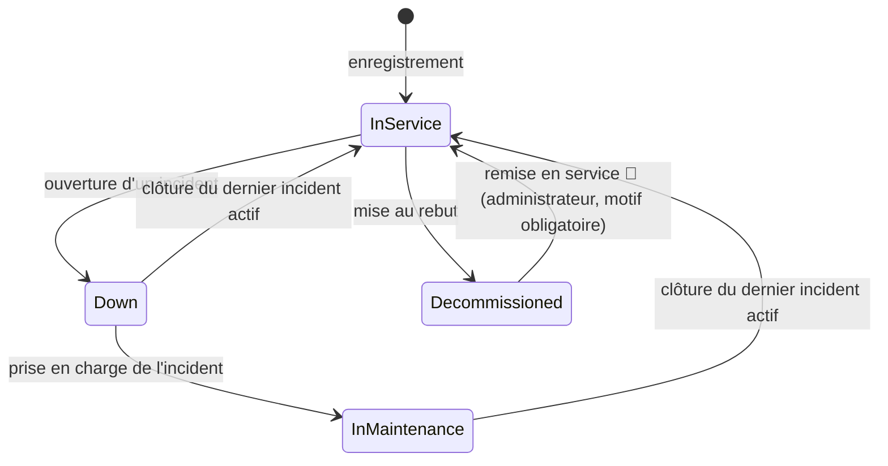
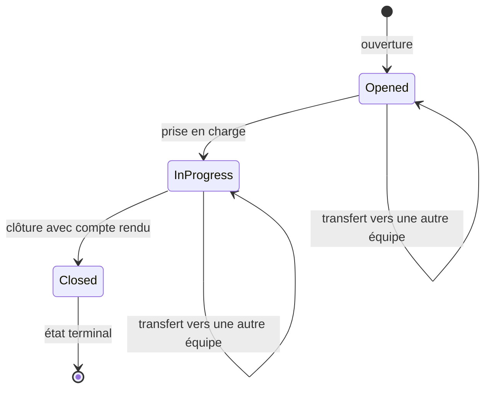

# AssetFlow Core — Spécifications fonctionnelles

**Objet** — Ce document décrit *comment* le produit se comporte : règles métier détaillées, cycles de vie, parcours utilisateur, écrans, messages et critères d'acceptation. Il complète [PRODUCT-REQUIREMENTS.md](PRODUCT-REQUIREMENTS.md) (le *quoi*) et ne répète pas le détail HTTP, qui se trouve dans [API-Specification.md](API-Specification.md).

> **Provenance.** Les sections 1 à 5 (domaine, cycles de vie, règles, validation, messages) sont **relevées dans le code** le 2026-08-04 : elles décrivent le comportement réel. Les sections 6 à 9 (parcours, écrans, critères d'acceptation) sont des **propositions 🎯** : le frontend n'existe pas encore et aucune maquette n'a été validée.

**Légende** : ✅ implémenté · 🟡 partiel · ⛔ impossible en l'état · 🎯 proposition

---

## 1. Modèle du domaine vu par l'utilisateur

### Actif

Équipement matériel du parc. Porte un libellé libre, un **numéro de série** qui l'identifie de façon unique, un **type** et un **état**.

| Attribut | Règle vue de l'utilisateur |
|---|---|
| Libellé | obligatoire, jusqu'à 100 caractères |
| Numéro de série | obligatoire, 5 à 50 caractères, **normalisé en majuscules** et débarrassé des espaces de bord, unique dans tout le parc |
| Type | `Server`, `Laptop` ou `NetworkDevice` — non modifiable après création |
| État | `InService`, `Down`, `InMaintenance`, `Decommissioned` — jamais choisi par l'utilisateur, toujours déduit des incidents |

### Incident (ticket)

Demande de maintenance rattachée à un actif.

| Attribut | Règle vue de l'utilisateur |
|---|---|
| Titre | obligatoire, jusqu'à 150 caractères |
| Description | obligatoire, longueur libre |
| Criticité | `Low`, `Medium`, `High` — déclarée à l'ouverture, **non modifiable ensuite** |
| Équipe affectée | **jamais choisie** à l'ouverture : déduite du couple (type d'actif, criticité). Modifiable ensuite par transfert |
| Compte rendu de résolution | obligatoire à la clôture |
| Note d'assistance IA | générée automatiquement en tâche de fond ⛔ non consultable |

### Équipe d'astreinte

Groupe responsable d'un couple (type d'actif, criticité).

| Attribut | Règle vue de l'utilisateur |
|---|---|
| Nom | obligatoire, jusqu'à 100 caractères, doit être unique — 🟡 l'unicité n'est pas contrôlée proprement (erreur technique en cas de doublon) |
| Type d'actif | obligatoire, l'une des valeurs de type d'actif |
| Criticité | obligatoire, l'une des valeurs de criticité |
| Description | facultative, jusqu'à 500 caractères |
| Active | vraie à la création ⛔ aucune opération ne permet de la modifier |

> Plusieurs équipes peuvent partager le même **nom** logique en couvrant des criticités différentes ? **Non** : le nom étant unique en base, chaque couple (type, criticité) exige une équipe de nom distinct. Une organisation qui veut une seule équipe « Support » pour trois criticités doit créer trois enregistrements de noms différents.

## 2. Cycle de vie d'un actif ✅

- L'état de l'actif n'est **jamais** saisi : il résulte des opérations sur ses incidents. Seule exception à venir : la remise en service, qui est un geste délibéré d'administrateur.
- Un actif portant plusieurs incidents reste en panne ou en maintenance tant que le **dernier** incident actif n'est pas clos.
- `Decommissioned` est terminal **dans le code actuel**. Décision produit n°1 du 2026-08-05 : il **cesse de l'être** — une remise en service devient possible, réservée à un rôle d'administrateur, avec motif obligatoire et opération tracée. Motif : le numéro de série d'un actif au rebut reste réservé dans tout le parc, donc un rebut par erreur interdit sinon définitivement de réenregistrer la machine.
- La mise au rebut est refusée tant qu'un incident est ouvert ou en cours.

## 3. Cycle de vie d'un incident ✅

- Le transfert **ne modifie pas** l'état de l'incident, seulement son équipe affectée. Il produira une **entrée d'historique** (équipe d'origine, équipe cible, motif, date) au lieu d'allonger la description (décision produit n°4).
- Aucune réouverture n'est possible après clôture.
- Le statut `Resolved` existe dans le modèle mais n'est jamais atteint : il est **supprimé** (décision produit n°3 du 2026-08-05, [PRD](PRODUCT-REQUIREMENTS.md) §8). Le cycle à trois états ci-dessus est donc le cycle définitif ; une étape de validation avant clôture exigerait un acteur validateur, que le produit n'a pas.
- La clôture d'un incident déclenchera son **indexation dans la base vectorielle** (décision produit n°7), condition pour que l'assistance au diagnostic des incidents suivants s'appuie sur des cas comparables.

## 4. Règles métier

Chaque règle indique le message **exact** produit aujourd'hui, ce qui permet à l'interface de le remplacer par un libellé maîtrisé.

### 4.1 Actifs

| Id | Règle | Message actuel | Statut |
|---|---|---|---|
| RM-01 | Le numéro de série est unique dans le parc | `Ce numéro de série constructeur est déjà enregistré dans le parc.` | ✅ |
| RM-02 | Le numéro de série compte de 5 à 50 caractères | `Le numéro de série doit contenir entre 5 et 50 caractères.` | ✅ |
| RM-03 | Le numéro de série est normalisé (majuscules, espaces de bord supprimés) avant enregistrement et comparaison | — | ✅ |
| RM-04 | Le libellé est obligatoire | `Le nom de l'actif ne peut pas être vide.` | ✅ |
| RM-05 | Le type doit appartenir à la liste des types connus | message technique de conversion | 🟡 message non maîtrisé |
| RM-06 | Un actif portant des incidents actifs ne peut pas être mis au rebut | `Action interdite : l'actif fait l'objet de N incident(s) en cours de traitement.` | ✅ |
| RM-07 | La mise au rebut d'un actif inexistant est refusée | `L'actif {id} est introuvable.` | ✅ |
| RM-28 | Un actif au rebut peut être **remis en service** par un administrateur, avec un motif obligatoire ; l'opération est tracée | à définir | 🎯 décision produit n°1 (2026-08-05) |
| RM-29 | Le numéro de série d'un actif au rebut **reste réservé** : il ne peut pas être réutilisé par un nouvel enregistrement | `Ce numéro de série constructeur est déjà enregistré dans le parc.` | ✅ comportement actuel, et raison d'être de `RM-28` |

### 4.2 Incidents

| Id | Règle | Message actuel | Statut |
|---|---|---|---|
| RM-08 | Un incident ne peut être ouvert que sur un actif existant | `L'actif cible {id} n'existe pas.` | ✅ |
| RM-09 | Aucun incident sur un actif mis au rebut | `Opération interdite : impossible d'ouvrir un incident sur un actif mis au rebut.` | 🟡 contournable dans la fenêtre de cache de 5 min |
| RM-10 | L'ouverture d'un incident met l'actif en panne | — | ✅ |
| RM-11 | L'équipe est déterminée automatiquement par (type d'actif, criticité) | — | ✅ |
| RM-12 | Sans équipe correspondante en référentiel, l'ouverture échoue | `L'équipe est introuvable en base. Vérifiez que les données de référence sont à jour.` | ✅ |
| RM-13 | Seul un incident **ouvert** peut être pris en charge | `Seul un ticket ouvert peut être pris en charge.` | 🟡 remonté comme erreur technique (500) |
| RM-14 | La prise en charge exige un actif en panne | `L'actif doit être en panne avant d'entrer en maintenance.` | ✅ |
| RM-15 | Seul un incident **en cours** peut être clôturé | `Seul un ticket en cours peut être clôturé.` | 🟡 remonté comme erreur technique (500) |
| RM-16 | Le compte rendu de résolution est obligatoire à la clôture | `Un commentaire de résolution est obligatoire.` | ✅ |
| RM-17 | À la clôture du dernier incident actif, l'actif revient en service | — | ✅ |
| RM-18 | Un incident clôturé ne peut pas être transféré | `Impossible de transférer un ticket clôturé.` | ✅ |
| RM-19 | Le transfert vers l'équipe déjà affectée est refusé | `Le ticket est déjà assigné à l'équipe '{nom}'.` | ✅ |
| RM-20 | L'équipe cible d'un transfert doit exister et être active | `Équipe introuvable.` | ✅ |
| RM-21 | Le motif de transfert est conservé **dans un historique dédié** : équipe d'origine, équipe cible, motif, date. La description de l'incident reste celle saisie à l'ouverture | — | 🟡 aujourd'hui concaténé à la description, donc destructeur du texte d'origine — historique retenu par la décision produit n°4 (2026-08-05) |
| RM-22 | Une modification concurrente du même incident est détectée et signalée | `Cette ressource a été mise à jour par un autre utilisateur. Veuillez recharger les données.` | ✅ |

### 4.3 Équipes

| Id | Règle | Message actuel | Statut |
|---|---|---|---|
| RM-23 | Le nom d'équipe est unique | — | 🟡 contrainte en base uniquement, erreur technique (500) |
| RM-24 | Type d'actif et criticité sont obligatoires et doivent appartenir aux listes connues | `Le type d'asset doit être l'un des suivants : Server, Laptop ou NetworkDevice.` | 🟡 message erroné pour la criticité |
| RM-25 | Une équipe portant des incidents actifs ne peut pas être supprimée | `Impossible de supprimer le team : des tickets actifs lui sont assignes.` | ✅ |
| RM-26 | Une équipe portant des incidents clôturés ne peut pas être supprimée non plus | — | 🟡 refus au niveau base, erreur technique (500) |
| RM-27 | La modification d'une équipe est partielle : les champs non fournis sont conservés | — | ✅ |
| RM-30 | Une équipe peut être **désactivée** sans être supprimée ; elle cesse alors de recevoir des incidents et disparaît des sélecteurs, sans perdre son historique. La suppression reste possible pour une équipe qu'aucun incident ne référence | à définir | 🎯 décision produit n°5 (2026-08-05) |
| RM-31 | Désactiver la **dernière** équipe d'un couple (type d'actif, criticité) rend l'ouverture d'incidents impossible pour ce couple (`RM-12`) : l'interface avertit avant de confirmer | à définir | 🎯 conséquence de `RM-30` |

### 4.4 Routage automatique ✅

| Type d'actif | Criticité | Équipe recherchée |
|---|---|---|
| `Laptop` | `High` | équipe active dont (type, criticité) = (`Laptop`, `High`) |
| `Laptop` | `Low` ou `Medium` | équipe active dont (type, criticité) = (`Laptop`, criticité déclarée) |
| `NetworkDevice` | toutes | équipe active dont (type, criticité) = (`NetworkDevice`, criticité déclarée) |
| `Server` | toutes | équipe active dont (type, criticité) = (`Server`, criticité déclarée) |

Le référentiel doit donc contenir jusqu'à **9 équipes actives** pour couvrir toutes les combinaisons. L'absence d'une combinaison se traduit par un refus d'ouverture d'incident (RM-12), pas par un repli silencieux. Les 9 combinaisons sont amorcées par la migration `SeedReferenceTeams` (Lot 1).

La résolution ne retient que les équipes **actives** : une équipe désactivée (`RM-30`) cesse immédiatement de couvrir sa combinaison, au même titre qu'une équipe absente.

## 5. Validation des saisies

État réel des contrôles, par formulaire.

### Enregistrement d'un actif — ⛔ aucun validateur de surface

Les erreurs proviennent du domaine, **une à la fois**, sans indication du champ concerné. L'interface doit donc valider elle-même avant envoi : libellé non vide (≤ 100), numéro de série de 5 à 50 caractères, type parmi la liste.

### Ouverture d'un incident — 🟡 validation partielle

| Champ | Contrôlé côté API | À contrôler côté interface |
|---|---|---|
| Actif | présence | sélection dans une liste, jamais saisie libre |
| Titre | présence, ≤ 150 caractères | idem, avec compteur |
| Description | présence | idem |
| Criticité | **présence uniquement** — la valeur n'est pas vérifiée malgré un message qui l'annonce | contraindre à une liste fermée |

⚠️ Un seul champ en erreur est retourné à la fois (le premier en échec) : l'interface ne peut pas se reposer sur l'API pour afficher toutes les erreurs d'un formulaire.

### Clôture d'un incident — 🟡

Le compte rendu est contrôlé par le domaine, pas par un validateur : message générique, sans nom de champ.

### Création et modification d'une équipe — ✅ validation complète

Tous les champs sont contrôlés (présence, longueurs, appartenance aux listes) et les erreurs sont retournées **par champ**, donc directement exploitables par un formulaire. Deux réserves : le message d'erreur de criticité est incorrect (RM-24), et une chaîne **vide** est rejetée alors qu'un champ **omis** est accepté comme « inchangé ».

## 6. Parcours utilisateur 🎯

### P-01 — Enregistrer un nouvel équipement

1. Le gestionnaire ouvre l'inventaire et déclenche « Enregistrer un actif ».
2. Il saisit libellé, numéro de série et type.
3. L'interface valide localement, puis envoie la demande.
4. En cas de succès, l'actif est **ajouté à la liste affichée à partir de la réponse reçue** — et non par un rechargement de la liste, qui peut renvoyer des données périmées pendant 5 minutes.
5. En cas de doublon de numéro de série, l'erreur est portée sur le champ correspondant.

### P-02 — Déclarer un incident

1. Le technicien sélectionne un actif (liste, recherche locale).
2. Il saisit titre, description et criticité.
3. L'interface affiche l'équipe qui sera saisie ? **Non** : l'équipe n'est connue qu'**après** création, dans la réponse. L'interface annonce donc « affectation automatique » avant envoi, puis affiche l'équipe retenue après succès.
4. L'actif passe visuellement en panne dans l'inventaire.
5. Si le référentiel ne couvre pas la combinaison, l'interface affiche un message d'anomalie de configuration et invite à contacter l'administrateur du référentiel.

### P-03 — Prendre en charge un incident

1. Le technicien ouvre un incident. ⛔ **Il n'existe aucune liste d'incidents** : le parcours nécessite l'identifiant, ce qui n'est pas exploitable. Ce parcours reste **bloqué** jusqu'à l'ajout d'un endpoint de liste.
2. Il déclenche « Prendre en charge ».
3. L'incident passe en cours, l'actif en maintenance.

### P-04 — Clôturer un incident

1. Depuis un incident en cours, le technicien déclenche « Clôturer ».
2. Il saisit un compte rendu obligatoire.
3. À la clôture du dernier incident actif, l'actif revient en service, ce qui doit être annoncé à l'utilisateur.

### P-05 — Transférer un incident mal routé

1. Depuis un incident non clôturé, le technicien déclenche « Transférer ».
2. Il choisit l'équipe cible dans un **sélecteur alimenté par `GET /api/teams?onlyActive=true`** et saisit un motif.
3. Le transfert est enregistré et **apparaît dans l'historique de routage** de l'incident (`RM-21`), sans altérer la description d'origine. 🟡 tant que la décision produit n°4 n'est pas réalisée, le motif reste ajouté à la description.

### P-06 — Mettre un équipement au rebut

1. Depuis l'inventaire, le gestionnaire déclenche « Mettre au rebut ».
2. L'interface **demande confirmation** : l'équipement sort du parc actif et son numéro de série reste réservé. La confirmation n'annonce pas une opération irréversible — un administrateur peut le remettre en service (`RM-28`).
3. Si des incidents sont actifs, le refus indique leur nombre et propose de les consulter, depuis la fiche de l'actif (`GET /api/assets/{id}`, qui renvoie ses incidents).

### P-06 bis — Remettre en service un équipement au rebut 🎯

1. Depuis la fiche d'un actif au rebut, un **administrateur** déclenche « Remettre en service » — l'action est absente pour tout autre profil.
2. Il saisit un **motif obligatoire** et confirme.
3. L'actif redevient `InService` et peut de nouveau porter des incidents ; l'opération est tracée.

Dépend de la décision produit n°1 pour l'endpoint et du Lot 7 pour l'habilitation.

### P-07 — Recevoir une notification d'incident

1. À l'ouverture de l'application, le client temps réel se connecte et s'abonne au groupe de l'équipe de l'utilisateur.
2. ⛔ **L'équipe de l'utilisateur reste inconnue** : il n'y a pas de notion d'utilisateur. La liste des équipes existe désormais, mais rien ne rattache une personne à l'une d'elles — le rattachement vient du Lot 7. En l'état, l'abonnement suppose un nom d'équipe choisi manuellement dans la liste.
3. À réception, l'interface affiche une notification non intrusive et met la vue à jour.

### P-08 — Administrer le référentiel d'équipes

1. L'administrateur consulte la liste des équipes (`GET /api/teams`, état actif inclus), avec le **contrôle de couverture des 9 combinaisons** (type × criticité).
2. Il crée, modifie partiellement, **désactive ou réactive** une équipe (`RM-30`) ; la suppression reste proposée et refusée dès qu'un incident référence l'équipe.
3. Toute désactivation qui retirerait la dernière équipe d'une combinaison est **signalée avant confirmation** (`RM-31`).

✅ Écran réalisable, à l'exception de la bascule d'activation, qui attend la réalisation de la décision produit n°5.

## 7. Écrans proposés 🎯

Faisabilité réévaluée au 2026-08-05, après la complétion du contrat d'API (Lot 2).

| Id | Écran | Données affichées | Actions | Faisabilité |
|---|---|---|---|---|
| E-01 | **Inventaire des actifs** | libellé, numéro de série, type, état, date de création | enregistrer, mettre au rebut, filtrer localement | ✅ réalisable (liste complète, filtrage et tri **côté client** faute de pagination serveur sur l'inventaire) |
| E-02 | **Formulaire d'actif** | libellé, numéro de série, type | enregistrer | ✅ réalisable |
| E-03 | **Fiche d'un actif** | attributs + incidents liés | ouvrir un incident, **remettre en service** si au rebut (administrateur) | ✅ réalisable — `GET /api/assets/{id}` renvoie l'actif et ses incidents ; la remise en service attend la décision produit n°1 et l'habilitation du Lot 7 |
| E-04 | **Formulaire d'incident** | actif sélectionné, titre, description, criticité | ouvrir | ✅ réalisable |
| E-05 | **Fiche d'un incident** | titre, description, criticité, état, équipe, compte rendu, **historique de routage** | prendre en charge, clôturer, transférer | ✅ réalisable — le contrat expose description, compte rendu et date d'ouverture ; l'historique de transferts attend la décision produit n°4 |
| E-06 | **File de travail des incidents** | liste filtrable par état, criticité, équipe, actif | ouvrir une fiche | ✅ réalisable — `GET /api/tickets` filtre, trie et pagine |
| E-07 | **Administration des équipes** | nom, type d'actif, criticité, état actif, couverture des 9 combinaisons | créer, modifier, supprimer, **activer / désactiver** | ✅ réalisable — `GET /api/teams` et le couple (type × criticité) dans le contrat de sortie ; la **désactivation** est retenue (décision produit n°5) mais pas encore exposée par l'API |
| E-08 | **Aide au diagnostic** | note d'assistance IA, incidents similaires | — | 🟡 dégradé : `assistanceNote` et `isAiProcessing` sont exposés, mais la fin d'analyse n'est pas notifiée — l'écran doit relire l'incident ; les incidents similaires restent hors contrat |
| E-09 | **Notifications temps réel** | nouveaux incidents de l'équipe suivie | ouvrir la fiche | 🟡 dégradé : le groupe suivi doit être saisi manuellement, faute de notion d'utilisateur |

**Conséquence de cadrage** : sur 9 écrans, **7 sont désormais réalisables** et 2 restent dégradés. Les deux limitations résiduelles relèvent du Lot 6 (notification de fin d'analyse IA) et du Lot 7 (rattachement d'un utilisateur à une équipe), pas du contrat d'API.

## 8. Messages destinés à l'utilisateur 🎯

L'API renvoie des messages techniques ou orientés développeur. L'interface doit les traduire.

| Situation détectée | Message proposé à l'utilisateur |
|---|---|
| Numéro de série déjà pris | « Ce numéro de série est déjà enregistré dans le parc. » (porté sur le champ) |
| Numéro de série trop court ou trop long | « Le numéro de série doit contenir entre 5 et 50 caractères. » |
| Actif introuvable | « Cet équipement n'existe plus. Actualisez la liste. » |
| Mise au rebut refusée (incidents actifs) | « Impossible : cet équipement a {n} incident(s) en cours. Clôturez-les d'abord. » |
| Confirmation d'une mise au rebut | « Cet équipement sortira du parc actif et son numéro de série restera réservé. Un administrateur pourra le remettre en service. » |
| Confirmation d'une remise en service | « Cet équipement redeviendra utilisable et pourra porter de nouveaux incidents. Indiquez le motif. » |
| Désactivation retirant la dernière équipe d'une combinaison | « Plus aucune équipe ne couvrira {type} en criticité {criticité} : l'ouverture d'incidents deviendra impossible pour cette combinaison. » |
| Suppression d'équipe refusée (incidents rattachés) | « Cette équipe a un historique d'incidents et ne peut pas être supprimée. Désactivez-la pour qu'elle cesse de recevoir des incidents. » |
| Aucune équipe pour la combinaison | « La configuration des équipes ne couvre pas ce type d'équipement avec cette criticité. Contactez l'administrateur. » |
| Incident déjà pris en charge | « Cet incident est déjà pris en charge. » |
| Incident non pris en charge lors d'une clôture | « Prenez d'abord l'incident en charge avant de le clôturer. » |
| Compte rendu vide | « Le compte rendu de résolution est obligatoire. » (porté sur le champ) |
| Transfert vers l'équipe courante | « Cet incident est déjà affecté à cette équipe. » |
| Conflit de concurrence (409) | « Cet incident a été modifié par quelqu'un d'autre. Rechargez pour voir les dernières données. » |
| Erreur serveur (500) | « Une erreur inattendue est survenue. L'équipe technique a été informée. » — **ne jamais afficher le détail technique renvoyé par l'API** |
| Perte de connexion temps réel | « Notifications temps réel interrompues, reconnexion en cours… » |

Règle transverse : ne jamais afficher un identifiant technique (GUID) dans un message destiné à l'utilisateur ; ne jamais afficher le champ `detail` d'une erreur 500.

## 9. Critères d'acceptation 🎯

Formulés pour les parcours réalisables sans modification du backend.

### P-01 — Enregistrer un équipement

- **Étant donné** un formulaire vide, **quand** l'utilisateur soumet sans rien saisir, **alors** les erreurs de champs obligatoires s'affichent sans appel réseau.
- **Étant donné** un numéro de série de 4 caractères, **quand** l'utilisateur soumet, **alors** l'erreur de longueur s'affiche sans appel réseau.
- **Étant donné** un numéro de série déjà présent, **quand** l'utilisateur soumet, **alors** l'erreur retournée par l'API est portée sur le champ numéro de série.
- **Étant donné** une saisie valide, **quand** l'enregistrement réussit, **alors** l'actif apparaît immédiatement dans la liste affichée, **construit depuis la réponse** et non depuis un rechargement.
- **Étant donné** une saisie en minuscules avec des espaces, **quand** l'enregistrement réussit, **alors** le numéro affiché est celui normalisé renvoyé par l'API.

### P-02 — Déclarer un incident

- **Étant donné** un actif au rebut, **quand** l'utilisateur tente d'ouvrir un incident, **alors** l'action est indisponible dans l'interface (et le refus API est géré si l'état affiché était périmé).
- **Étant donné** un titre de 151 caractères, **quand** l'utilisateur soumet, **alors** l'erreur s'affiche sans appel réseau.
- **Étant donné** une création réussie, **alors** l'équipe affectée est affichée à l'utilisateur et l'actif apparaît en panne.
- **Étant donné** un référentiel incomplet, **quand** l'API refuse, **alors** le message d'anomalie de configuration est affiché, distinct d'une erreur de saisie.

### P-04 — Clôturer un incident

- **Étant donné** un compte rendu vide, **quand** l'utilisateur soumet, **alors** l'erreur est portée sur le champ.
- **Étant donné** la clôture du dernier incident d'un actif, **alors** l'interface indique que l'équipement est revenu en service.
- **Étant donné** un conflit de concurrence (409), **alors** l'interface propose explicitement de recharger et ne perd pas la saisie de l'utilisateur.

### Exigences transverses à tous les écrans

- Chaque écran gère et distingue quatre états : **chargement**, **vide**, **erreur**, **contenu**.
- Aucune action destructive sans confirmation explicite (mise au rebut, suppression d'équipe).
- Toute action longue désactive son déclencheur et affiche une progression.
- Parcours complet réalisable **au clavier seul**, chaque contrôle portant un nom accessible.
- Aucune information portée par la seule couleur : les états et criticités associent couleur **et** libellé.
- Rendu correct de 320 px de large jusqu'à 200 % de zoom.

Les modalités de mise en œuvre visuelle et d'accessibilité relèvent de l'agent `ui-ux-designer`, les modalités techniques de [TECHNICAL-SPECIFICATION.md](TECHNICAL-SPECIFICATION.md).
